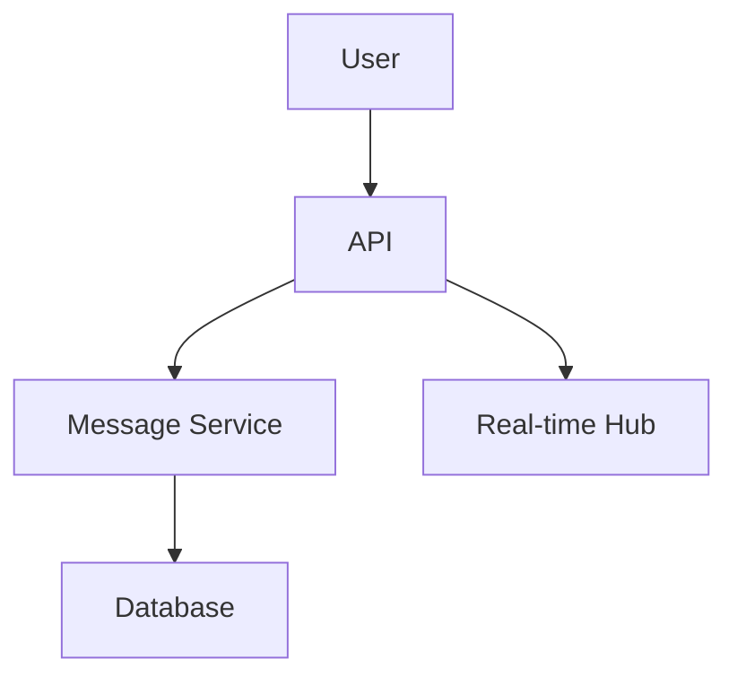

# Slack Messaging System

## Overview

Slack is a collaboration platform with channels, direct messages, and integrations. This design covers message persistence, real-time delivery, and scalability.

## Detailed Explanation

### Architecture



### Components

- **Channels and Threads**: Organized communication.
- **Integrations**: Third-party apps.
- **Search**: Full-text search.

## Real-world Examples & Use Cases

- Team collaboration.
- Workflow automation.

## Code Examples

### Go for Message API

```go
func SendMessage(w http.ResponseWriter, r *http.Request) {
    msg := parseMessage(r)
    db.Insert(msg)
    hub.Broadcast(msg.Channel, msg)
}
```

## References

- [Slack Engineering Blog](https://slack.engineering/)

## Github-README Links & Related Topics

- [System Design Basics](system-design-basics/README.md)
- [Discord System Design](discord-system-design/README.md)