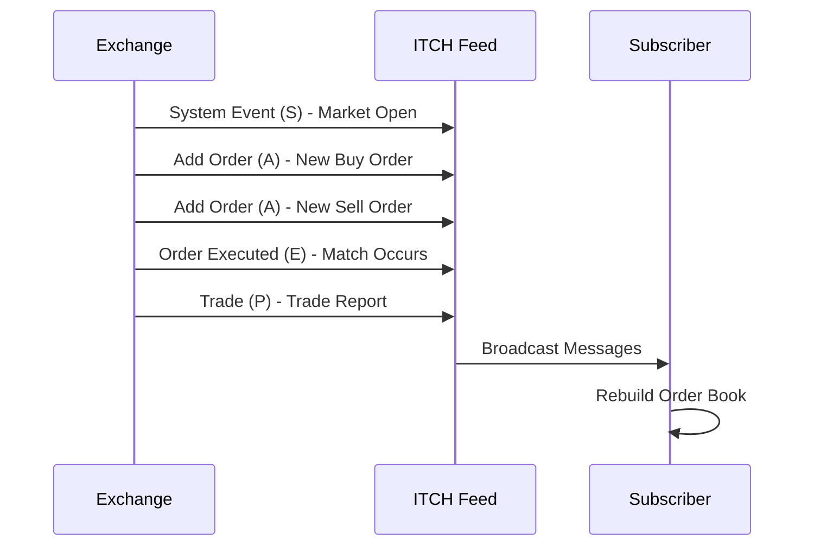

# ITCH Protocol

## Overview

The ITCH protocol is a low-latency, binary protocol developed by Nasdaq for the dissemination of market data, including order book updates, trades, and quotes. ITCH stands for "Nasdaq Integrated TotalView-ITCH" and is designed to provide real-time, high-speed market data feeds to subscribers. It is used primarily by Nasdaq exchanges and has become a standard for market data distribution in electronic trading.

Unlike text-based protocols like FIX, ITCH uses a compact binary format to minimize bandwidth and reduce latency. Messages are fixed-length and include timestamps for precise sequencing. ITCH feeds include information on order additions, modifications, deletions, and executions, providing a complete view of market activity.

## STAR Summary

**S: Situation** - In the late 1990s, as electronic trading volumes increased, there was a need for efficient, real-time market data dissemination that could handle high message rates without overwhelming network infrastructure.

**T: Task** - Create a protocol optimized for broadcasting market data with minimal latency and bandwidth usage.

**A: Action** - Nasdaq developed ITCH as part of its TotalView system, starting with version 1.0 and evolving to support more message types and higher throughput.

**R: Result** - ITCH enables Nasdaq to broadcast millions of messages per second, providing traders with timely market information. It has influenced the design of other market data protocols and is widely used in high-frequency trading environments.

## Detailed Explanation

ITCH is a unidirectional protocol where data is broadcast from the exchange to subscribers via multicast UDP. It does not support acknowledgments or session management like FIX; instead, it relies on sequence numbers and timestamps for integrity.

Key features:

- **Binary Format**: Messages are encoded in binary for efficiency. Each message type has a fixed length and structure.

- **Message Types**: Common messages include:
  - Add Order (A): Adds a new order to the book.
  - Delete Order (D): Removes an order.
  - Order Executed (E): Reports a trade execution.
  - Order Executed with Price (C): Execution with price information.
  - Order Cancel (X): Cancels part of an order.
  - Order Replace (U): Modifies an existing order.
  - System Event (S): Indicates market open/close events.

- **Timestamps**: Each message includes a nanosecond timestamp for precise ordering.

- **Sequence Numbers**: Messages are numbered sequentially to detect gaps.

- **Book Reconstruction**: Subscribers can rebuild the order book by processing the stream of messages.

ITCH supports multiple books (e.g., equities, options) and includes cross-references for related instruments. It is designed for high throughput, with some feeds handling over 100,000 messages per second.

## Real-world Examples & Use Cases

1. **Order Book Maintenance**: High-frequency traders use ITCH feeds to maintain real-time order books for making trading decisions.

2. **Market Making**: Market makers subscribe to ITCH to monitor liquidity and adjust quotes accordingly.

3. **Algorithmic Trading**: Algorithms parse ITCH messages to identify patterns and execute trades based on market conditions.

4. **Surveillance**: Regulators use ITCH data for market monitoring and detecting anomalies.

## Message Formats / Data Models

ITCH messages start with a 1-byte message type indicator. Example Add Order message structure (simplified):

- Message Type: 'A' (1 byte)
- Stock Locate: 2 bytes
- Tracking Number: 2 bytes
- Timestamp: 6 bytes (nanoseconds)
- Order Reference Number: 8 bytes
- Buy/Sell Indicator: 1 byte
- Shares: 4 bytes
- Stock: 8 bytes (symbol)
- Price: 4 bytes (4 decimal places)
- Attribution: 4 bytes

Example binary representation (hex): 41 00 01 00 02 00 00 00 00 00 00 00 01 42 55 59 00 00 00 64 41 41 50 4C 00 00 00 00 00 00 5D C0 00 00 00 00

Decoded: Add Order for 100 shares of AAPL at $150.00, Buy side.

Common message types table:

| Type | Name | Description |
|------|------|-------------|
| S | System Event | Market events like start/end of trading |
| R | Stock Directory | Stock reference data |
| H | Stock Trading Action | Trading status changes |
| Y | Reg SHO Restriction | Short sale restrictions |
| L | Market Participant Position | MM position disclosures |
| A | Add Order | New order added to book |
| F | Add Order with Attribution | Add with MM attribution |
| E | Order Executed | Execution without price |
| C | Order Executed with Price | Execution with price |
| X | Order Cancel | Partial cancel |
| D | Order Delete | Full delete |
| U | Order Replace | Modify order |
| P | Trade | Non-cross trade |
| Q | Cross Trade | Cross trade |
| B | Broken Trade | Cancelled trade |

## Journey of a Trade



This diagram illustrates how ITCH disseminates market events and order book changes in real-time.

## Common Pitfalls & Edge Cases

1. **Message Loss**: UDP multicast can drop packets; use sequence numbers to detect and request retransmissions.

2. **Out-of-Order Delivery**: Timestamps help reorder messages, but high-speed environments may require buffering.

3. **Book Synchronization**: Initial snapshots may be needed to synchronize; ITCH assumes subscribers start from a known state.

4. **High Throughput**: Processing millions of messages/second requires optimized parsing code.

5. **Symbol Changes**: Handle stock splits, mergers via directory messages.

6. **Regulatory Feeds**: Some ITCH feeds include regulatory data that must be handled separately.

## Tools & Libraries

- **ITCH Parser Libraries**: Open-source parsers in C++, Python for decoding binary messages.
- **Nasdaq ITCH Specification**: Official documentation for message formats.
- **Wireshark ITCH Dissector**: Plugin for network analysis.

Sample code snippet (Python for parsing Add Order):

```python
import struct

def parse_add_order(data):
    msg_type, stock_locate, tracking, timestamp, ref_num, side, shares, stock, price, attribution = struct.unpack('>cHHQQL8sLQ', data[:42])
    symbol = stock.decode('ascii').rstrip('\x00')
    price_float = price / 10000.0  # 4 decimal places
    return {
        'type': msg_type,
        'symbol': symbol,
        'side': 'BUY' if side == b'B' else 'SELL',
        'shares': shares,
        'price': price_float
    }
```

## Github-README Links & Related Topics

[[FIX Protocol]]
[[OUCH Protocol]]
[[Market Data]]
[[Order Entry Protocols]]
[[Execution Report]]

## References

- [Nasdaq ITCH Protocol Specification](https://www.nasdaqtrader.com/Trader.aspx?id=ITCH)
- [ITCH Message Reference](https://www.nasdaqtrader.com/content/technicalsupport/specifications/dataproducts/ITCH4.1.pdf)
- [Nasdaq TotalView-ITCH](https://www.nasdaq.com/solutions/nasdaq-totalview)