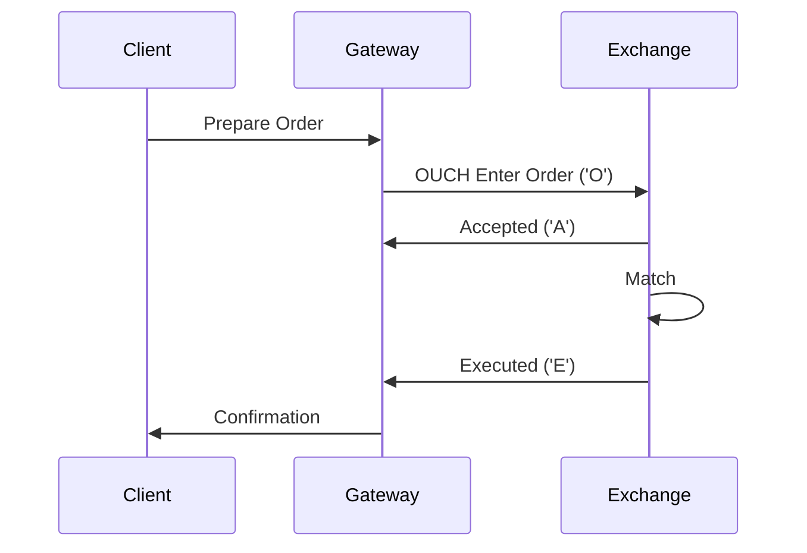

# Overview

OUCH (Order Handling and Execution) is a binary protocol developed by NASDAQ for order entry and execution. It allows market participants to submit, modify, and cancel orders directly to the matching engine with low latency.

# STAR Summary

**SITUATION**: Text-based protocols like FIX were too verbose for high-speed order entry.

**TASK**: Develop a binary protocol for efficient order submission and management.

**ACTION**: NASDAQ created OUCH as a compact binary format for order messages.

**RESULT**: OUCH enables sub-millisecond order processing, critical for HFT.

# Detailed Explanation

OUCH uses a binary format with fixed-length messages. It supports order entry, cancellation, modification, and query operations. Messages are acknowledged with response messages indicating acceptance or rejection.

Key message types:
- 'O': Enter Order
- 'U': Replace Order
- 'X': Cancel Order
- 'S': System Event
- 'A': Accepted
- 'J': Rejected
- 'E': Executed
- 'C': Canceled
- 'B': Broken Trade

# Real-world Examples & Use Cases

- **Order Submission**: Send 'O' message to place a new order.
- **Order Cancellation**: 'X' message to cancel by order token.
- **Execution**: 'E' messages report fills.

Used by brokers and HFT firms for direct market access.

# Message Formats / Data Models

Example Enter Order ('O'):

| Field | Type | Length | Description |
|-------|------|--------|-------------|
| Message Type | char | 1 | 'O' |
| Order Token | char[14] | 14 | Unique order identifier |
| Buy/Sell Indicator | char | 1 | 'B' or 'S' |
| Shares | uint32 | 4 | Quantity |
| Stock | char[8] | 8 | Symbol |
| Price | uint32 | 4 | Price (4 decimals) |
| Time in Force | uint32 | 4 | TIF in nanoseconds |
| Firm | char[4] | 4 | Firm ID |
| Display | char | 1 | Display flag |
| Capacity | char | 1 | Capacity code |
| ISO | char | 1 | ISO flag |
| Min Qty | uint32 | 4 | Minimum quantity |
| Cross Type | char | 1 | Cross type |
| Customer Type | char | 1 | Customer type |

# Journey of a Trade



# Common Pitfalls & Edge Cases

- **Token Management**: Unique tokens required; collisions can cause issues.
- **Rejection Handling**: 'J' messages must be processed to resubmit or cancel.
- **Latency**: Binary format minimizes, but network issues can cause delays.
- **Capacity Limits**: Exceeding order rate limits leads to throttling.

# Tools & Libraries

- **NASDAQ OUCH Specs**: Official documentation.
- **Order Management Systems**: Integrate OUCH for DMA.
- **Sample Code**: C++ parser example:

```cpp
struct EnterOrder {
    char type;
    char token[14];
    char side;
    uint32_t shares;
    char stock[8];
    uint32_t price;
    // etc.
};
```

# Github-README Links & Related Topics

- [FIX Protocol](../fix-protocol/README.md)
- [ITCH Protocol](../itch-protocol/README.md)
- [Order Entry Protocols](../order-entry-protocols/README.md)

# References

- [NASDAQ OUCH Specification](https://www.nasdaqtrader.com/content/technicalsupport/specifications/dataproducts/ouch4.2.pdf)