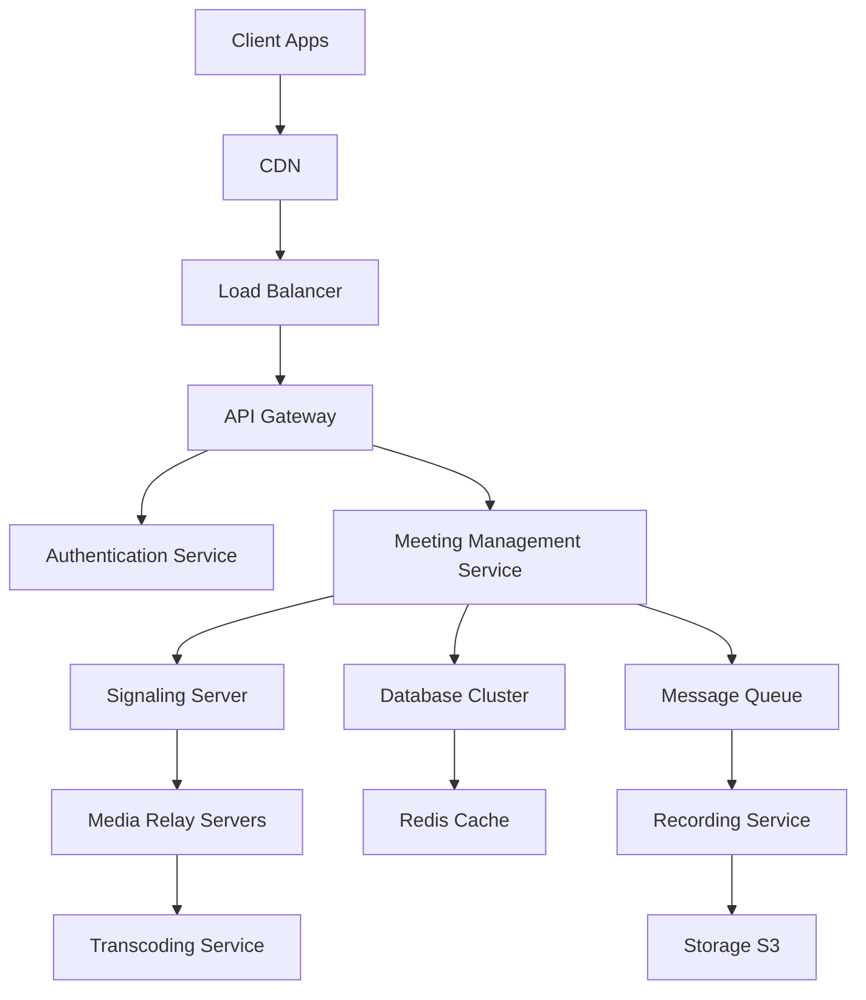

# Zoom Video Conferencing System Design

## Overview

Zoom Video Conferencing is a real-time communication platform that supports video calls, audio conferencing, screen sharing, and chat for millions of users simultaneously. This system design covers the architecture for handling high-volume, low-latency media streaming and user interactions.

## Detailed Explanation

### High-Level Architecture



### Key Components

| Component | Description | Technology |
|-----------|-------------|------------|
| Client Apps | Web, mobile apps using WebRTC | JavaScript, React Native |
| Load Balancer | Distributes incoming requests | NGINX, AWS ELB |
| API Gateway | Routes API calls, rate limiting | Kong, AWS API Gateway |
| Authentication | User login, JWT tokens | OAuth 2.0, JWT |
| Meeting Management | Create/join meetings, participant lists | Microservices in Go/Java |
| Signaling Server | WebRTC signaling for peer connections | WebSocket, STUN/TURN |
| Media Relay Servers | Handle media streams, NAT traversal | Kurento, Janus |
| Transcoding | Video/audio codec conversion | FFmpeg, AWS Elemental |
| Database | Meeting metadata, user data | PostgreSQL, DynamoDB |
| Cache | Session data, participant info | Redis |
| Message Queue | Async processing, notifications | Kafka, RabbitMQ |
| Recording Service | Store meetings | AWS S3, GCS |

### Scalability Considerations

- **Horizontal Scaling**: Auto-scale media servers based on load.
- **Global Distribution**: Use CDNs and edge locations for low latency.
- **Sharding**: Database sharding by region or user ID.
- **Caching**: Redis for hot data like active meetings.

### Data Flow

1. User authenticates via API Gateway.
2. Meeting created, participants invited.
3. Signaling server establishes WebRTC connections.
4. Media streams routed through relay servers.
5. Optional recording saved to storage.

## Real-world Examples & Use Cases

- **Corporate Meetings**: Teams collaborating remotely with screen sharing.
- **Online Education**: Virtual classrooms with interactive whiteboards.
- **Telehealth**: Doctor-patient consultations with HIPAA compliance.
- **Webinars**: Large audiences with Q&A features.

## Code Examples

### WebRTC Client Setup (JavaScript)

```javascript
// Initialize peer connection
const pc = new RTCPeerConnection({
  iceServers: [{ urls: 'stun:stun.l.google.com:19302' }]
});

// Get user media
navigator.mediaDevices.getUserMedia({ video: true, audio: true })
  .then(stream => {
    stream.getTracks().forEach(track => pc.addTrack(track, stream));
    return pc.createOffer();
  })
  .then(offer => pc.setLocalDescription(offer))
  .then(() => {
    // Send offer to signaling server via WebSocket
    socket.send(JSON.stringify({ type: 'offer', sdp: pc.localDescription.sdp }));
  });

// Handle incoming messages
socket.onmessage = (event) => {
  const data = JSON.parse(event.data);
  if (data.type === 'answer') {
    pc.setRemoteDescription(new RTCSessionDescription(data.sdp));
  }
};
```

### Meeting Creation API (Node.js)

```javascript
const express = require('express');
const app = express();

app.post('/meetings', (req, res) => {
  const { title, hostId } = req.body;
  // Validate input
  if (!title || !hostId) return res.status(400).json({ error: 'Missing fields' });
  
  // Create meeting in DB
  const meetingId = generateId();
  db.insert('meetings', { id: meetingId, title, hostId, createdAt: new Date() });
  
  res.json({ meetingId, joinUrl: `https://zoom.example.com/${meetingId}` });
});

app.listen(3000);
```

## Common Pitfalls & Edge Cases

- **NAT Traversal**: Use STUN/TURN servers for firewall issues.
- **Bandwidth Limitations**: Adaptive bitrate streaming.
- **Concurrent Users**: Handle 1000+ participants with selective forwarding.
- **Security**: End-to-end encryption, prevent Zoombombing with waiting rooms.

## Tools & Libraries

- **WebRTC**: For browser-based real-time communication.
- **Kurento**: Media server for WebRTC.
- **FFmpeg**: Video processing.
- **AWS Chime**: Managed video conferencing service.

## References

- [WebRTC API](https://developer.mozilla.org/en-US/docs/Web/API/WebRTC_API)
- [Zoom System Design Interview](https://www.educative.io/courses/grokking-the-system-design-interview/zoom-system-design)
- [Real-time Communication Protocols](https://tools.ietf.org/html/rfc3261)

## Github-README Links & Related Topics

- [WebRTC Signaling](system-design/webrtc-signaling/README.md)
- [Real-time Communication](system-design/real-time-communication/README.md)
- [Video Streaming](system-design/video-streaming/README.md)
- [Load Balancing](system-design/load-balancing-and-strategies/README.md)
- [Microservices Architecture](system-design/microservices-architecture/README.md)