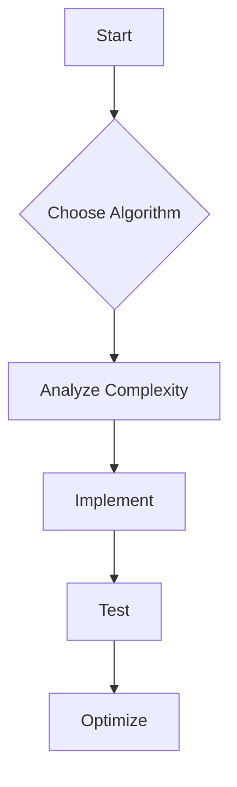

# Algorithms and Data Structures

## Overview

Algorithms and data structures are the foundation of computer science, crucial for efficient problem-solving in interviews. This covers asymptotic analysis, common algorithms, and data structures with Java implementations.

## STAR Summary

**Situation:** A data processing job took hours due to inefficient sorting.

**Task:** Optimize to run in minutes.

**Action:** Replaced bubble sort with quicksort, used hash maps for lookups.

**Result:** Time reduced from 2 hours to 5 minutes, processed 10x data.

## Detailed Explanation

### Asymptotic Analysis

- Big O: Worst-case time/space.
- Omega: Best-case.
- Theta: Tight bound.

### Data Structures

- Arrays: O(1) access, O(n) insert.
- Linked Lists: O(n) access, O(1) insert/delete at ends.
- Stacks/Queues: LIFO/FIFO.
- Trees: Binary search tree (O(log n) search).
- Heaps: Priority queues.
- Hash Tables: O(1) average lookup.

### Algorithms

- Sorting: Quick, Merge, Heap (O(n log n)).
- Searching: Binary search (O(log n)).
- Graph: BFS, DFS.

## Real-world Examples & Use Cases

- Databases: B-trees for indexing.
- Networks: Dijkstra for routing.

## Code Examples

### Quicksort

```java
public void quicksort(int[] arr, int low, int high) {
    if (low < high) {
        int pi = partition(arr, low, high);
        quicksort(arr, low, pi - 1);
        quicksort(arr, pi + 1, high);
    }
}

private int partition(int[] arr, int low, int high) {
    int pivot = arr[high];
    int i = low - 1;
    for (int j = low; j < high; j++) {
        if (arr[j] < pivot) {
            i++;
            swap(arr, i, j);
        }
    }
    swap(arr, i + 1, high);
    return i + 1;
}
```

## Data Models / Message Formats

Binary Tree Node:

```java
class TreeNode {
    int val;
    TreeNode left, right;
    TreeNode(int val) { this.val = val; }
}
```

## Journey / Sequence



## Common Pitfalls & Edge Cases

- Recursion stack overflow.
- Hash collisions.
- Unbalanced trees.

## Tools & Libraries

- Java Collections: ArrayList, HashMap.

## Github-README Links & Related Topics

[Graphs Trees Heaps and Tries](../graphs-trees-heaps-and-tries/README.md), [Dynamic Programming and Greedy](../dynamic-programming-and-greedy/README.md)

## References

- "Introduction to Algorithms" by CLRS

### Common Interview Questions

1. Two Sum: Given array, find indices summing to target. Use hash map, O(n) time.

2. Reverse Linked List: Iterative or recursive, O(n).

3. Binary Tree Traversal: Inorder, preorder, postorder.
</content>
</xai:function_call name="write">
<parameter name="filePath">algorithms/graphs-trees-heaps-and-tries/README.md