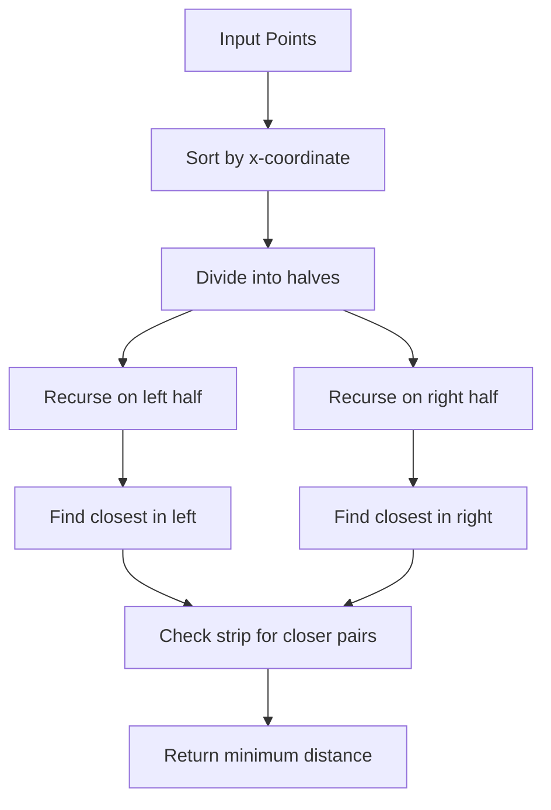

# Overview

Computational geometry is a branch of computer science that deals with algorithms for solving geometric problems. It focuses on designing efficient algorithms for problems involving points, lines, polygons, and other geometric objects. Key problems include convex hull computation, line segment intersection, and point location queries. These algorithms are essential in computer graphics, robotics, GIS, and CAD systems, where spatial data processing is critical.

In interviews, computational geometry questions test spatial reasoning, algorithmic efficiency, and understanding of geometric primitives. Complexity often ranges from O(n log n) for sorting-based approaches to O(n^2) for brute force.

# Detailed Explanation

Computational geometry algorithms typically operate on sets of points in 2D or 3D space. Common primitives include:

- **Points**: Represented as (x,y) coordinates
- **Line segments**: Defined by two endpoints
- **Polygons**: Closed shapes formed by line segments
- **Convex hulls**: Smallest convex polygon containing all points

Key algorithms:

- **Convex Hull**: Graham scan (O(n log n)), Jarvis march (O(nh))
- **Line Intersection**: Sweep line algorithm (O((n+k) log n))
- **Closest Pair**: Divide and conquer (O(n log n))



# Real-world Examples & Use Cases

- **Computer Graphics**: Collision detection in games, ray tracing
- **Robotics**: Path planning, obstacle avoidance
- **GIS Systems**: Spatial queries, map rendering
- **CAD Software**: Shape analysis, mesh generation
- **Image Processing**: Feature extraction, object recognition

| Algorithm | Use Case | Complexity |
|-----------|----------|------------|
| Convex Hull | Shape boundary detection | O(n log n) |
| Line Intersection | Collision detection | O(n log n + k) |
| Closest Pair | Proximity queries | O(n log n) |

# Code Examples

### Convex Hull - Graham Scan (Java)

```java
import java.util.*;

public class ConvexHull {
    static class Point {
        int x, y;
        Point(int x, int y) { this.x = x; this.y = y; }
    }

    public static List<Point> convexHull(Point[] points) {
        int n = points.length;
        if (n <= 1) return Arrays.asList(points);

        // Find the bottommost point
        int min = 0;
        for (int i = 1; i < n; i++) {
            if (points[i].y < points[min].y || (points[i].y == points[min].y && points[i].x < points[min].x)) {
                min = i;
            }
        }

        // Swap with first
        Point temp = points[0];
        points[0] = points[min];
        points[min] = temp;

        Point p0 = points[0];

        // Sort by polar angle
        Arrays.sort(points, 1, n, (a, b) -> {
            int o = orientation(p0, a, b);
            if (o == 0) return distSq(p0, a) < distSq(p0, b) ? -1 : 1;
            return o == 2 ? -1 : 1;
        });

        // Remove collinear points
        int m = 1;
        for (int i = 1; i < n; i++) {
            while (i < n - 1 && orientation(p0, points[i], points[i+1]) == 0) i++;
            points[m] = points[i];
            m++;
        }

        if (m < 3) return Arrays.asList(points).subList(0, m);

        Stack<Point> hull = new Stack<>();
        hull.push(points[0]);
        hull.push(points[1]);
        hull.push(points[2]);

        for (int i = 3; i < m; i++) {
            while (hull.size() > 1 && orientation(nextToTop(hull), hull.peek(), points[i]) != 2) {
                hull.pop();
            }
            hull.push(points[i]);
        }

        return new ArrayList<>(hull);
    }

    static int orientation(Point p, Point q, Point r) {
        long val = (long)(q.y - p.y) * (r.x - q.x) - (long)(q.x - p.x) * (r.y - q.y);
        if (val == 0) return 0;
        return val > 0 ? 1 : 2;
    }

    static long distSq(Point p1, Point p2) {
        return (long)(p1.x - p2.x) * (p1.x - p2.x) + (long)(p1.y - p2.y) * (p1.y - p2.y);
    }

    static Point nextToTop(Stack<Point> s) {
        Point p = s.pop();
        Point res = s.peek();
        s.push(p);
        return res;
    }
}
```

### Line Segment Intersection (Java)

```java
import java.util.*;

public class LineIntersection {
    static class Point {
        double x, y;
        Point(double x, double y) { this.x = x; this.y = y; }
    }

    static class Line {
        Point p1, p2;
        Line(Point p1, Point p2) { this.p1 = p1; this.p2 = p2; }
    }

    public static boolean doIntersect(Line l1, Line l2) {
        Point p1 = l1.p1, q1 = l1.p2, p2 = l2.p1, q2 = l2.p2;

        int o1 = orientation(p1, q1, p2);
        int o2 = orientation(p1, q1, q2);
        int o3 = orientation(p2, q2, p1);
        int o4 = orientation(p2, q2, q1);

        if (o1 != o2 && o3 != o4) return true;

        if (o1 == 0 && onSegment(p1, p2, q1)) return true;
        if (o2 == 0 && onSegment(p1, q2, q1)) return true;
        if (o3 == 0 && onSegment(p2, p1, q2)) return true;
        if (o4 == 0 && onSegment(p2, q1, q2)) return true;

        return false;
    }

    static int orientation(Point p, Point q, Point r) {
        double val = (q.y - p.y) * (r.x - q.x) - (q.x - p.x) * (r.y - q.y);
        if (val == 0) return 0;
        return val > 0 ? 1 : 2;
    }

    static boolean onSegment(Point p, Point q, Point r) {
        if (q.x <= Math.max(p.x, r.x) && q.x >= Math.min(p.x, r.x) &&
            q.y <= Math.max(p.y, r.y) && q.y >= Math.min(p.y, r.y))
            return true;
        return false;
    }
}
```

# Common Pitfalls & Edge Cases

- **Collinear points**: Handle degenerate cases where points are collinear
- **Floating point precision**: Use exact arithmetic or epsilon comparisons
- **Empty inputs**: Handle arrays with 0 or 1 points
- **Vertical lines**: Special handling in orientation calculations
- **Boundary conditions**: Points exactly on segment endpoints

# Tools & Libraries

- **Java**: No built-in, implement from scratch
- **C++**: CGAL library for computational geometry
- **Python**: Shapely for geometric operations
- **Visualization**: Matplotlib for plotting geometric shapes

# References

- [Computational Geometry - Wikipedia](https://en.wikipedia.org/wiki/Computational_geometry)
- [Introduction to Algorithms - Cormen et al.](https://mitpress.mit.edu/9780262033848/introduction-to-algorithms/)
- [Computational Geometry in C - O'Rourke](https://www.amazon.com/Computational-Geometry-C-Joseph-Orrourke/dp/0521649765)

# Github-README Links & Related Topics

- [Algorithms](../algorithms/README.md)
- [Divide and Conquer](../divide-and-conquer/README.md)
- [Graph Algorithms](../graph-algorithms/README.md)