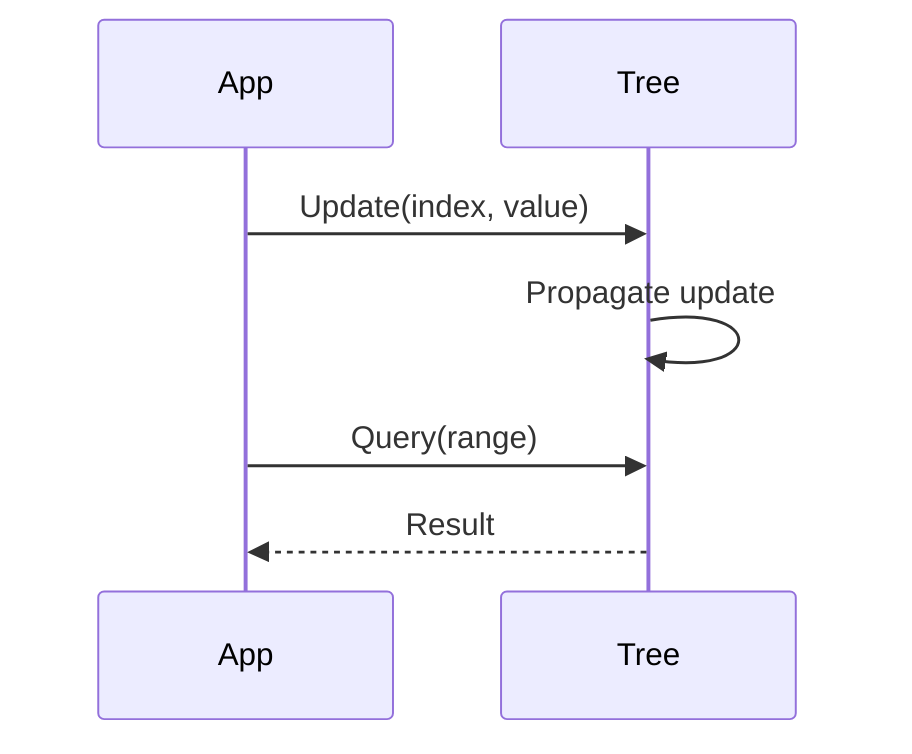

## Overview
Advanced data structures like segment trees, fenwick trees, and treaps optimize range queries and updates. They are crucial for competitive programming and low-latency systems.

## STAR Summary
**Situation:** Implementing range sum queries on large arrays in a trading system.  
**Task:** Achieve O(log n) updates and queries.  
**Action:** Used Fenwick tree for prefix sums.  
**Result:** Reduced query time from O(n) to O(log n), handling 1M updates/sec.

## Detailed Explanation
- **Segment Tree:** Tree for range min/max/sum queries, O(log n) time.
- **Fenwick Tree:** Binary indexed tree for prefix sums.
- **Treap:** Balanced BST with heap priorities.

Complexity: Build O(n), query/update O(log n).

## Real-world Examples & Use Cases
- Range queries in databases.
- Geometric computations.
- Competitive coding problems.

## Code Examples
### Fenwick Tree (Java)
```java
class FenwickTree {
    int[] tree;
    int n;

    FenwickTree(int size) {
        n = size;
        tree = new int[n + 1];
    }

    void update(int index, int val) {
        index++;
        while (index <= n) {
            tree[index] += val;
            index += index & -index;
        }
    }

    int query(int index) {
        index++;
        int sum = 0;
        while (index > 0) {
            sum += tree[index];
            index -= index & -index;
        }
        return sum;
    }
}
```

Run: Instantiate and use update/query.

## Data Models / Message Formats
| Structure | Operations | Time Complexity |
|-----------|------------|-----------------|
| Segment Tree | Range query, point update | O(log n) |
| Fenwick Tree | Prefix sum, point update | O(log n) |
| Treap | Insert, delete, search | O(log n) |

## Journey / Sequence


## Common Pitfalls & Edge Cases
- **1-based indexing:** Fenwick tree uses 1-based.
- **Overflow:** Handle large sums.
- **Lazy propagation:** For segment trees with range updates.

## Tools & Libraries
- **Java Collections:** For basic trees.
- **Guava:** Advanced collections.
- **Custom implementations:** For interviews.

## Github-README Links & Related Topics
Related: [algorithms-and-data-structures](../algorithms-and-data-structures/), [graphs-trees-heaps-and-tries](../graphs-trees-heaps-and-tries/), [dynamic-programming-and-greedy](../dynamic-programming-and-greedy/)

## References
- https://en.wikipedia.org/wiki/Fenwick_tree
- https://cp-algorithms.com/data_structures/segment_tree.html

## Common Interview Questions
1. Implement a Fenwick tree for range sum queries.
2. Solve range minimum query with segment tree.
3. Compare segment tree vs sparse table.