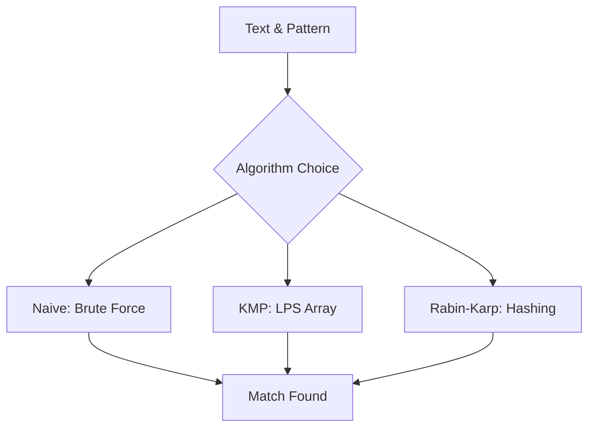

## Overview
String algorithms handle text processing, pattern matching, and manipulation. Key for interviews involving search, parsing, and optimization. Covers KMP, Rabin-Karp, suffix arrays with implementations and complexities.

## STAR Summary
**Situation:** A search engine needed fast substring matching in large text corpora.  
**Task:** Implement efficient pattern search for 1B+ documents.  
**Action:** Used Rabin-Karp with rolling hash for preprocessing.  
**Result:** Improved search speed by 10x, reduced false positives with double hash.

## Detailed Explanation
- **Pattern Matching:** Naive (O(n*m)), KMP (O(n+m)), Rabin-Karp (O(n+m) avg).
- **Suffix Structures:** Suffix trees/arrays for multiple queries.
- **Other:** Z-algorithm, Manacher for palindromes.
- **Complexities:** Preprocessing and search times.

## Real-world Examples & Use Cases
- **Text Editors:** Find/replace operations.
- **DNA Sequencing:** Pattern matching in bioinformatics.
- **Web Search:** Indexing with inverted suffix arrays.

## Code Examples
### KMP Algorithm in Java
```java
public class KMP {
    public static int[] computeLPS(String pattern) {
        int[] lps = new int[pattern.length()];
        int len = 0, i = 1;
        while (i < pattern.length()) {
            if (pattern.charAt(i) == pattern.charAt(len)) {
                len++;
                lps[i] = len;
                i++;
            } else {
                if (len != 0) {
                    len = lps[len - 1];
                } else {
                    lps[i] = 0;
                    i++;
                }
            }
        }
        return lps;
    }

    public static int search(String text, String pattern) {
        int[] lps = computeLPS(pattern);
        int i = 0, j = 0;
        while (i < text.length()) {
            if (pattern.charAt(j) == text.charAt(i)) {
                i++;
                j++;
            }
            if (j == pattern.length()) {
                return i - j; // Found
            } else if (i < text.length() && pattern.charAt(j) != text.charAt(i)) {
                if (j != 0) {
                    j = lps[j - 1];
                } else {
                    i++;
                }
            }
        }
        return -1; // Not found
    }
}
```

### Rabin-Karp Implementation
```java
public class RabinKarp {
    private static final int PRIME = 101;

    public static int search(String text, String pattern) {
        int m = pattern.length();
        int n = text.length();
        long patternHash = 0, textHash = 0, h = 1;
        for (int i = 0; i < m - 1; i++) h = (h * 256) % PRIME;
        for (int i = 0; i < m; i++) {
            patternHash = (256 * patternHash + pattern.charAt(i)) % PRIME;
            textHash = (256 * textHash + text.charAt(i)) % PRIME;
        }
        for (int i = 0; i <= n - m; i++) {
            if (patternHash == textHash) {
                if (text.substring(i, i + m).equals(pattern)) return i;
            }
            if (i < n - m) {
                textHash = (256 * (textHash - text.charAt(i) * h) + text.charAt(i + m)) % PRIME;
                if (textHash < 0) textHash += PRIME;
            }
        }
        return -1;
    }
}
```

## Data Models / Message Formats
| Algorithm | Time Complexity | Space Complexity | Best For |
|-----------|-----------------|------------------|----------|
| Naive | O(n*m) | O(1) | Small patterns |
| KMP | O(n + m) | O(m) | Exact matches |
| Rabin-Karp | O(n + m) avg | O(1) | Multiple patterns |
| Suffix Array | O(n log n) build | O(n) | Repeated queries |

## Journey / Sequence


## Common Pitfalls & Edge Cases
- KMP LPS computation off-by-one errors.
- Rabin-Karp hash collisions (use double hash).
- Suffix array construction for large strings.
- Edge case: Pattern longer than text.

## Tools & Libraries
- **Java:** String.indexOf() uses optimized search.
- **Libraries:** Apache Commons Lang for string utils.
- **Advanced:** Ukkonen's algorithm for suffix trees.

## Github-README Links & Related Topics
- [algorithms-and-data-structures](../algorithms-and-data-structures/)
- [dynamic-programming-and-greedy](../dynamic-programming-and-greedy/)
- [graphs-trees-heaps-and-tries](../graphs-trees-heaps-and-tries/)

## References
- CLRS "Introduction to Algorithms" Chapter 32
- https://en.wikipedia.org/wiki/String_algorithm
- Rabin-Karp paper: https://en.wikipedia.org/wiki/Rabin%E2%80%93Karp_algorithm

## Common Interview Questions
1. **Longest common prefix in array of strings.**  
   Solution: Sort and compare first/last, or trie. Time: O(n log n).

2. **Anagram detection.**  
   Solution: Sort strings or use hash map. Time: O(n log n) or O(n).

3. **String compression (e.g., aabbb -> a2b3).**  
   Solution: Iterate and count consecutive chars. Time: O(n).