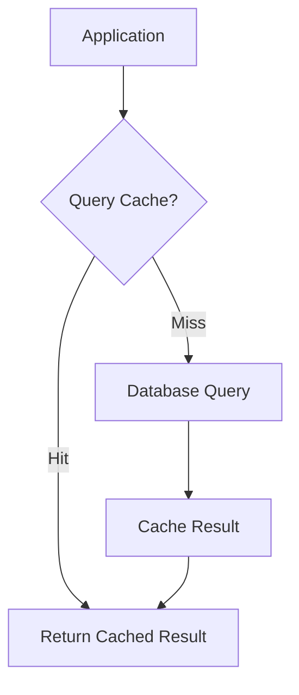

# Overview

Database Performance Tuning involves optimizing database systems to improve query response times, throughput, and resource utilization. This includes indexing strategies, query optimization, hardware tuning, and architectural decisions to handle high loads efficiently.

# Detailed Explanation

## Indexing Strategies

Indexes speed up data retrieval but can slow down writes. Choose appropriate index types (B-tree, Hash, etc.) based on query patterns.

## Query Optimization

- **EXPLAIN Plans**: Analyze query execution paths.
- **Avoid Full Table Scans**: Use WHERE clauses effectively.
- **Joins and Subqueries**: Optimize join orders and use appropriate join types.

## Normalization vs. Denormalization

- **Normalization**: Reduces redundancy but may require more joins.
- **Denormalization**: Improves read performance at the cost of write complexity.

## Caching and Connection Pooling

Use in-memory caches (Redis) and connection pools to reduce database load.



# Real-world Examples & Use Cases

- **E-commerce Site**: Optimize product search queries with full-text indexes.
- **Analytics Dashboard**: Use materialized views for complex aggregations.
- **High-Traffic API**: Implement read replicas and caching for user data.

# Code Examples

## Creating an Index (SQL)

```sql
CREATE INDEX idx_user_email ON users (email);
```

## Query Optimization with EXPLAIN (PostgreSQL)

```sql
EXPLAIN ANALYZE
SELECT * FROM orders WHERE customer_id = 123 AND status = 'pending';
```

## Connection Pooling Configuration (Java with HikariCP)

```java
HikariConfig config = new HikariConfig();
config.setJdbcUrl("jdbc:postgresql://localhost:5432/mydb");
config.setUsername("user");
config.setPassword("password");
config.setMaximumPoolSize(10);
HikariDataSource ds = new HikariDataSource(config);
```

## Denormalization Example

```sql
-- Normalized
SELECT u.name, o.total FROM users u JOIN orders o ON u.id = o.user_id;

-- Denormalized (if reads >> writes)
ALTER TABLE orders ADD COLUMN user_name VARCHAR(255);
```

# Common Pitfalls & Edge Cases

- **Over-Indexing**: Too many indexes increase write overhead.
- **Ignoring Execution Plans**: Always analyze slow queries.
- **Lock Contention**: Use appropriate isolation levels.
- **Scaling Bottlenecks**: Monitor I/O, CPU, and memory usage.

# Tools & Libraries

- **Database Profilers**: pg_stat_statements for PostgreSQL.
- **ORM Tools**: Hibernate with query optimization.
- **Monitoring**: Prometheus with database exporters.

# References

- [PostgreSQL Performance Tuning](https://www.postgresql.org/docs/current/performance-tips.html)
- [MySQL Optimization](https://dev.mysql.com/doc/refman/8.0/en/optimization.html)
- [Database Indexing](https://use-the-index-luke.com/)

# Github-README Links & Related Topics

- [Database Indexing Strategies](../database-indexing-strategies/)
- [Caching](../caching/)
- [Database Connection Pooling](../database-connection-pooling/)
- [Monitoring and Logging](../monitoring-and-logging/)