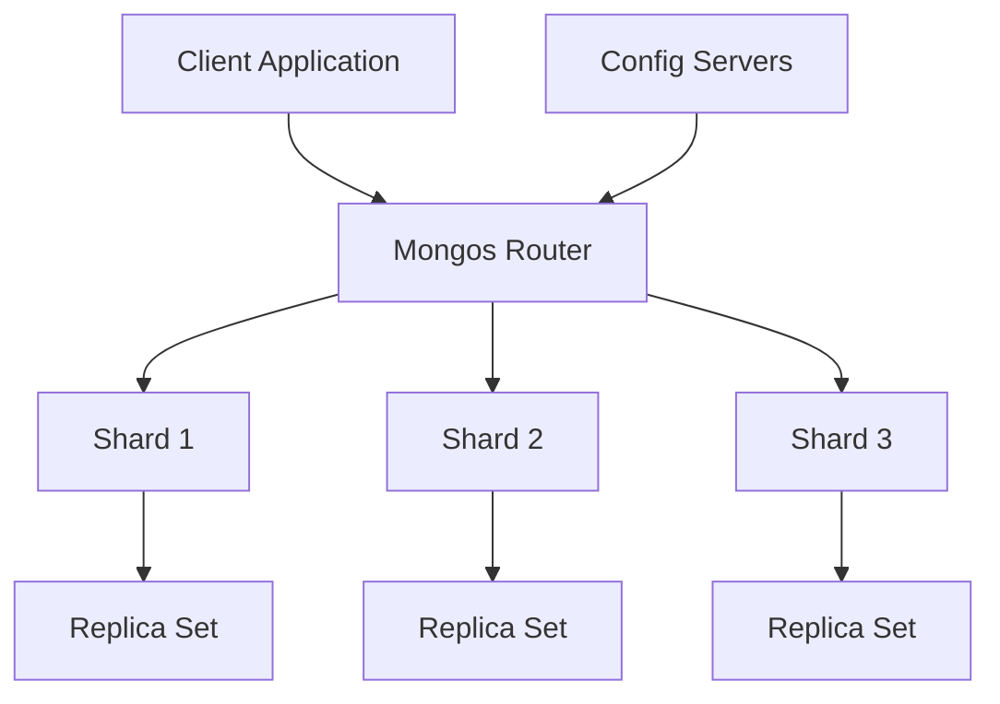
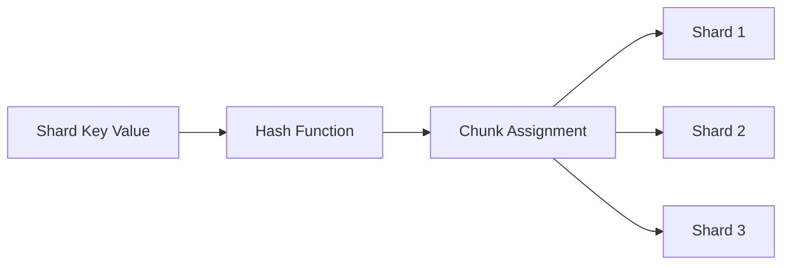
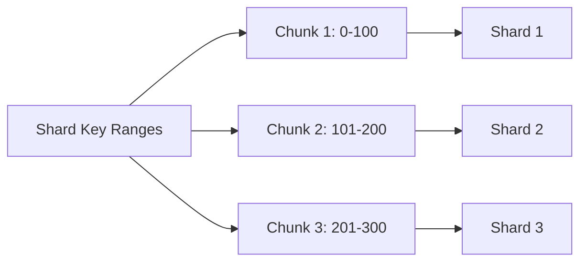

# Overview

Database sharding is a horizontal scaling technique that distributes data across multiple database instances (shards) to improve performance, availability, and storage capacity. By partitioning data based on a shard key, sharding enables systems to handle massive datasets and high-throughput workloads that exceed the limits of a single server. This approach contrasts with vertical scaling, which relies on upgrading hardware, and is essential for building scalable distributed systems.

# Detailed Explanation

Sharding involves splitting a database into smaller, manageable pieces called shards, each residing on separate servers. Data is partitioned using a shard key—a field or combination of fields that determines data distribution. Shards operate independently, allowing parallel processing of reads and writes.

## Key Components of a Sharded Cluster

A typical sharded cluster includes:
- **Shards**: Replica sets containing subsets of data.
- **Mongos (Query Routers)**: Route queries to appropriate shards.
- **Config Servers**: Store cluster metadata and configuration.



## Sharding Strategies

MongoDB supports two primary strategies: hashed and ranged sharding. The choice depends on query patterns, data distribution needs, and scalability goals.

### 1. Hashed Sharding
Data is distributed using a hash function on the shard key, ensuring even distribution even for monotonically increasing keys (e.g., timestamps). This minimizes hotspots but can lead to scatter-gather queries for range-based operations.



**Advantages**:
- Even data distribution.
- Scales well for write-heavy workloads.

**Disadvantages**:
- Inefficient for range queries.

### 2. Ranged Sharding
Data is partitioned into contiguous ranges based on shard key values. Ideal for queries filtering on key ranges, but risks uneven distribution if keys are not well-chosen.



**Advantages**:
- Efficient range queries.
- Predictable data locality.

**Disadvantages**:
- Potential for hotspots if ranges are imbalanced.

### Comparison Table

| Strategy       | Data Distribution | Query Efficiency | Use Case                  |
|----------------|-------------------|------------------|---------------------------|
| Hashed        | Even              | Poor for ranges | High write throughput     |
| Ranged        | Range-based       | Good for ranges | Analytical queries        |

## Zones and Data Locality
Zones associate shard key ranges with specific shards, enabling geographic or hardware-based data placement for compliance or performance.

# Real-world Examples & Use Cases

- **MongoDB Atlas**: Uses hashed sharding for global deployments, handling petabytes of data in applications like e-commerce.
- **Facebook**: Shards user data across thousands of MySQL instances using user ID ranges for efficient friend lookups.
- **Twitter**: Employs sharding for tweet storage, distributing by user ID to manage billions of posts.
- **Uber**: Shards ride data geographically to optimize latency in location-based queries.

Use cases include:
- Social networks with user-generated content.
- IoT platforms with time-series data.
- Financial systems requiring high availability.

# Code Examples

## MongoDB Sharding Setup (Shell Commands)

```bash
# Enable sharding on database
sh.enableSharding("mydb")

# Shard a collection with hashed key
sh.shardCollection("mydb.users", { "_id": "hashed" })

# Shard with ranged key
sh.shardCollection("mydb.orders", { "order_date": 1 })
```

## Java Example: Simple Hash Sharding Logic

```java
import java.util.List;

public class ShardRouter {
    private List<String> shards;

    public ShardRouter(List<String> shards) {
        this.shards = shards;
    }

    public String getShard(String key) {
        int hash = key.hashCode();
        int index = Math.abs(hash) % shards.size();
        return shards.get(index);
    }

    // Usage
    public static void main(String[] args) {
        List<String> shards = List.of("shard1", "shard2", "shard3");
        ShardRouter router = new ShardRouter(shards);
        System.out.println(router.getShard("user123")); // Outputs shard based on hash
    }
}
```

This code demonstrates basic routing; in production, use libraries like MongoDB's Java driver for full sharding support.

# References

- [MongoDB Sharding Documentation](https://docs.mongodb.com/manual/sharding/)
- [Wikipedia: Shard (database architecture)](https://en.wikipedia.org/wiki/Shard_(database_architecture))
- [Consistent Hashing for Sharding](https://en.wikipedia.org/wiki/Consistent_hashing)
- [Facebook's Sharding at Scale](https://www.facebook.com/notes/facebook-engineering/sharding-and-replication-at-facebook/10150547593205920/)

# Github-README Links & Related Topics

- [Replication vs Sharding vs Partitioning](../replication-vs-sharding-vs-partitioning/)
- [Database Indexing Strategies](../database-indexing-strategies/)
- [Load Balancing and Strategies](../load-balancing-and-strategies/)
- [Distributed Systems Basics](../lld-hld-basics/)
- [CAP Theorem and Distributed Systems](../cap-theorem-and-distributed-systems/)

# STAR Summary

**Situation**: Handling exponential data growth in a monolithic database leading to performance bottlenecks.  
**Task**: Implement horizontal scaling to distribute load.  
**Action**: Chose hashed sharding for even distribution, deployed on MongoDB with zones for geo-locality.  
**Result**: Achieved 10x throughput, reduced query latency by 50%, and ensured 99.9% uptime.

# Common Pitfalls & Edge Cases

- **Poor Shard Key Selection**: Monotonic keys cause hotspots; test with real data.
- **Cross-Shard Queries**: Avoid scatter-gather; design queries around shard keys.
- **Rebalancing Overhead**: Large migrations during resharding; plan during low-traffic periods.
- **Edge Case**: Missing shard keys default to null, potentially clustering data.
- **Migration Failures**: Ensure backups; use tools like MongoDB's resharding for zero-downtime.

# Tools & Libraries

- **MongoDB**: Native sharding with Atlas UI.
- **Vitess**: MySQL sharding framework by PlanetScale.
- **Apache ShardingSphere**: Java-based sharding proxy.
- **Redis Cluster**: Built-in sharding for key-value stores.
- **AWS RDS with Aurora**: Managed sharding for PostgreSQL/MySQL.