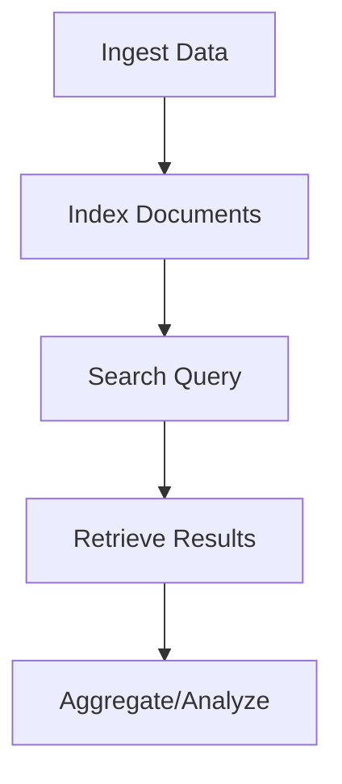

# Overview

Elasticsearch is a distributed, RESTful search and analytics engine capable of addressing a growing number of use cases. As the heart of the Elastic Stack, it centrally stores your data for lightning-fast search, fine‑tuned relevancy, and powerful analytics that scale with ease.

# Detailed Explanation

Elasticsearch is built on Apache Lucene and provides a distributed, multitenant-capable full-text search engine with an HTTP web interface and schema-free JSON documents. It supports full-text search, aggregations, geospatial search, and more.

Key concepts:

- **Index**: A collection of documents
- **Document**: A JSON object containing data
- **Shard**: A subset of an index
- **Query DSL**: JSON-based query language

## Search Process



# Real-world Examples & Use Cases

- **E-commerce Search**: Product search with filters and facets
- **Log Analysis**: Searching through application logs
- **Content Management**: Full-text search in documents
- **Analytics**: Real-time data analysis and visualization
- **Security**: Threat hunting and anomaly detection

# Code Examples

## Basic Search Query

```json
GET /_search
{
  "query": {
    "match": {
      "title": "elasticsearch"
    }
  }
}
```

## Aggregations

```json
GET /sales/_search
{
  "size": 0,
  "aggs": {
    "total_sales": {
      "sum": {
        "field": "amount"
      }
    }
  }
}
```

## Python Client Example

```python
from elasticsearch import Elasticsearch

es = Elasticsearch()

# Index a document
es.index(index='test-index', id=1, body={'title': 'Test Document', 'content': 'This is a test'})

# Search
results = es.search(index='test-index', body={'query': {'match': {'title': 'test'}}})
print(results)
```

# References

- [Elasticsearch Documentation](https://www.elastic.co/guide/en/elasticsearch/reference/current/search-your-data.html)
- [Query DSL](https://www.elastic.co/guide/en/elasticsearch/reference/current/query-dsl.html)
- [Python Client](https://elasticsearch-py.readthedocs.io/)

# Github-README Links & Related Topics

- [Elasticsearch GitHub](https://github.com/elastic/elasticsearch)
- [Kibana](kibana/)
- [Logstash](logstash/)