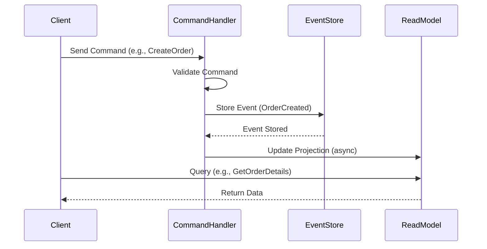

## Overview

Event Sourcing is an architectural pattern that stores the state of an application as a sequence of immutable events. Instead of updating the current state directly, changes are captured as events that can be replayed to reconstruct the state at any point in time. CQRS (Command Query Responsibility Segregation) is a complementary pattern that separates the responsibilities of handling commands (write operations) from queries (read operations), often used together with Event Sourcing for better scalability and performance.

## Detailed Explanation

### Event Sourcing
- **Event Store**: A database or storage system that persists events in chronological order.
- **Aggregates**: Domain objects that encapsulate state and behavior, emitting events when state changes.
- **Event Replay**: To reconstruct the current state, replay all events from the beginning.
- **Benefits**: Full audit trail, time travel debugging, decoupling of reads and writes.
- **Challenges**: Eventual consistency, increased storage needs, complexity in handling event versioning.

### CQRS
- **Command Side**: Handles create, update, delete operations. Validates commands and emits events.
- **Query Side**: Optimized for reads, often using denormalized data structures like read models or projections.
- **Separation**: Allows independent scaling of read and write workloads.
- **Integration with Event Sourcing**: Events from the command side update the query side asynchronously.

## Journey / Sequence



## Data Models / Message Formats

### Event Structure
```json
{
  "eventId": "uuid",
  "eventType": "OrderCreated",
  "aggregateId": "order-123",
  "timestamp": "2025-09-25T10:00:00Z",
  "payload": {
    "customerId": "cust-456",
    "items": [{"productId": "prod-789", "quantity": 2}]
  }
}
```

### Command Structure
```json
{
  "commandId": "uuid",
  "commandType": "CreateOrder",
  "aggregateId": "order-123",
  "payload": {
    "customerId": "cust-456",
    "items": [{"productId": "prod-789", "quantity": 2}]
  }
}
```

## Real-world Examples & Use Cases

- **Banking Systems**: Maintain immutable transaction logs for compliance and auditing. Reconstruct account balances by replaying events.
- **E-commerce Platforms**: Track order lifecycle (created, paid, shipped) as events. Use CQRS to separate order processing (writes) from order history views (reads).
- **Inventory Management**: Events like "StockReceived", "StockSold" allow rebuilding inventory levels and analyzing trends.
- **Collaborative Applications**: Like Google Docs, where changes are events that can be replayed for conflict resolution.

## Code Examples

### Simple Event Sourcing in Java

```java
import java.util.ArrayList;
import java.util.List;
import java.util.UUID;

// Event base class
abstract class Event {
    public final String eventId;
    public final String aggregateId;
    public final long timestamp;

    public Event(String aggregateId) {
        this.eventId = UUID.randomUUID().toString();
        this.aggregateId = aggregateId;
        this.timestamp = System.currentTimeMillis();
    }
}

// Specific event
class OrderCreatedEvent extends Event {
    public final String customerId;
    public final List<String> items;

    public OrderCreatedEvent(String aggregateId, String customerId, List<String> items) {
        super(aggregateId);
        this.customerId = customerId;
        this.items = items;
    }
}

// Aggregate
class OrderAggregate {
    private String id;
    private String status = "pending";
    private List<Event> uncommittedEvents = new ArrayList<>();

    public OrderAggregate(String id) {
        this.id = id;
    }

    public void createOrder(String customerId, List<String> items) {
        OrderCreatedEvent event = new OrderCreatedEvent(id, customerId, items);
        apply(event);
        uncommittedEvents.add(event);
    }

    private void apply(Event event) {
        if (event instanceof OrderCreatedEvent) {
            status = "created";
        }
    }

    public List<Event> getUncommittedEvents() {
        return uncommittedEvents;
    }

    public void markCommitted() {
        uncommittedEvents.clear();
    }
}

// Event Store (simplified)
class EventStore {
    private List<Event> events = new ArrayList<>();

    public void save(List<Event> events) {
        this.events.addAll(events);
    }

    public List<Event> getEvents(String aggregateId) {
        return events.stream()
                .filter(e -> e.aggregateId.equals(aggregateId))
                .toList();
    }
}

// Usage
public class Main {
    public static void main(String[] args) {
        EventStore store = new EventStore();
        OrderAggregate order = new OrderAggregate("order-123");
        order.createOrder("cust-456", List.of("item1", "item2"));
        store.save(order.getUncommittedEvents());
        order.markCommitted();
    }
}
```

### CQRS with Projections

```java
// Read Model
class OrderReadModel {
    public String orderId;
    public String status;
    public String customerId;
    public List<String> items;
}

// Projection Service
class OrderProjection {
    private Map<String, OrderReadModel> readModels = new HashMap<>();

    public void apply(Event event) {
        if (event instanceof OrderCreatedEvent) {
            OrderCreatedEvent e = (OrderCreatedEvent) event;
            OrderReadModel model = new OrderReadModel();
            model.orderId = e.aggregateId;
            model.status = "created";
            model.customerId = e.customerId;
            model.items = e.items;
            readModels.put(e.aggregateId, model);
        }
    }

    public OrderReadModel getOrder(String orderId) {
        return readModels.get(orderId);
    }
}
```

## Common Pitfalls & Edge Cases

- **Event Versioning**: Handle schema changes in events without breaking replay.
- **Eventual Consistency**: Reads may lag behind writes; design for it.
- **Performance**: Replaying large event streams; use snapshots.
- **Concurrency**: Handle concurrent commands on the same aggregate.
- **Data Corruption**: Ensure event immutability and integrity.

## Tools & Libraries

- **Axon Framework**: For Java, provides CQRS and Event Sourcing support.
- **EventStoreDB**: Specialized database for event sourcing.
- **Akka Persistence**: For Scala/Java, actor-based event sourcing.

## References

- [Event Sourcing - Martin Fowler](https://martinfowler.com/eaaDev/EventSourcing.html)
- [CQRS - Microsoft Azure Patterns](https://docs.microsoft.com/en-us/azure/architecture/patterns/cqrs)
- [Event Sourcing and CQRS - Greg Young](https://www.youtube.com/watch?v=JHGkaShoyNs)

## Github-README Links & Related Topics

- [System Design Basics](../system-design-basics/README.md)
- [CAP Theorem & Distributed Systems](../cap-theorem-and-distributed-systems/README.md)
- [Microservices Architecture](../microservices-architecture/README.md)
- [Data Consistency Models](../data-consistency-models/README.md)