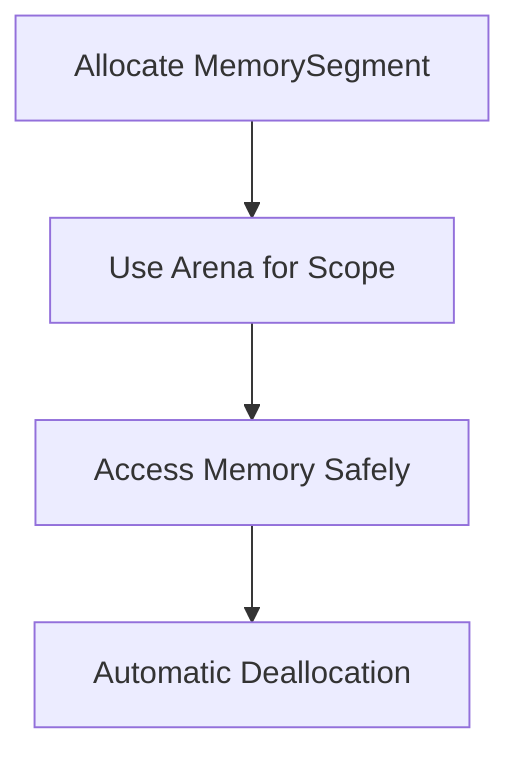

# Java Foreign Function & Memory API

## Overview

The Foreign Function & Memory API (FFM API) enables Java programs to interoperate with code and data outside the Java runtime, such as native libraries and managed memory. Introduced in Java 22 as a preview, it's part of Project Panama.

## Detailed Explanation

FFM API provides safe and efficient access to foreign memory and functions. It replaces JNI for better performance and safety.

Key components:
- MemorySegment: Represents contiguous memory regions
- MemoryLayout: Describes memory structure
- Linker: Loads and links native functions
- Arena: Manages memory lifecycle

### Memory Management



## Real-world Examples & Use Cases

- Calling C libraries from Java (e.g., OpenSSL, SQLite)
- High-performance data processing with off-heap memory
- Interfacing with GPUs or specialized hardware
- Legacy system integration

## Code Examples

### Calling Native Function

```java
import java.lang.foreign.*;

public class NativeCall {
    public static void main(String[] args) {
        try (Arena arena = Arena.ofConfined()) {
            Linker linker = Linker.nativeLinker();
            SymbolLookup stdlib = linker.defaultLookup();
            MemorySegment printf = stdlib.find("printf").orElseThrow();
            
            FunctionDescriptor desc = FunctionDescriptor.ofVoid(ValueLayout.ADDRESS);
            MethodHandle handle = linker.downcallHandle(printf, desc);
            
            MemorySegment message = arena.allocateUtf8String("Hello, World!\n");
            handle.invoke(message);
        } catch (Throwable e) {
            e.printStackTrace();
        }
    }
}
```

### Memory Allocation

```java
try (Arena arena = Arena.ofConfined()) {
    MemorySegment segment = arena.allocate(100); // 100 bytes
    // Use segment...
}
```

## References

- [Oracle FFM API Guide](https://docs.oracle.com/en/java/javase/22/core/foreign-function-and-memory-api.html)
- [Project Panama JEP 454](https://openjdk.org/jeps/454)

## Github-README Links & Related Topics

- [JVM Internals & Class Loading](../jvm-internals-and-class-loading/README.md)
- [Java Security Basics](../java-security-basics/README.md)
- [File I/O and NIO](../file-io-nio/README.md)