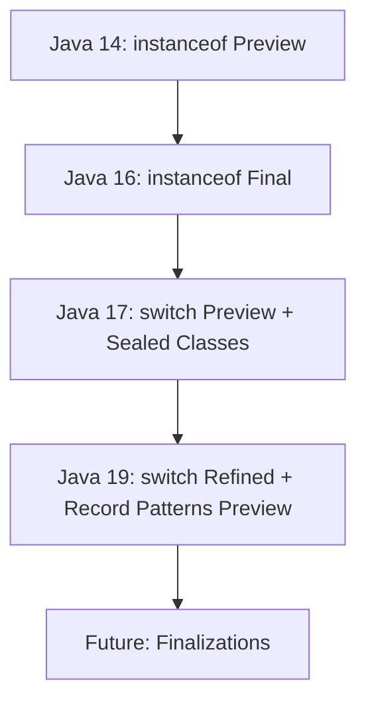

# Java Pattern Matching

## Overview

Pattern matching in Java allows for more concise and safe code by enabling conditional extraction of components from objects. Introduced as a preview feature in Java 14 and finalized in subsequent versions, it enhances the `instanceof` operator, extends `switch` expressions and statements, and supports record patterns for deconstructing data.

Key features include:
- **Pattern Matching for `instanceof`**: Simplifies type checking and casting (Java 14 preview, finalized in 16).
- **Pattern Matching for `switch`**: Allows patterns in `case` labels for multi-way branching (Java 17 preview, refined in 19).
- **Record Patterns**: Deconstructs record instances into their components (Java 19 preview).

These features reduce boilerplate, improve readability, and minimize errors compared to traditional `if-else` chains or explicit casts.

## Detailed Explanation

### Pattern Matching for `instanceof`

Introduced in Java 14 as a preview and finalized in Java 16, this extends the `instanceof` operator to take a *type pattern* instead of just a type. A type pattern consists of a type and a pattern variable.

When `instanceof` matches, it performs the cast and assigns the result to the pattern variable, which is then in scope.

**Syntax**: `obj instanceof Type var`

**Scope**: The pattern variable is flow-sensitive; it's only accessible where the match is guaranteed.

### Pattern Matching for `switch`

Previewed in Java 17 and refined in Java 19, this allows `case` labels to use patterns, not just constants. The selector can be any reference type, and patterns can be type patterns, record patterns, or guarded patterns.

**Key Concepts**:
- **Type Patterns**: Match based on type.
- **Guarded Patterns**: Refine matches with boolean expressions (`pattern && condition`).
- **Null Handling**: `case null` explicitly handles null values.
- **Exhaustiveness**: Switch expressions must cover all possible values; for sealed classes, the compiler verifies this.

**Syntax**: `switch (obj) { case Pattern -> action; ... }`

### Record Patterns

Introduced as a preview in Java 19, record patterns deconstruct record instances by matching against their components. They can be nested and used in `instanceof` or `switch`.

**Syntax**: `RecordType(componentPattern1, componentPattern2, ...)`

**Inference**: Type arguments can be inferred; use `var` for component types.

**Null**: Does not match null.

### Evolution Across Versions

| Feature | Java 14 | Java 16 | Java 17 | Java 19 |
|---------|---------|---------|---------|--------|
| `instanceof` Pattern Matching | Preview | Final | - | - |
| `switch` Pattern Matching | - | - | Preview | Refined Preview |
| Record Patterns | - | - | - | Preview |
| Sealed Classes (Related) | - | - | Final | - |



## Real-world Examples & Use Cases

- **Data Processing**: Simplify parsing JSON-like structures or handling polymorphic data.
- **Error Handling**: Replace verbose `if-else` chains in exception handling or state machines.
- **API Design**: Cleaner code in libraries dealing with variant types, e.g., shapes, expressions, or configurations.
- **Refactoring**: Modernize legacy codebases by reducing casts and improving type safety.

For instance, in a graphics library, pattern matching can elegantly handle different shape types without manual casting.

## Code Examples

### Pattern Matching for `instanceof`

```java
// Before Java 16
if (obj instanceof String) {
    String s = (String) obj;
    System.out.println(s.length());
}

// Java 16+
if (obj instanceof String s) {
    System.out.println(s.length());
}
```

### Pattern Matching for `switch`

```java
sealed interface Shape permits Circle, Rectangle {}
record Circle(double radius) implements Shape {}
record Rectangle(double width, double height) implements Shape {}

static double area(Shape shape) {
    return switch (shape) {
        case Circle c -> Math.PI * c.radius() * c.radius();
        case Rectangle r -> r.width() * r.height();
    };
}
```

### Record Patterns

```java
record Point(int x, int y) {}

static void print(Object obj) {
    if (obj instanceof Point(var x, var y)) {
        System.out.println("x: " + x + ", y: " + y);
    }
}

// Nested
record ColoredPoint(Point p, String color) {}

static void printColor(Object obj) {
    if (obj instanceof ColoredPoint(Point(var x, var y), var c)) {
        System.out.println("Color at (" + x + "," + y + "): " + c);
    }
}
```

### Guarded Patterns

```java
static void classify(Object obj) {
    switch (obj) {
        case String s && s.length() > 5 -> System.out.println("Long string");
        case String s -> System.out.println("Short string");
        default -> System.out.println("Not a string");
    }
}
```

## References

- [JEP 305: Pattern Matching for instanceof (Preview)](https://openjdk.org/jeps/305)
- [JEP 394: Pattern Matching for instanceof](https://openjdk.org/jeps/394)
- [JEP 406: Pattern Matching for switch (Preview)](https://openjdk.org/jeps/406)
- [JEP 440: Record Patterns](https://openjdk.org/jeps/440)
- [Oracle Java Documentation: Pattern Matching](https://docs.oracle.com/en/java/javase/19/language/pattern-matching.html)
- [Oracle Java Documentation: Records](https://docs.oracle.com/en/java/javase/19/language/records.html)

## Github-README Links & Related Topics

- [Java Records](../java-records/)
- [Java Sealed Classes](../java-sealed-classes/)
- [Java Switch Expressions](../java-switch-expressions/)
- [OOP Principles in Java](../oop-principles-in-java/)

## Common Pitfalls & Edge Cases

- **Scope Issues**: Pattern variables are flow-scoped; accessing them outside guaranteed match blocks causes errors.
- **Null Handling**: `switch` throws `NullPointerException` unless `case null` is present.
- **Exhaustiveness**: Incomplete switches in expressions cause compile errors; add `default` or ensure sealed hierarchies.
- **Dominance**: Later patterns must not dominate earlier ones in `switch`.
- **Generic Records**: Use explicit types in record patterns; raw types are disallowed.
- **Performance**: Pattern matching can optimize to O(1) in switches, but chained `if` remains O(n).