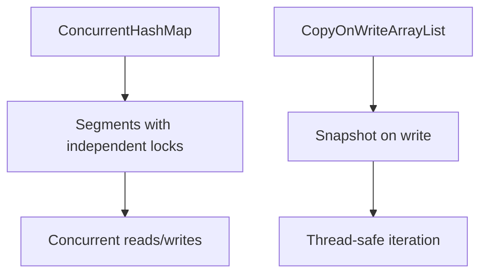

# Overview

Thread-safe collections in Java enable safe concurrent access and modification, preventing race conditions and data corruption in multi-threaded applications. Essential for building scalable concurrent systems.

Canonical Interview Prompt: Compare ConcurrentHashMap with synchronized HashMap and explain their use cases in high-concurrency scenarios.

# Detailed Explanation

## High-Level Design

Concurrent collections use advanced locking mechanisms like lock striping (ConcurrentHashMap divides the map into segments) and optimistic operations to allow multiple threads to access data simultaneously without blocking.



## Key Classes and Mechanisms

- **ConcurrentHashMap**: Provides thread-safe operations with high concurrency. Uses lock striping to allow concurrent updates to different segments.
- **ConcurrentSkipListMap/Set**: Sorted concurrent maps and sets using skip lists.
- **CopyOnWriteArrayList/Set**: Ideal for read-heavy workloads; creates a new copy on modification.
- **BlockingQueue implementations**: ArrayBlockingQueue, LinkedBlockingQueue for producer-consumer patterns.

## Capacity and Throughput Targets

- ConcurrentHashMap: Supports thousands of concurrent operations per second, scaling better than synchronized collections.
- CopyOnWriteArrayList: High read throughput but expensive writes; suitable for <1000 modifications per second.

## Tradeoffs

- **Performance vs Thread-Safety**: Concurrent collections trade some performance for safety compared to unsynchronized ones.
- **Memory Overhead**: CopyOnWrite collections use more memory due to copying.
- **Consistency**: Weakly consistent iterators may not reflect latest changes.

# Real-world Examples & Use Cases

- **Web Caching**: ConcurrentHashMap for in-memory caches in web servers handling multiple requests.
- **Event Processing**: BlockingQueues in message-driven systems for decoupling producers and consumers.
- **Configuration Management**: CopyOnWriteArrayList for dynamic configuration lists read by many threads.

# Code Examples

**ConcurrentHashMap Usage:**

```java
import java.util.concurrent.ConcurrentHashMap;

ConcurrentHashMap<String, Integer> cache = new ConcurrentHashMap<>();
cache.put("user1", 100);

// Concurrent put and get
cache.computeIfAbsent("user2", k -> 200);
Integer score = cache.get("user1");
```

**CopyOnWriteArrayList for Read-Heavy Scenarios:**

```java
import java.util.concurrent.CopyOnWriteArrayList;

CopyOnWriteArrayList<String> listeners = new CopyOnWriteArrayList<>();
listeners.add("listener1");

// Safe iteration without external synchronization
for (String listener : listeners) {
    // Notify listener
}
```

**BlockingQueue for Producer-Consumer:**

```java
import java.util.concurrent.ArrayBlockingQueue;
import java.util.concurrent.BlockingQueue;

BlockingQueue<String> queue = new ArrayBlockingQueue<>(10);
queue.put("task1"); // Producer
String task = queue.take(); // Consumer
```

# Data Models / Message Formats

**ConcurrentHashMap Entry:**

Key-value pairs with segment-based locking.

**Queue Element:**

Arbitrary objects, often POJOs or commands.

# Common Pitfalls & Edge Cases

- **Iterator Consistency**: Iterators may not reflect concurrent modifications; use forEach or external locking if needed.
- **Size() Method**: ConcurrentHashMap.size() is approximate; avoid relying on exact counts in loops.
- **Null Values**: ConcurrentHashMap allows null keys/values, but be cautious as it can lead to ambiguities.

# Tools & Libraries

- Java Util Concurrent package
- Guava's concurrent utilities for additional features

# Github-README Links & Related Topics

[java-memory-model-and-concurrency](../java-memory-model-and-concurrency/README.md), [threads-executors-futures](../threads-executors-futures/README.md), [collections-framework](../collections-framework/README.md)

# References

- https://docs.oracle.com/javase/8/docs/api/java/util/concurrent/ConcurrentHashMap.html
- https://www.baeldung.com/java-concurrent-collections
- https://docs.oracle.com/javase/tutorial/essential/concurrency/collections.html