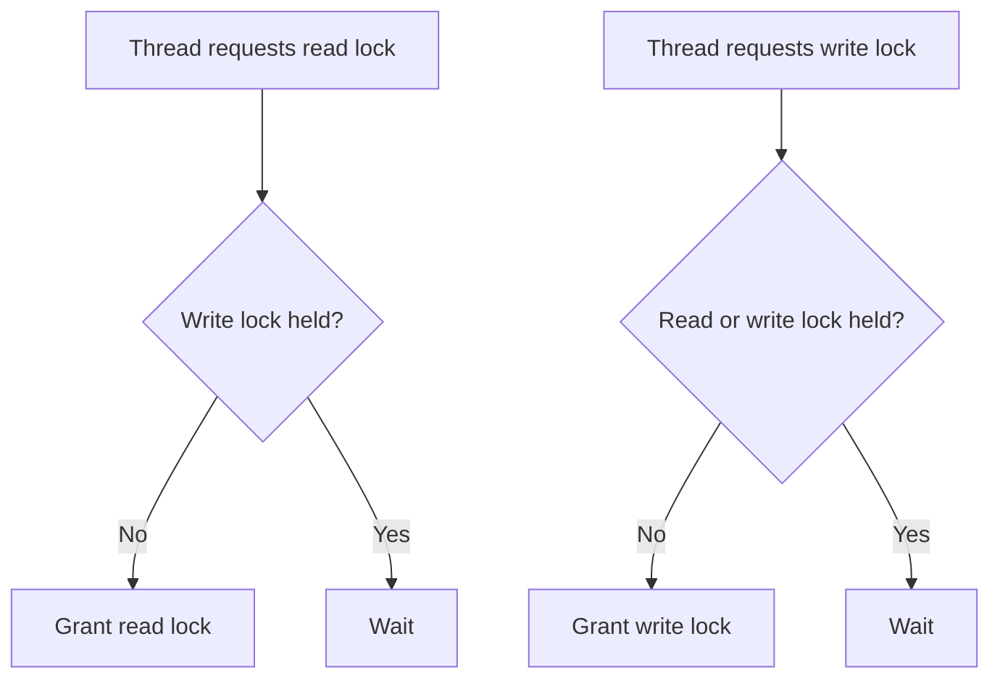

# Java ReadWriteLock

## Overview

Java ReadWriteLock is a synchronization mechanism that allows multiple threads to read a shared resource concurrently while ensuring exclusive access for write operations. It improves performance in scenarios where reads are more frequent than writes.

## Detailed Explanation

ReadWriteLock provides two locks: a read lock and a write lock. Multiple threads can acquire the read lock simultaneously, but the write lock is exclusive. If a thread holds the write lock, no other thread can acquire either read or write lock.

Key methods:
- `readLock().lock()`: Acquires the read lock.
- `readLock().unlock()`: Releases the read lock.
- `writeLock().lock()`: Acquires the write lock.
- `writeLock().unlock()`: Releases the write lock.



## Real-world Examples & Use Cases

- Caching systems where reads are frequent and writes are rare.
- Configuration management in applications.
- Database connection pools.

## Code Examples

```java
import java.util.concurrent.locks.ReadWriteLock;
import java.util.concurrent.locks.ReentrantReadWriteLock;

public class ReadWriteLockExample {
    private final ReadWriteLock lock = new ReentrantReadWriteLock();
    private int value = 0;

    public int readValue() {
        lock.readLock().lock();
        try {
            return value;
        } finally {
            lock.readLock().unlock();
        }
    }

    public void writeValue(int newValue) {
        lock.writeLock().lock();
        try {
            value = newValue;
        } finally {
            lock.writeLock().unlock();
        }
    }
}
```

## References

- [Oracle JavaDoc: ReadWriteLock](https://docs.oracle.com/javase/8/docs/api/java/util/concurrent/locks/ReadWriteLock.html)
- [Java Concurrency in Practice - Chapter 13](https://www.amazon.com/Java-Concurrency-Practice-Brian-Goetz/dp/0321349601)

## Github-README Links & Related Topics

- [java-reentrantlock](java-reentrantlock/README.md)
- [java-volatile-keyword](java-volatile-keyword/README.md)
- [Multithreading & Concurrency in Java](../multithreading-and-concurrency-in-java/README.md)