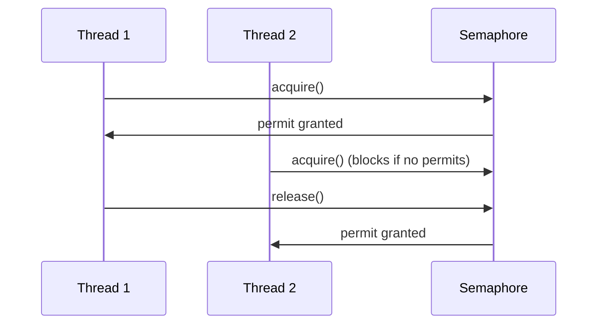

# Overview

A counting semaphore. Conceptually, a semaphore maintains a set of permits. Each `acquire()` blocks if necessary until a permit is available, and then takes it. Each `release()` adds a permit, potentially releasing a blocking acquirer. However, no actual permit objects are used; the `Semaphore` just keeps a count of the number available and acts accordingly.

# Detailed Explanation

Semaphores are often used to restrict the number of threads than can access some (physical or logical) resource. For example, controlling access to a pool of items.

A semaphore initialized to one, and which is used such that it only has at most one permit available, can serve as a mutual exclusion lock. This is more commonly known as a *binary semaphore*.

The constructor optionally accepts a *fairness* parameter. When set false, this class makes no guarantees about the order in which threads acquire permits. When fairness is set true, the semaphore guarantees that threads invoking acquire methods are selected in the order in which their invocation was processed (FIFO).

## Constructors

- `Semaphore(int permits)`: Creates with nonfair fairness.
- `Semaphore(int permits, boolean fair)`: Creates with specified fairness.

## Key Methods

- `void acquire()`: Acquires a permit.
- `void acquire(int permits)`: Acquires multiple.
- `void release()`: Releases a permit.
- `void release(int permits)`: Releases multiple.
- `boolean tryAcquire()`: Tries to acquire without blocking.
- `boolean tryAcquire(long timeout, TimeUnit unit)`: With timeout.
- `int availablePermits()`: Returns available permits.
- `boolean isFair()`: Checks fairness.

# Real-world Examples & Use Cases

- Resource pool: Limiting concurrent access to a database connection pool.
- Rate limiting: Controlling the number of requests to a service.
- Producer-consumer: Limiting buffer size.

# Code Examples

```java
import java.util.concurrent.Semaphore;

class Pool {
    private static final int MAX_AVAILABLE = 100;
    private final Semaphore available = new Semaphore(MAX_AVAILABLE, true);

    public Object getItem() throws InterruptedException {
        available.acquire();
        return getNextAvailableItem();
    }

    public void putItem(Object x) {
        if (markAsUnused(x))
            available.release();
    }
}
```

Binary semaphore example:

```java
Semaphore binary = new Semaphore(1);
binary.acquire();
// critical section
binary.release();
```

# References

- [Oracle Java Docs: Semaphore](https://docs.oracle.com/javase/8/docs/api/java/util/concurrent/Semaphore.html)

# Github-README Links & Related Topics

- [Java CyclicBarrier](java-cyclicbarrier/)
- [Java CountDownLatch](java-countdownlatch/)
- [Multithreading & Concurrency in Java](multithreading-and-concurrency-in-java/)

# Common Pitfalls & Edge Cases

- Starvation: In non-fair mode, threads may starve.
- Indefinite postponement: Multiple acquires without fairness can lead to indefinite wait.
- Negative permits: Constructor allows negative, but releases needed first.

# Tools & Libraries

- Java Standard Library: java.util.concurrent.Semaphore

