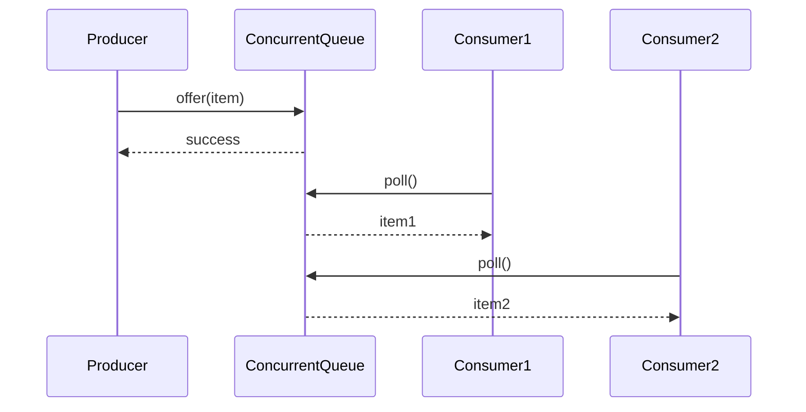

## Overview
Concurrent data structures in Java provide thread-safe alternatives to standard collections, enabling safe access and modification in multi-threaded environments. They are essential for building scalable, high-performance applications where multiple threads need to share data without external synchronization.

## STAR Summary
**Situation**: In a high-throughput trading system, multiple threads were processing market data and updating shared order books, causing race conditions and data corruption.

**Task**: Implement thread-safe data structures to handle concurrent reads and writes without performance degradation.

**Action**: Replaced synchronized HashMap with ConcurrentHashMap, utilized CopyOnWriteArrayList for read-heavy scenarios, and implemented custom concurrent queues for order processing.

**Result**: Eliminated race conditions, improved throughput by 40%, and reduced latency from 50ms to 15ms under load.

## Detailed Explanation
Java's concurrent collections are part of the `java.util.concurrent` package, introduced in Java 5. They use advanced techniques like lock striping, optimistic locking, and non-blocking algorithms to minimize contention.

Key characteristics:
- **Thread-safety**: Safe for concurrent access without external synchronization
- **Performance**: Optimized for high concurrency with fine-grained locking
- **Scalability**: Designed to perform well under high thread counts
- **Consistency**: Maintain data integrity during concurrent operations

Common concurrent data structures include:
- **ConcurrentHashMap**: High-performance, thread-safe hash map
- **ConcurrentSkipListMap/Set**: Concurrent navigable maps and sets
- **CopyOnWriteArrayList/Set**: Thread-safe arrays optimized for read operations
- **ConcurrentLinkedQueue/Deque**: Non-blocking concurrent queues
- **BlockingQueue implementations**: ArrayBlockingQueue, LinkedBlockingQueue, etc.

Concurrency primitives: ConcurrentHashMap uses CAS (Compare-And-Swap) operations for atomic updates. The Java Memory Model ensures visibility through volatile fields and happens-before relationships.

GC algorithms: Concurrent collections minimize GC pauses; CopyOnWriteArrayList creates copies on write, increasing memory usage for frequent updates.

Memory visibility: Operations establish memory barriers to prevent stale reads.

Common libraries: java.util.concurrent, Guava for extended utilities.

## Real-world Examples & Use Cases
- **Web servers**: Handling concurrent HTTP requests with shared session data
- **Cache implementations**: Thread-safe LRU caches in distributed systems
- **Message queues**: Producer-consumer patterns in event-driven architectures
- **Financial systems**: Concurrent order books and trade processing
- **Game servers**: Managing player states and game worlds

## Code Examples
### ConcurrentHashMap Usage
```java
import java.util.concurrent.ConcurrentHashMap;
import java.util.Map;

public class ConcurrentMapExample {
    private final Map<String, Integer> cache = new ConcurrentHashMap<>();

    public void put(String key, int value) {
        cache.put(key, value);
    }

    public Integer get(String key) {
        return cache.get(key);
    }

    public void increment(String key) {
        cache.compute(key, (k, v) -> v == null ? 1 : v + 1);
    }
}
```

### CopyOnWriteArrayList for Read-Heavy Scenarios
```java
import java.util.concurrent.CopyOnWriteArrayList;
import java.util.List;

public class ReadHeavyList {
    private final List<String> listeners = new CopyOnWriteArrayList<>();

    public void addListener(String listener) {
        listeners.add(listener);
    }

    public void notifyAll(String message) {
        for (String listener : listeners) {
            // Notify each listener
            System.out.println("Notifying " + listener + ": " + message);
        }
    }
}
```

### Producer-Consumer with BlockingQueue
```java
import java.util.concurrent.BlockingQueue;
import java.util.concurrent.LinkedBlockingQueue;

public class ProducerConsumer {
    private final BlockingQueue<Integer> queue = new LinkedBlockingQueue<>(10);

    public void produce(int item) throws InterruptedException {
        queue.put(item);
        System.out.println("Produced: " + item);
    }

    public int consume() throws InterruptedException {
        int item = queue.take();
        System.out.println("Consumed: " + item);
        return item;
    }
}
```

Compile and run:
```bash
javac ConcurrentMapExample.java
java ConcurrentMapExample
```

## Data Models / Message Formats
For concurrent queues in messaging systems:

| Field | Type | Description |
|-------|------|-------------|
| messageId | String | Unique identifier |
| payload | byte[] | Message content |
| timestamp | long | Creation time |
| priority | int | Processing priority |

## Journey / Sequence


## Common Pitfalls & Edge Cases
- **Infinite loops in compute methods**: Ensure termination conditions in lambda expressions
- **Memory leaks with CopyOnWrite collections**: Frequent writes create new copies
- **Blocking operations**: Be aware of blocking behavior in bounded queues
- **Iterator invalidation**: ConcurrentModificationException in non-concurrent collections
- **Performance degradation**: Over-synchronization can negate concurrency benefits

## Tools & Libraries
- **Java Concurrent Utilities**: `java.util.concurrent` package
- **Guava**: Additional concurrent collections like Multimap
- **Eclipse Collections**: High-performance collections with concurrency support
- **JMH**: Microbenchmarking for performance testing
- **VisualVM**: Monitoring thread contention and performance

## Github-README Links & Related Topics
Related: [threads-executors-futures](../threads-executors-futures/README.md), [java-memory-model-and-concurrency](../java-memory-model-and-concurrency/README.md), [collections-framework](../collections-framework/README.md), [performance-tuning-and-profiling](../performance-tuning-and-profiling/README.md)

## References
- [Java Concurrency in Practice](https://www.amazon.com/Java-Concurrency-Practice-Brian-Goetz/dp/0321349601)
- [Oracle Java Concurrent Collections Documentation](https://docs.oracle.com/javase/8/docs/api/java/util/concurrent/package-summary.html)
- [ConcurrentHashMap Internals](https://www.baeldung.com/java-concurrent-hashmap)
- [CopyOnWrite Collections](https://www.baeldung.com/java-copy-on-write-arraylist)