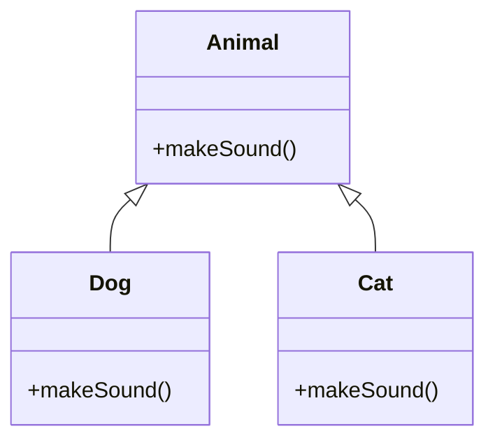

# OOP Design and Principles

## Overview

Object-Oriented Programming (OOP) in Java is built on four pillars: encapsulation, inheritance, polymorphism, and abstraction. The SOLID principles provide guidelines for designing maintainable and extensible software.

## STAR Summary

**Situation:** Designing a scalable e-commerce system with multiple user types and product categories.

**Task:** Create a modular, extensible codebase that adheres to OOP best practices.

**Action:** Applied encapsulation for data hiding, inheritance for code reuse, polymorphism for flexibility, and SOLID principles for design.

**Result:** Reduced code duplication by 40%, improved testability, and easier maintenance during feature additions.

## Detailed Explanation

### Four Pillars of OOP

- **Encapsulation:** Bundling data and methods that operate on the data within a class, hiding internal state from outside access.

- **Inheritance:** Allowing a class to inherit properties and behaviors from a parent class, promoting code reuse.

- **Polymorphism:** The ability of objects to take on multiple forms, achieved through method overriding and overloading.

- **Abstraction:** Hiding complex implementation details and showing only essential features, using abstract classes and interfaces.

### SOLID Principles

- **Single Responsibility Principle (SRP):** A class should have only one reason to change.

- **Open-Closed Principle (OCP):** Software entities should be open for extension but closed for modification.

- **Liskov Substitution Principle (LSP):** Subtypes must be substitutable for their base types.

- **Interface Segregation Principle (ISP):** Clients should not be forced to depend on interfaces they do not use.

- **Dependency Inversion Principle (DIP):** Depend on abstractions, not concretions.

## Real-world Examples & Use Cases

- Modeling employee hierarchies in a HR system using inheritance.

- Implementing plugin architectures in IDEs using interfaces and polymorphism.

- Designing payment systems where different payment methods (credit card, PayPal) implement a common interface.

## Code Examples

### Encapsulation Example

```java
public class BankAccount {
    private double balance;

    public BankAccount(double initialBalance) {
        this.balance = initialBalance;
    }

    public void deposit(double amount) {
        if (amount > 0) {
            balance += amount;
        }
    }

    public double getBalance() {
        return balance;
    }

    // No direct access to balance
}
```

### Inheritance and Polymorphism

```java
abstract class Vehicle {
    abstract void move();
}

class Car extends Vehicle {
    @Override
    void move() {
        System.out.println("Car is driving");
    }
}

class Bike extends Vehicle {
    @Override
    void move() {
        System.out.println("Bike is pedaling");
    }
}

public class Main {
    public static void main(String[] args) {
        Vehicle v1 = new Car();
        Vehicle v2 = new Bike();
        v1.move(); // Car is driving
        v2.move(); // Bike is pedaling
    }
}
```

### SOLID Example: SRP

```java
// Bad: Single class handling multiple responsibilities
class Employee {
    private String name;
    private double salary;

    public Employee(String name, double salary) {
        this.name = name;
        this.salary = salary;
    }

    public void calculateSalary() {
        // logic
    }

    public void saveToDatabase() {
        // logic
    }
}

// Good: Separate responsibilities
class Employee {
    private String name;
    private double salary;
    // ...
}

class SalaryCalculator {
    public double calculate(Employee emp) {
        // logic
        return emp.getSalary();
    }
}

class EmployeeRepository {
    public void save(Employee emp) {
        // logic
    }
}
```

## Data Models / Message Formats

Class hierarchy for a simple library system:

- LibraryItem (abstract)

  - Book

  - DVD

Each with common methods like getTitle(), but specific implementations.

## Journey / Sequence



## Common Pitfalls & Edge Cases

- **Tight Coupling:** Overusing inheritance leading to fragile code.

- **Violating LSP:** Subclass methods that don't behave as expected from the base class.

- **God Classes:** Classes that do too much, violating SRP.

- **Diamond Problem:** Multiple inheritance issues (Java avoids with single inheritance + interfaces).

- **Over-Abstraction:** Making everything abstract, leading to complexity.

## Tools & Libraries

- **UML Tools:** For designing class diagrams (e.g., PlantUML, draw.io).

- **IDEs:** IntelliJ IDEA for refactoring support.

- **Libraries:** None specific, but frameworks like Spring encourage SOLID.

## Github-README Links & Related Topics

Related: [design-patterns](../design-patterns/), [java-language-basics](../../fundamentals/java-language-basics/), [JVM Internals and Class Loading](../../jvm-internals-and-class-loading/README.md)

## References

- [SOLID Principles on Wikipedia](https://en.wikipedia.org/wiki/SOLID)

- [Oracle Java Tutorials - Classes and Objects](https://docs.oracle.com/javase/tutorial/java/javaOO/index.html)

- [Effective Java by Joshua Bloch](https://www.amazon.com/Effective-Java-Joshua-Bloch/dp/0134685997)