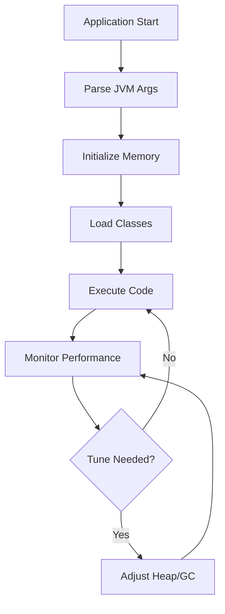

# Overview

JVM performance tuning involves optimizing Java Virtual Machine settings for better application performance, focusing on heap sizing, garbage collection tuning, and low-latency configurations. Key areas include memory management, GC algorithm selection, and JVM flags that minimize pause times and maximize throughput. In high-performance systems, tuning can reduce GC pauses from seconds to milliseconds, critical for real-time applications.

Interview questions often cover heap sizing formulas, GC logs analysis, and choosing between throughput vs. low-latency collectors.

# Detailed Explanation

JVM memory is divided into heap (managed by GC) and non-heap (metaspace, code cache). Heap sizing uses formulas like:

- Initial heap: -Xms = 1/64 of physical memory (min 32MB)
- Max heap: -Xmx = 1/4 of physical memory
- Young generation: 1/3 to 1/2 of heap

GC tuning involves selecting algorithms:
- **Serial GC**: Single-threaded, for small apps
- **Parallel GC**: Multi-threaded throughput
- **CMS**: Concurrent, low pause (deprecated)
- **G1**: Regional, predictable pauses
- **ZGC/Shenandoah**: Ultra-low pause, large heaps



# Real-world Examples & Use Cases

- **Low-latency trading systems**: Use ZGC with 10ms max pauses
- **Big data processing**: G1 for large heaps with predictable pauses
- **Web servers**: Parallel GC for high throughput
- **Microservices**: CMS/G1 for reduced pause times

| Scenario | Recommended GC | Key Flags |
|----------|----------------|-----------|
| High Throughput | Parallel | -XX:+UseParallelGC |
| Low Latency | ZGC | -XX:+UseZGC |
| Large Heap | G1 | -XX:+UseG1GC |
| Small Apps | Serial | -XX:+UseSerialGC |

# Code Examples

### Heap Sizing Script (Bash)

```bash
#!/bin/bash
# Calculate JVM heap sizes
PHYSICAL_MEMORY=$(free -m | awk 'NR==2{printf "%.0f", $2}')
INITIAL_HEAP=$(( PHYSICAL_MEMORY / 64 ))
MAX_HEAP=$(( PHYSICAL_MEMORY / 4 ))

echo "-Xms${INITIAL_HEAP}m -Xmx${MAX_HEAP}m"
```

### GC Tuning Flags (Java)

```java
// Example JVM args for low-latency app
public class GCTuning {
    public static void main(String[] args) {
        // Run with: java -XX:+UseZGC -Xms1g -Xmx4g -XX:ZAllocationSpikeTolerance=5 GCTuning
        System.out.println("JVM tuned for low latency");
    }
}
```

### GC Log Analysis (Java)

```java
import java.lang.management.*;

public class GCLogger {
    public static void main(String[] args) {
        // Run with: java -XX:+PrintGCDetails -XX:+PrintGCTimeStamps GCLogger
        ManagementFactory.getGarbageCollectorMXBeans().forEach(gc -> {
            System.out.println("GC: " + gc.getName() + ", Collections: " + gc.getCollectionCount());
        });
    }
}
```

# Common Pitfalls & Edge Cases

- **Heap too small**: Frequent GC, poor throughput
- **Heap too large**: Long GC pauses, memory waste
- **Wrong GC choice**: Parallel for latency-sensitive apps causes pauses
- **Metaspace leaks**: Class loading without bounds
- **Thread stack size**: Too small causes StackOverflow

# Tools & Libraries

- **JVisualVM**: GUI monitoring
- **JMC (Java Mission Control)**: Advanced profiling
- **GCViewer**: Analyze GC logs
- **Async Profiler**: Low-overhead profiling

# References

- [JVM Performance Tuning Guide](https://docs.oracle.com/en/java/javase/17/gctuning/)
- [Garbage Collection Tuning](https://www.oracle.com/technetwork/java/javase/gc-tuning-5-138395.html)
- [ZGC: A Scalable Low-Latency Garbage Collector](https://openjdk.java.net/jeps/333)

# Github-README Links & Related Topics

- [JVM Internals](../jvm-internals-and-class-loading/README.md)
- [Garbage Collection](../garbage-collection-algorithms/README.md)
- [Java Memory Management](../java-memory-management/README.md)