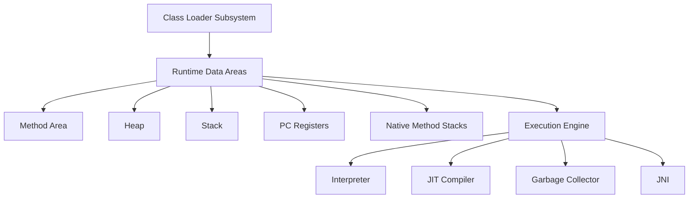

# Overview

The Java Virtual Machine (JVM) is the cornerstone of the Java platform, providing a runtime environment that executes Java bytecode. It abstracts the underlying hardware and operating system, enabling "write once, run anywhere" capability. The JVM handles memory management, garbage collection, and just-in-time compilation for optimal performance.

# Detailed Explanation

The JVM architecture comprises several key components that work together to execute Java programs:

1. **Class Loader Subsystem**: Loads, links, and initializes classes and interfaces.
2. **Runtime Data Areas**: Memory areas allocated at runtime.
   - **Method Area**: Stores class-level information, constants, and static variables.
   - **Heap**: Stores objects and instance variables.
   - **Stack**: Stores local variables and method calls (one per thread).
   - **PC Registers**: Holds the address of the current instruction (one per thread).
   - **Native Method Stacks**: Supports native methods written in languages like C/C++.
3. **Execution Engine**: Interprets or compiles bytecode into machine code.
   - **Interpreter**: Executes bytecode line by line.
   - **JIT Compiler**: Compiles frequently executed bytecode into native code for better performance.
   - **Garbage Collector**: Automatically manages memory by reclaiming unused objects.
4. **Java Native Interface (JNI)**: Allows Java code to call native methods and vice versa.



# Real-world Examples & Use Cases

- **Enterprise Applications**: JVM powers large-scale applications like banking systems and e-commerce platforms, ensuring consistent performance across different environments.
- **Android Development**: Android's ART (Android Runtime) is based on JVM principles, allowing Java code to run on mobile devices.
- **Big Data Processing**: Frameworks like Apache Spark run on JVM, handling massive datasets with efficient memory management.
- **Microservices**: JVM's portability enables deploying Java-based microservices in containers across cloud platforms.

# Code Examples

## Basic JVM Execution

```java
public class HelloWorld {
    public static void main(String[] args) {
        System.out.println("Hello, JVM!");
    }
}
```

Compile and run:
```bash
javac HelloWorld.java
java HelloWorld
```

## Memory Management Example

```java
public class MemoryDemo {
    public static void main(String[] args) {
        // Object created in Heap
        String message = new String("Hello, Heap!");
        System.out.println(message);
        
        // Local variable in Stack
        int localVar = 42;
        System.out.println(localVar);
    }
}
```

# References

- [Oracle JVM Specification](https://docs.oracle.com/javase/specs/jvms/se21/html/)
- [OpenJDK Documentation](https://openjdk.org/)
- [JVM Internals](https://shipilev.net/jvm/)

# Github-README Links & Related Topics

- [java-fundamentals](./java-fundamentals/)
- [garbage-collection-algorithms](./garbage-collection-algorithms/)
- [java-memory-management](./java-memory-management/)
- [jvm-internals-and-class-loading](./jvm-internals-and-class-loading/)
