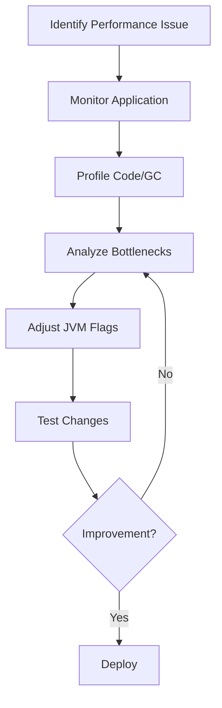

## Overview

Performance tuning in Java applications involves optimizing JVM parameters, garbage collection strategies, memory management, and code-level improvements to enhance throughput, reduce latency, and minimize resource usage. Key areas include heap sizing, GC algorithm selection, profiling, and avoiding common pitfalls like inefficient data structures or excessive object creation. Effective tuning requires data-driven decisions using benchmarks and monitoring tools.

## Detailed Explanation

### JVM Ergonomics and Defaults
Java's HotSpot VM uses ergonomics to automatically select optimal settings based on system capabilities. For server-class machines (≥2 CPUs, ≥2GB RAM), it defaults to the parallel GC, server compiler, and heap sizes of 1/64th to 1/4th of physical memory.

### Garbage Collection Tuning
GC is critical for performance. Common collectors:
- **Serial GC**: Single-threaded, suitable for small apps.
- **Parallel GC**: Multi-threaded throughput-oriented.
- **CMS (Concurrent Mark Sweep)**: Low-pause, concurrent.
- **G1 GC**: Region-based, balances throughput and pauses.

Key parameters:
- `-Xms` and `-Xmx`: Initial and max heap size.
- `-Xmn`: Young generation size.
- `-XX:SurvivorRatio`: Eden to survivor space ratio.
- `-XX:MaxTenuringThreshold`: Object promotion age.

### Memory Management
- **Heap Sizing**: Avoid over-sizing to prevent paging. Young gen should be 1/3 to 1/2 of total heap.
- **Off-Heap Memory**: Use direct buffers for I/O to reduce GC pressure.
- **Object Allocation**: Minimize temporary objects; reuse via object pools.

### Profiling and Monitoring
Use tools like VisualVM, JConsole, or commercial profilers (e.g., JProfiler) to identify bottlenecks. Enable GC logging with `-XX:+PrintGCDetails -XX:+PrintGCTimeStamps`.

### Code-Level Optimizations
- Prefer primitive types over wrappers.
- Use efficient collections (e.g., ArrayList over LinkedList for random access).
- Avoid string concatenation in loops; use StringBuilder.
- Leverage NIO for I/O operations.
- Use concurrency utilities (e.g., ExecutorService) for multi-threading.

### Tuning Process Flow


## Real-world Examples & Use Cases

- **Web Applications**: Tune heap for high concurrency; use G1 GC to minimize pauses during peak loads.
- **Batch Processing**: Optimize for throughput with parallel GC; increase young gen to handle large datasets.
- **Microservices**: Low-latency services benefit from CMS or G1; monitor with distributed tracing.
- **Big Data Apps**: Avoid full GC pauses by sizing heaps appropriately and using off-heap storage.

## Code Examples

### Inefficient String Concatenation
```java
// Before: Creates many temporary objects
String result = "";
for (String s : list) {
    result += s;  // Inefficient
}
```

```java
// After: Use StringBuilder
StringBuilder sb = new StringBuilder();
for (String s : list) {
    sb.append(s);
}
String result = sb.toString();
```

### Collection Optimization
```java
// Before: LinkedList for frequent access
List<String> list = new LinkedList<>();
for (int i = 0; i < 1000; i++) {
    list.add("item" + i);
}
String item = list.get(500);  // O(n) access
```

```java
// After: ArrayList for O(1) access
List<String> list = new ArrayList<>();
for (int i = 0; i < 1000; i++) {
    list.add("item" + i);
}
String item = list.get(500);  // O(1) access
```

### JVM Flags Example
```bash
java -Xmx4g -Xms4g -Xmn2g -XX:+UseG1GC -XX:MaxGCPauseMillis=200 -XX:+PrintGCDetails MyApp
```

## References

- [Oracle Java Tuning White Paper](https://www.oracle.com/technetwork/java/tuning-139912.html)
- [Java HotSpot VM Options](https://www.oracle.com/java/technologies/javase/vmoptions-jsp.html)
- [Garbage Collection Tuning Guide](https://docs.oracle.com/javase/8/docs/technotes/guides/vm/gctuning/)
- [Baeldung Java Performance Tuning](https://www.baeldung.com/java-performance-tuning)

## Github-README Links & Related Topics

- [Java Memory Management](../java-memory-management/)
- [GC Tuning](../gc-tuning/)
- [JVM Internals and Class Loading](../jvm-internals-and-class-loading/)
- [Java Multithreading and Concurrency](../java-multithreading-and-concurrency/)
- [Java Collections Deep Dive](../java-collections-deep-dive/)

## Common Pitfalls & Edge Cases

- **Microbenchmarking Traps**: Use JMH for accurate measurements; avoid warming-up issues.
- **GC Overhead**: Excessive GC time (>98%) triggers OutOfMemoryError; increase heap or switch collectors.
- **Memory Leaks**: Monitor heap growth; use profilers to detect retained objects.
- **Thread Contention**: High lock contention; consider lock-free data structures.
- **Large Objects**: Humongous allocations in G1 can cause fragmentation.

## Tools & Libraries

- **Monitoring**: JConsole, VisualVM, JMX.
- **Profiling**: Async Profiler, JProfiler, YourKit.
- **Benchmarking**: JMH (Java Microbenchmark Harness).
- **Libraries**: Apache Commons Pool for object pooling; Netty for high-performance I/O.