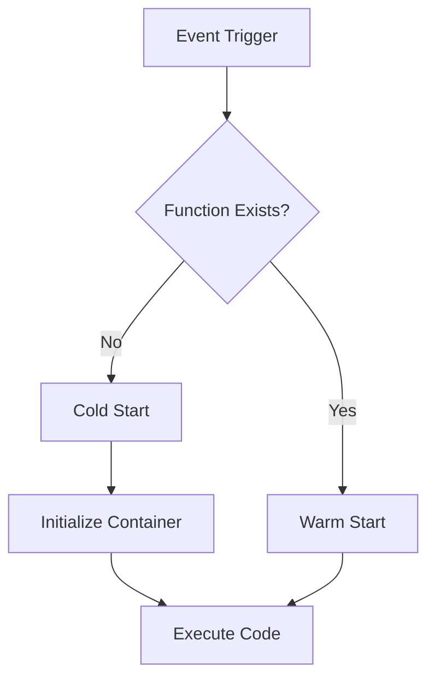

# Overview

AWS Lambda is a serverless compute service that runs code in response to events without provisioning or managing servers. Serverless computing abstracts infrastructure management, allowing developers to focus on code while AWS handles scaling, patching, and administration.

# Detailed Explanation

## Lambda Functions

- **Execution Model**: Code runs in stateless containers triggered by events.
- **Runtimes**: Supports languages like Python, Node.js, Java, etc.
- **Limits**: 15-minute timeout, 10 GB RAM, 6 MB payload.

## Event Sources

- **API Gateway**: HTTP requests trigger functions.
- **S3**: Object uploads/downloads.
- **DynamoDB**: Table changes.
- **CloudWatch**: Scheduled events or logs.

## Cold Starts and Performance

Cold start occurs when a new container is initialized. Mitigate with provisioned concurrency.



# Real-world Examples & Use Cases

- **Image Processing**: Resize images uploaded to S3 using Lambda.
- **Data Processing**: Process streaming data from Kinesis.
- **API Backends**: Build RESTful APIs with API Gateway and Lambda.
- **Scheduled Tasks**: Run periodic jobs like database cleanup.

# Code Examples

## Simple Lambda Function (Python)

```python
import json

def lambda_handler(event, context):
    return {
        'statusCode': 200,
        'body': json.dumps('Hello from Lambda!')
    }
```

## S3 Trigger Configuration

```json
{
  "LambdaFunctionConfigurations": [
    {
      "Id": "s3-lambda-trigger",
      "LambdaFunctionArn": "arn:aws:lambda:us-east-1:123456789012:function:my-function",
      "Events": ["s3:ObjectCreated:*"],
      "Filter": {
        "Key": {
          "FilterRules": [
            {
              "Name": "suffix",
              "Value": ".jpg"
            }
          ]
        }
      }
    }
  ]
}
```

## API Gateway Integration

```yaml
# SAM template snippet
Resources:
  MyFunction:
    Type: AWS::Serverless::Function
    Properties:
      CodeUri: .
      Handler: app.lambda_handler
      Runtime: python3.9
      Events:
        Api:
          Type: Api
          Properties:
            Path: /hello
            Method: get
```

# Common Pitfalls & Edge Cases

- **Cold Start Latency**: Optimize for performance-critical apps.
- **State Management**: Avoid storing state in functions; use external services.
- **Cost Monitoring**: Watch invocation counts and duration.
- **Security**: Use IAM roles and VPC configurations appropriately.

# Tools & Libraries

- **AWS CLI**: Command-line tool for AWS services.
- **AWS SAM**: Framework for building serverless applications.
- **Serverless Framework**: Open-source framework for serverless deployments.

# References

- [AWS Lambda Documentation](https://docs.aws.amazon.com/lambda/)
- [Serverless Computing](https://aws.amazon.com/serverless/)
- [AWS SAM](https://aws.amazon.com/serverless/sam/)

# Github-README Links & Related Topics

- [Serverless Architecture](../serverless-architecture/)
- [Cloud Deployment Strategies](../cloud-deployment-strategies/)
- [API Gateway Design](../api-gateway-design/)
- [Event-Driven Systems](../event-driven-systems/)