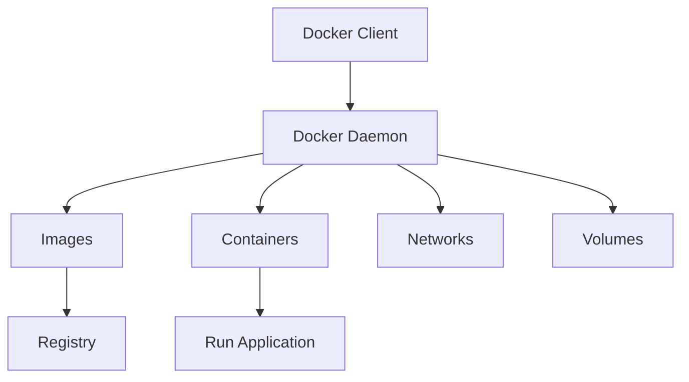

## Overview

Docker is an open platform for developing, shipping, and running applications in containers. It enables separation of applications from infrastructure, delivering software quickly. Containers are lightweight, executable packages that include everything needed to run an application, ensuring consistency across development, testing, and production environments.

## Detailed Explanation

Docker uses a client-server architecture with the Docker daemon managing containers, images, networks, and volumes. Key components include:

- **Containers**: Isolated processes running applications with their dependencies. Self-contained, isolated, independent, and portable.
- **Images**: Read-only templates with instructions for creating containers, composed of immutable layers.
- **Dockerfile**: A script defining steps to build an image.
- **Registries**: Centralized repositories for storing and sharing images, such as Docker Hub.
- **Docker Compose**: A tool for defining and running multi-container applications.

Docker leverages Linux namespaces and cgroups for isolation, making containers more efficient than virtual machines by sharing the host kernel.

### Containers vs. Virtual Machines

| Aspect          | Containers                          | Virtual Machines                     |
|-----------------|-------------------------------------|--------------------------------------|
| Isolation      | Process-level via namespaces       | Full OS-level via hypervisor        |
| Resource Usage | Lightweight, shares host kernel     | Heavier, includes guest OS          |
| Startup Time   | Seconds                            | Minutes                             |
| Portability    | Highly portable across environments| Tied to hypervisor compatibility    |



## Real-world Examples & Use Cases

- **Microservices Architecture**: Deploy and scale individual services independently in containers.
- **CI/CD Pipelines**: Automate building, testing, and deploying applications in isolated environments.
- **Development Environments**: Ensure consistent setups across team members, reducing "works on my machine" issues.
- **Legacy Application Migration**: Containerize monolithic apps for easier management and deployment.
- **Edge Computing**: Run lightweight applications on resource-constrained devices.

## Code Examples

### Building and Running a Simple Node.js Application

1. Create a `Dockerfile`:

```dockerfile
# syntax=docker/dockerfile:1

FROM node:lts-alpine
WORKDIR /app
COPY package*.json ./
RUN npm install
COPY . .
EXPOSE 3000
CMD ["npm", "start"]
```

2. Build the image:

```bash
docker build -t my-node-app .
```

3. Run the container:

```bash
docker run -d -p 3000:3000 my-node-app
```

### Multi-Container Application with Docker Compose

Create a `docker-compose.yml`:

```yaml
version: '3.8'
services:
  web:
    build: .
    ports:
      - "3000:3000"
    depends_on:
      - db
  db:
    image: postgres:13
    environment:
      POSTGRES_DB: mydb
      POSTGRES_USER: user
      POSTGRES_PASSWORD: password
    volumes:
      - db_data:/var/lib/postgresql/data

volumes:
  db_data:
```

Run with:

```bash
docker-compose up -d
```

### Pushing to a Registry

```bash
docker tag my-node-app username/my-node-app:v1.0
docker push username/my-node-app:v1.0
```

## Docker Interview Concepts

### CMD, RUN, and ENTRYPOINT
- RUN executes command(s) in a new layer and creates a new image. E.g., it is often used for installing software packages.
- CMD sets default command and/or parameters, which can be overwritten from command line when docker container runs.
- ENTRYPOINT command and parameters will not be overwritten from command line. Instead, all command line arguments will be added after ENTRYPOINT parameters.

## References

- [Docker Overview](https://docs.docker.com/get-started/overview/)
- [What is a Container?](https://docs.docker.com/get-started/docker-concepts/the-basics/what-is-a-container/)
- [What is an Image?](https://docs.docker.com/get-started/docker-concepts/the-basics/what-is-an-image/)
- [What is a Registry?](https://docs.docker.com/get-started/docker-concepts/the-basics/what-is-a-registry/)
- [What is a Dockerfile?](https://docs.docker.com/get-started/docker-concepts/the-basics/what-is-a-dockerfile/)
- [What is Docker Compose?](https://docs.docker.com/get-started/docker-concepts/the-basics/what-is-docker-compose/)
- [Containerize an Application](https://docs.docker.com/get-started/workshop/02_our_app/)

## Github-README Links & Related Topics

- [Docker Best Practices](../docker-best-practices/README.md)
- [Docker Compose Best Practices](../docker-compose-best-practices/README.md)
- [Container Orchestration](../container-orchestration/README.md)
- [Kubernetes](../container-orchestration-with-kubernetes/README.md)
- [CI/CD Pipelines](../ci-cd-pipelines/README.md)