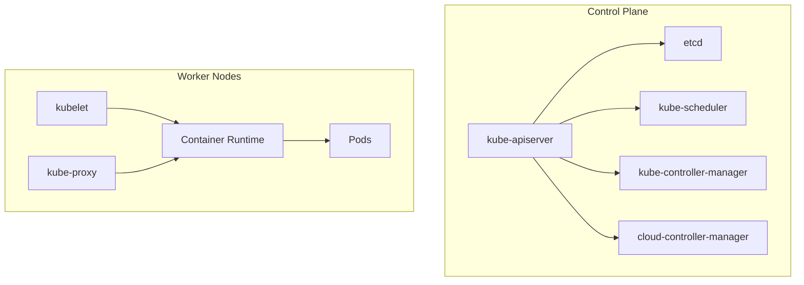

# Overview

Kubernetes (K8s) is a portable, extensible, open-source platform for managing containerized workloads and services. It facilitates declarative configuration and automation, providing a robust framework for deploying, scaling, and operating application containers across clusters of machines. Originating from Google's experience with container orchestration, Kubernetes has become the de facto standard for cloud-native application management.

# Detailed Explanation

Kubernetes abstracts the underlying infrastructure, allowing developers and operators to focus on application logic rather than infrastructure concerns. It achieves this through a declarative API where users specify the desired state of their applications, and Kubernetes ensures the actual state matches the desired state.

## Core Components

Kubernetes clusters consist of control plane and worker node components:

### Control Plane Components

| Component | Description | Purpose |
|-----------|-------------|---------|
| kube-apiserver | Exposes the Kubernetes API | Frontend for control plane, handles REST operations |
| etcd | Consistent key-value store | Stores all cluster data |
| kube-scheduler | Assigns pods to nodes | Selects optimal nodes for pod placement |
| kube-controller-manager | Runs controller processes | Implements Kubernetes API behavior |
| cloud-controller-manager | Integrates with cloud providers | Manages cloud-specific resources |

### Node Components

| Component | Description | Purpose |
|-----------|-------------|---------|
| kubelet | Agent on each node | Ensures containers are running in pods |
| kube-proxy | Network proxy | Maintains network rules for services |
| Container Runtime | Executes containers | Runs and manages container lifecycle |

## Architecture Diagram



## Key Concepts

- **Pods**: Smallest deployable units, encapsulating one or more containers
- **Services**: Abstractions for pod networking and load balancing
- **Deployments**: Manage replica sets and rolling updates
- **Namespaces**: Provide resource isolation and organization
- **ConfigMaps and Secrets**: Manage configuration and sensitive data

Kubernetes supports self-healing through automatic restarts, rescheduling, and health checks. It enables horizontal scaling via replica sets and provides rolling updates for zero-downtime deployments.

# Real-world Examples & Use Cases

- **Web Applications**: Deploy scalable web services with automatic load balancing and health checks
- **Microservices**: Orchestrate complex applications composed of multiple loosely-coupled services
- **Batch Processing**: Run large-scale data processing jobs with job and cron job controllers
- **Machine Learning**: Deploy ML models with GPU support and auto-scaling based on resource usage
- **CI/CD Pipelines**: Integrate with tools like Jenkins or GitLab for automated testing and deployment

# Code Examples

## Basic kubectl Commands

```bash
# Get cluster information
kubectl cluster-info

# List nodes
kubectl get nodes

# Create a deployment
kubectl create deployment nginx --image=nginx

# Scale deployment
kubectl scale deployment nginx --replicas=3

# Expose deployment as service
kubectl expose deployment nginx --port=80 --type=LoadBalancer

# View logs
kubectl logs deployment/nginx
```

## Sample YAML Manifests

### Pod Manifest

```yaml
apiVersion: v1
kind: Pod
metadata:
  name: nginx-pod
  labels:
    app: nginx
spec:
  containers:
  - name: nginx
    image: nginx:1.21
    ports:
    - containerPort: 80
```

### Deployment Manifest

```yaml
apiVersion: apps/v1
kind: Deployment
metadata:
  name: nginx-deployment
spec:
  replicas: 3
  selector:
    matchLabels:
      app: nginx
  template:
    metadata:
      labels:
        app: nginx
    spec:
      containers:
      - name: nginx
        image: nginx:1.21
        ports:
        - containerPort: 80
        resources:
          requests:
            memory: "64Mi"
            cpu: "250m"
          limits:
            memory: "128Mi"
            cpu: "500m"
```

### Service Manifest

```yaml
apiVersion: v1
kind: Service
metadata:
  name: nginx-service
spec:
  selector:
    app: nginx
  ports:
  - port: 80
    targetPort: 80
  type: LoadBalancer
```

# References

- [What is Kubernetes?](https://kubernetes.io/docs/concepts/overview/what-is-kubernetes/)
- [Kubernetes Components](https://kubernetes.io/docs/concepts/overview/components/)
- [The Kubernetes API](https://kubernetes.io/docs/concepts/overview/kubernetes-api/)
- [Learn Kubernetes Basics](https://kubernetes.io/docs/tutorials/kubernetes-basics/)
- [Cluster Architecture](https://kubernetes.io/docs/concepts/architecture/)

# Github-README Links & Related Topics

- [Container Orchestration](../container-orchestration/README.md)
- [Container Orchestration with Kubernetes](../container-orchestration-with-kubernetes/README.md)
- [Docker Containerization](../docker-containerization/README.md)
- [DevOps and Infrastructure as Code](../devops-and-infrastructure-as-code/README.md)