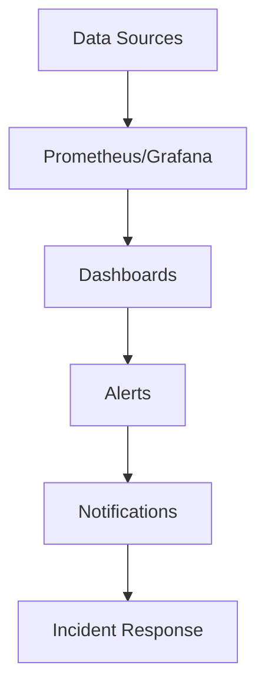

## Overview

Monitoring dashboards provide visual representations of system metrics, logs, and traces to help teams detect issues, optimize performance, and ensure reliability. They aggregate data from various sources for real-time insights.

## Detailed Explanation

### Components
- **Metrics**: CPU, memory, latency.
- **Logs**: Application and system logs.
- **Traces**: Request flow across services.

### Tools
- Grafana, Kibana, Prometheus UI, Datadog.

### Best Practices
- Define key metrics (SLIs/SLOs).
- Alert on anomalies.
- Correlate metrics with logs/traces.



## Real-world Examples & Use Cases

- **E-commerce**: Monitor checkout latency and error rates.
- **Cloud Services**: Track API response times and resource usage.
- **IoT Platform**: Visualize sensor data and device health.

## Code Examples

### Prometheus Query
```promql
rate(http_requests_total[5m])
```

### Grafana Dashboard JSON (Snippet)
```json
{
  "dashboard": {
    "title": "System Metrics",
    "panels": [
      {
        "title": "CPU Usage",
        "type": "graph",
        "targets": [
          {
            "expr": "cpu_usage"
          }
        ]
      }
    ]
  }
}
```

## Common Pitfalls & Edge Cases

- **Data Overload**: Focus on actionable metrics.
- **Alert Fatigue**: Tune thresholds carefully.
- **Security**: Protect dashboard access.

## Tools & Libraries

- Grafana, Kibana, Prometheus, Datadog, New Relic.

## References

- [Grafana Docs](https://grafana.com/docs/)
- [Prometheus Monitoring](https://prometheus.io/docs/)
- [Observability Best Practices](https://opentelemetry.io/docs/)

## Github-README Links & Related Topics

- [monitoring-and-logging](../monitoring-and-logging/README.md)
- [monitoring-with-prometheus-and-grafana](../monitoring-with-prometheus-and-grafana/README.md)
- [distributed-tracing](../distributed-tracing/README.md)