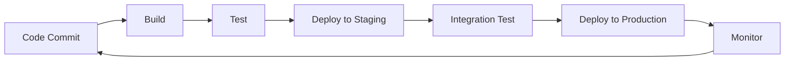

# DevOps & Infrastructure as Code

## Overview

DevOps is a cultural and technical movement that emphasizes collaboration between development and operations teams to deliver software faster and more reliably. Infrastructure as Code (IaC) is the practice of managing and provisioning infrastructure through machine-readable definition files, rather than physical hardware configuration or interactive configuration tools.

## Detailed Explanation

### DevOps Principles

- **Collaboration**: Breaking down silos between dev and ops teams
- **Automation**: Automating repetitive tasks and processes
- **Continuous Integration/Continuous Deployment (CI/CD)**: Frequent, automated code integration and deployment
- **Monitoring and Feedback**: Continuous monitoring and improvement based on metrics

### Infrastructure as Code

IaC treats infrastructure provisioning, configuration, and management as software development practices:

- **Declarative vs Imperative**: Declarative defines desired state, imperative defines steps
- **Version Control**: Infrastructure code stored in git repositories
- **Testing**: Infrastructure code can be tested and validated
- **Reusability**: Modules and templates for consistent deployments

### DevOps Pipeline



## Real-world Examples & Use Cases

1. **Cloud Migration**: Companies migrating legacy applications to cloud using IaC for consistent environments
2. **Microservices Deployment**: Automated deployment pipelines for containerized microservices
3. **Multi-Environment Management**: Maintaining consistent dev, staging, and production environments

## Code Examples

### Terraform Infrastructure as Code

```hcl
# main.tf
terraform {
  required_providers {
    aws = {
      source  = "hashicorp/aws"
      version = "~> 4.0"
    }
  }
}

provider "aws" {
  region = "us-east-1"
}

resource "aws_instance" "web" {
  ami           = "ami-0c55b159cbfafe1d0"
  instance_type = "t2.micro"
  
  tags = {
    Name = "WebServer"
  }
}

resource "aws_security_group" "web_sg" {
  name_prefix = "web-sg"
  
  ingress {
    from_port   = 80
    to_port     = 80
    protocol    = "tcp"
    cidr_blocks = ["0.0.0.0/0"]
  }
  
  egress {
    from_port   = 0
    to_port     = 0
    protocol    = "-1"
    cidr_blocks = ["0.0.0.0/0"]
  }
}
```

### Ansible Playbook for Configuration Management

```yaml
---
- name: Configure web server
  hosts: webservers
  become: yes
  
  tasks:
    - name: Install Apache
      apt:
        name: apache2
        state: present
      when: ansible_os_family == "Debian"
    
    - name: Start Apache service
      service:
        name: apache2
        state: started
        enabled: yes
    
    - name: Deploy application
      copy:
        src: /local/app
        dest: /var/www/html/
```

### Jenkins Pipeline for CI/CD

```groovy
pipeline {
    agent any
    
    stages {
        stage('Build') {
            steps {
                sh 'mvn clean compile'
            }
        }
        
        stage('Test') {
            steps {
                sh 'mvn test'
            }
        }
        
        stage('Deploy') {
            steps {
                sh 'kubectl apply -f deployment.yaml'
            }
        }
    }
    
    post {
        always {
            junit 'target/surefire-reports/*.xml'
        }
    }
}
```

## Common Pitfalls & Edge Cases

- **State Drift**: Infrastructure state diverging from code definitions
- **Secret Management**: Securely handling credentials and sensitive data
- **Testing Infrastructure**: Ensuring infrastructure changes don't break applications
- **Version Compatibility**: Managing dependencies between infrastructure components
- **Cost Management**: Monitoring and controlling cloud resource costs

## Tools & Libraries

- **IaC Tools**: Terraform, CloudFormation, Pulumi
- **Configuration Management**: Ansible, Puppet, Chef
- **CI/CD**: Jenkins, GitLab CI, GitHub Actions
- **Container Orchestration**: Kubernetes, Docker Swarm
- **Monitoring**: Prometheus, Grafana

## References

- [Terraform Documentation](https://www.terraform.io/docs)
- [Ansible Documentation](https://docs.ansible.com/)
- [Jenkins Pipeline](https://www.jenkins.io/doc/book/pipeline/)
- [DevOps Handbook](https://itrevolution.com/book/the-devops-handbook/)

## Github-README Links & Related Topics

- [CI CD Pipelines](ci-cd-pipelines/)
- [Infrastructure as Code with Terraform](infrastructure-as-code-with-terraform/)
- [Container Orchestration with Kubernetes](container-orchestration-with-kubernetes/)
- [Docker Containerization](docker-containerization/)
- [Monitoring and Logging](monitoring-and-logging/)
