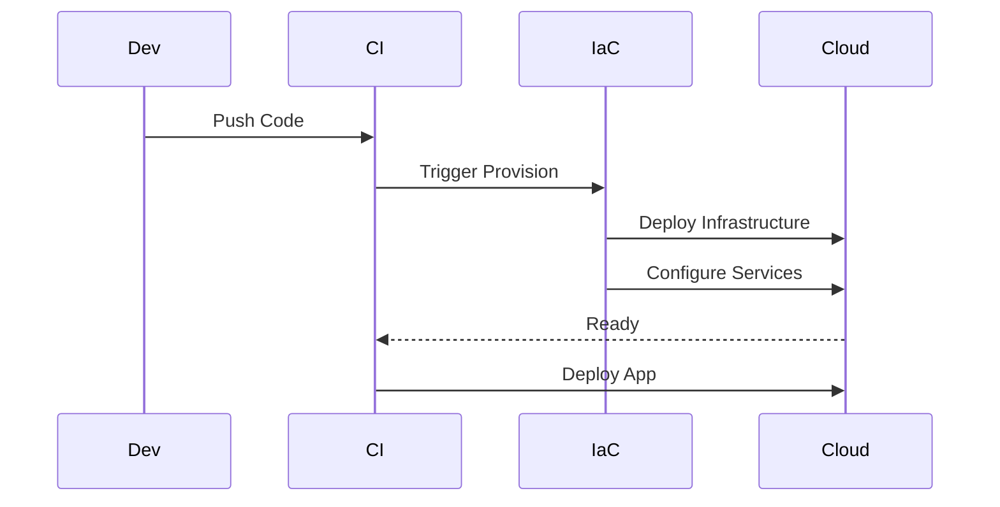

## Overview

DevOps & Infrastructure as Code (IaC) combine cultural philosophies, practices, and tools to automate and integrate the processes of software development and IT operations. IaC treats infrastructure provisioning, configuration, and management as software code, enabling version control, testing, and repeatability. This approach eliminates manual processes, reduces errors, and accelerates deployment cycles in modern software delivery pipelines.

## STAR Summary

- **S (Situation)**: A rapidly growing startup faced inconsistent environments across development, staging, and production, leading to deployment failures and delayed releases.
- **T (Task)**: Implement IaC to standardize infrastructure provisioning and achieve consistent, automated deployments across all environments.
- **A (Action)**: Adopted Terraform for infrastructure provisioning, Ansible for configuration management, and integrated CI/CD pipelines with automated testing and rollbacks. Established code reviews and version control for all infrastructure changes.
- **R (Result)**: Reduced deployment time by 70%, eliminated environment drift, and improved reliability with 99.9% successful deployments, enabling the team to scale from weekly to daily releases.

## Detailed Explanation

DevOps bridges the gap between development and operations through automation, collaboration, and continuous improvement. Key principles include:

- **Continuous Integration/Continuous Deployment (CI/CD)**: Automated pipelines for building, testing, and deploying code.
- **Infrastructure as Code**: Defining infrastructure in declarative code rather than manual setup.
- **Monitoring and Feedback**: Real-time insights into system performance and user feedback.

IaC enables:

- **Version Control**: Track changes to infrastructure like any codebase.
- **Reproducibility**: Spin up identical environments on-demand.
- **Scalability**: Automate scaling and resource management.
- **Compliance**: Audit trails and policy enforcement.

Tools like Terraform (immutable infrastructure) and Ansible (mutable configuration) complement each other. Best practices include modular code, testing IaC with tools like Terratest, and implementing drift detection.

## Real-world Examples & Use Cases

- **Cloud Migration**: Enterprises migrating legacy systems to AWS use IaC to provision VPCs, EC2 instances, and databases consistently.
- **Microservices Deployment**: Platforms like Netflix use IaC to manage thousands of services across regions with automated scaling.
- **Compliance-Heavy Industries**: Financial institutions use IaC for audit trails and automated security configurations.

A case study from a Fortune 500 company showed IaC reduced infrastructure costs by 30% through optimized resource usage and eliminated manual errors.

## Message Formats / Data Models

IaC uses configuration files in formats like HCL (Terraform), YAML (Ansible), or JSON.

Terraform HCL example:

```hcl
resource "aws_instance" "web" {
  ami           = "ami-12345678"
  instance_type = "t2.micro"

  tags = {
    Name = "WebServer"
  }
}
```

Ansible YAML playbook:

```yaml
---
- name: Configure web server
  hosts: webservers
  tasks:
    - name: Install nginx
      apt:
        name: nginx
        state: present
```

Table of common IaC constructs:

| Construct | Terraform | Ansible | Purpose |
|-----------|-----------|---------|---------|
| Resource | resource | task | Define infrastructure components |
| Variable | variable | vars | Parameterize configurations |
| Output | output | register | Expose results |
| Module | module | role | Reusable code blocks |

## Journey of a Trade

In a trading system, IaC manages the deployment pipeline:



This ensures trading platforms scale automatically during market volatility.

## Common Pitfalls & Edge Cases

- **State Management**: Terraform state files can become inconsistent; use remote state with locking.
- **Secrets Handling**: Avoid hardcoding credentials; use vaults like AWS Secrets Manager.
- **Dependency Ordering**: Circular dependencies in IaC can fail deployments; model dependencies explicitly.
- **Drift Detection**: Manual changes cause drift; implement automated reconciliation.
- **Testing Gaps**: Untested IaC leads to runtime failures; integrate unit and integration tests.
- **Version Compatibility**: Tool versions must align across teams; pin versions in CI.

Edge cases include handling multi-cloud deployments and rolling back failed infrastructure changes.

## Tools & Libraries

- **Terraform**: Declarative IaC for multi-cloud provisioning.
- **Ansible**: Agentless configuration management.
- **Puppet/Chef**: Declarative configuration tools.
- **CloudFormation**: AWS-native IaC.
- **Pulumi**: IaC with programming languages.
- **Terragrunt**: Wrapper for Terraform with DRY principles.

Sample Terraform code:

```hcl
terraform {
  required_providers {
    aws = {
      source  = "hashicorp/aws"
      version = "~> 4.0"
    }
  }
}

provider "aws" {
  region = "us-east-1"
}

resource "aws_s3_bucket" "example" {
  bucket = "my-tf-test-bucket"
}
```

## Github-README Links & Related Topics

- [Ci Cd Pipelines](devops/ci-cd-pipelines/)
- [Container Orchestration With Kubernetes](devops/container-orchestration-with-kubernetes/)
- [Infrastructure As Code With Terraform](devops/infrastructure-as-code-with-terraform/)

## References

- [Terraform Documentation](https://www.terraform.io/docs)
- [Ansible User Guide](https://docs.ansible.com/ansible/latest/user_guide/index.html)
- [DevOps Handbook](https://itrevolution.com/book/the-devops-handbook/)