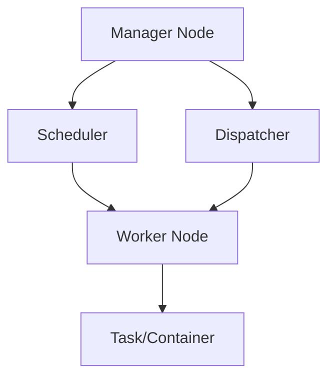

# Overview

Docker Swarm is Docker's native orchestration tool that allows you to create and manage a cluster of Docker nodes as a single virtual system. It provides clustering, service discovery, load balancing, and scaling capabilities for containerized applications, making it suitable for deploying and managing distributed systems.

# Detailed Explanation

## Swarm Architecture

A Swarm consists of multiple Docker hosts running in swarm mode. Nodes are either managers (handle orchestration) or workers (run tasks).

### Swarm Components

- **Manager Nodes**: Maintain cluster state, schedule tasks, and provide the Swarm API.
- **Worker Nodes**: Execute tasks assigned by managers.
- **Services**: Define the desired state for a set of tasks (containers).
- **Tasks**: Individual containers running on nodes.



## Services and Stacks

- **Services**: Replicated or global services with scaling and rolling updates.
- **Stacks**: Groups of interrelated services defined in a Compose file.

## Networking and Load Balancing

Swarm provides overlay networks for service-to-service communication and built-in load balancing.

## Secrets and Configs

Securely manage sensitive data and configuration files.

# Real-world Examples & Use Cases

- **Web Application Deployment**: Deploy a scalable web app with database and load balancer using Swarm stacks.
- **Microservices Orchestration**: Manage a set of microservices with automatic scaling and service discovery.
- **CI/CD Integration**: Use Swarm for deploying containerized applications in automated pipelines.

# Code Examples

## Initialize Swarm

```bash
# On manager node
docker swarm init --advertise-addr <MANAGER-IP>

# Join worker nodes
docker swarm join --token <TOKEN> <MANAGER-IP>:2377
```

## Deploy a Service

```bash
docker service create --name web --publish 80:80 nginx
```

## Stack Deployment with Compose

```yaml
version: '3.8'
services:
  web:
    image: nginx
    ports:
      - "80:80"
    deploy:
      replicas: 3
  db:
    image: postgres
    environment:
      POSTGRES_PASSWORD: example
    deploy:
      placement:
        constraints: [node.role == manager]
```

```bash
docker stack deploy -c docker-compose.yml myapp
```

## Using Secrets

```bash
echo "mysecret" | docker secret create my_secret -
docker service create --name app --secret my_secret nginx
```

# Common Pitfalls & Edge Cases

- **Manager Node Failure**: Ensure multiple managers for high availability; use odd number for quorum.
- **Network Isolation**: Be cautious with overlay networks and firewall rules.
- **Resource Constraints**: Monitor node resources to prevent overloading.
- **Rolling Updates**: Test update strategies to avoid downtime.

# Tools & Libraries

- **Docker CLI**: Command-line interface for Swarm management.
- **Docker Compose**: Tool for defining and running multi-container applications.
- **Portainer**: Web UI for managing Docker environments.

# References

- [Docker Swarm Documentation](https://docs.docker.com/engine/swarm/)
- [Swarm Mode Overview](https://docs.docker.com/engine/swarm/key-concepts/)
- [Docker Compose for Swarm](https://docs.docker.com/compose/swarm/)

# Github-README Links & Related Topics

- [Docker Containerization](../docker-containerization/)
- [Docker Networking](../docker-networking/)
- [Kubernetes Basics](../kubernetes-basics/)
- [Load Balancing and Strategies](../load-balancing-and-strategies/)