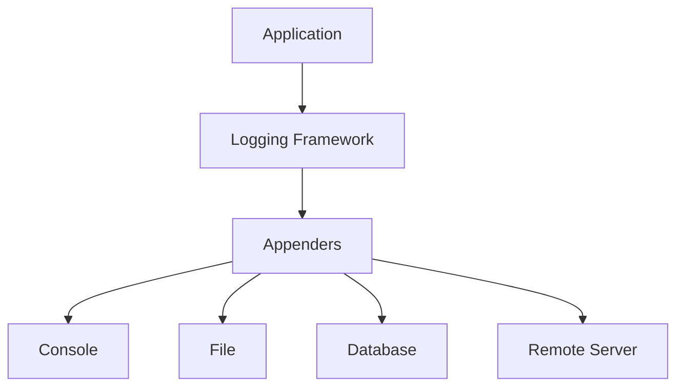

# Logging Frameworks

## Overview

Logging frameworks provide structured ways to record application events, errors, and diagnostic information. They enable debugging, monitoring, and auditing by capturing runtime behavior and system state changes.

## Detailed Explanation

### Key Concepts

- **Log Levels**: DEBUG, INFO, WARN, ERROR, FATAL
- **Structured Logging**: JSON format with key-value pairs
- **Async Logging**: Non-blocking log writes for performance
- **Log Rotation**: Automatic file management and archival
- **Centralized Logging**: Aggregation across distributed systems

### Architecture



## Real-world Examples & Use Cases

1. **Web Applications**: Track user actions and system errors
2. **Microservices**: Correlate logs across service boundaries
3. **Financial Systems**: Audit trails for compliance
4. **IoT Devices**: Remote diagnostics and monitoring

## Code Examples

### Logback Configuration (Java)

```xml
<configuration>
    <appender name="STDOUT" class="ch.qos.logback.core.ConsoleAppender">
        <encoder>
            <pattern>%d{HH:mm:ss.SSS} [%thread] %-5level %logger{36} - %msg%n</pattern>
        </encoder>
    </appender>

    <root level="debug">
        <appender-ref ref="STDOUT" />
    </root>
</configuration>
```

### SLF4J Usage

```java
import org.slf4j.Logger;
import org.slf4j.LoggerFactory;

public class MyService {
    private static final Logger logger = LoggerFactory.getLogger(MyService.class);

    public void process() {
        logger.info("Processing started");
        try {
            // business logic
            logger.debug("Processing item: {}", itemId);
        } catch (Exception e) {
            logger.error("Processing failed", e);
        }
    }
}
```

### Structured Logging with Logstash

```java
logger.info("User login", 
    kv("userId", userId),
    kv("ip", ipAddress),
    kv("timestamp", System.currentTimeMillis()));
```

## Common Pitfalls & Edge Cases

- **Performance Impact**: Excessive logging in hot paths
- **Sensitive Data Leakage**: Logging passwords or PII
- **Log Level Misconfiguration**: Missing critical errors
- **Distributed Log Correlation**: Lack of trace IDs

## Tools & Libraries

- **Logback**: Default for Spring Boot, high performance
- **Log4j**: Widely used, extensible
- **SLF4J**: Logging facade for abstraction
- **ELK Stack**: Elasticsearch, Logstash, Kibana
- **Fluentd**: Log collector and aggregator

## References

- [SLF4J Documentation](https://www.slf4j.org/)
- [Logback Manual](https://logback.qos.ch/manual/)
- [Log4j 2](https://logging.apache.org/log4j/2.x/)

## Github-README Links & Related Topics

- [Async Logging](async-logging/README.md)
- [Monitoring and Logging](monitoring-and-logging/README.md)
- [Java Fundamentals](java-fundamentals/README.md)