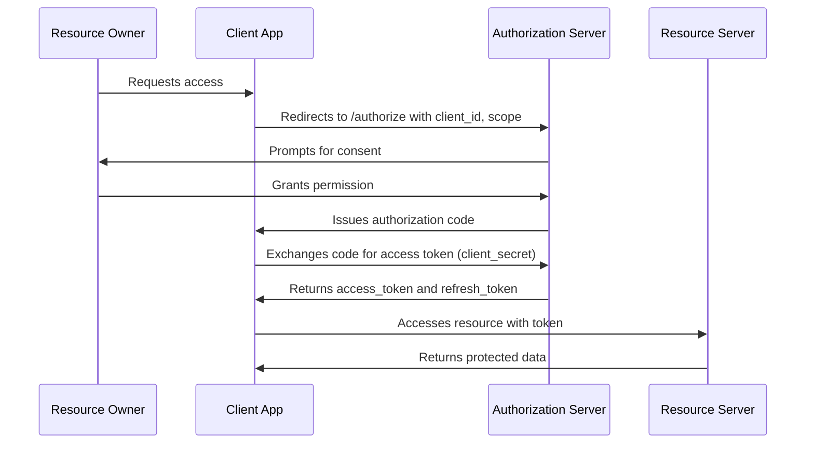
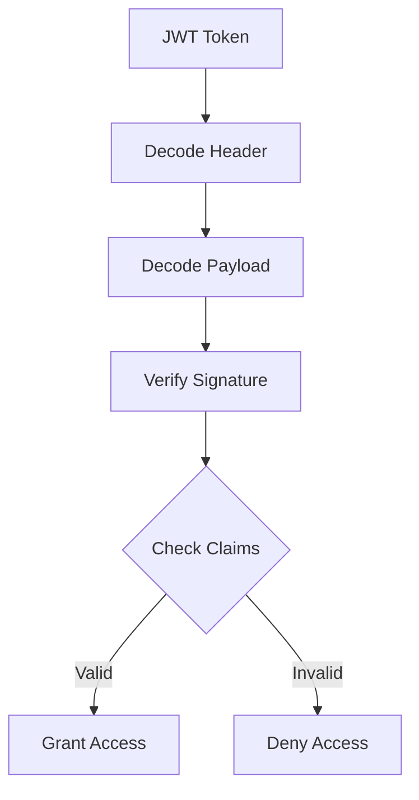

# OAuth and JWT Authentication

## Overview

OAuth (Open Authorization) and JWT (JSON Web Tokens) are fundamental protocols for secure authentication and authorization in modern web and API-based systems. OAuth enables third-party access to resources without sharing credentials, while JWT provides a stateless, compact token format for transmitting claims securely. Together, they form the backbone of delegated authentication, allowing users to grant limited access to applications via tokens. This topic covers their integration, flows, and best practices for system design interviews.

## Detailed Explanation

### OAuth 2.0 Flow

OAuth 2.0 defines roles: Resource Owner (user), Client (app), Authorization Server (issues tokens), and Resource Server (hosts protected resources). The standard flow is Authorization Code Grant, ideal for web apps.



**Key Components:**
- **Scopes**: Define permissions (e.g., `read:profile`, `write:posts`).
- **Tokens**: Access tokens (short-lived), refresh tokens (long-lived for renewal).
- **Grant Types**: Authorization Code, Implicit, Client Credentials, Password.

### JWT Structure and Validation

JWT is a self-contained token with three parts: Header, Payload, Signature. Encoded in Base64URL.

- **Header**: Algorithm and token type (e.g., `{"alg": "HS256", "typ": "JWT"}`).
- **Payload**: Claims like `iss` (issuer), `exp` (expiration), `sub` (subject), custom claims.
- **Signature**: HMAC or RSA signature for integrity.

Validation involves decoding, verifying signature, and checking claims (e.g., expiration).



**Security Considerations:**
- Use HTTPS for transmission.
- Store tokens securely (e.g., HttpOnly cookies for web).
- Implement token rotation and revocation.

| Aspect | OAuth 2.0 | JWT |
|--------|-----------|-----|
| Purpose | Authorization delegation | Token format for claims |
| Flow | Multi-step with server interaction | Stateless token exchange |
| Security | Relies on TLS, scopes | Signature verification |
| Use Case | Third-party logins | API authentication |

## Real-world Examples & Use Cases

- **Google OAuth for Web Apps**: Users log in via Google, granting access to email/profile. Used in apps like Slack integrations.
- **API Gateways**: JWTs authenticate microservices (e.g., Kubernetes with service accounts).
- **Single Sign-On (SSO)**: OAuth enables seamless login across domains (e.g., enterprise apps with Okta).
- **Mobile Apps**: Implicit Grant for native apps, with PKCE (Proof Key for Code Exchange) to prevent interception.
- **IoT Devices**: Client Credentials Grant for machine-to-machine auth.

## Code Examples

### JWT Generation in Node.js

```javascript
const jwt = require('jsonwebtoken');

const payload = { userId: 123, role: 'admin' };
const secret = 'your-secret-key';
const token = jwt.sign(payload, secret, { expiresIn: '1h' });

console.log(token); // eyJhbGciOiJIUzI1NiIsInR5cCI6IkpXVCJ9...
```

### OAuth Client in Python (Flask)

```python
from flask import Flask, redirect, request
import requests

app = Flask(__name__)

@app.route('/login')
def login():
    return redirect('https://auth.example.com/authorize?client_id=your_id&response_type=code&redirect_uri=http://localhost:5000/callback')

@app.route('/callback')
def callback():
    code = request.args.get('code')
    token_response = requests.post('https://auth.example.com/token', data={
        'grant_type': 'authorization_code',
        'code': code,
        'client_id': 'your_id',
        'client_secret': 'your_secret'
    })
    access_token = token_response.json()['access_token']
    return f'Access Token: {access_token}'
```

### JWT Validation in Java

```java
import io.jsonwebtoken.Jwts;
import io.jsonwebtoken.Claims;

public class JwtValidator {
    public static Claims validateToken(String token, String secret) {
        return Jwts.parser()
                .setSigningKey(secret)
                .parseClaimsJws(token)
                .getBody();
    }
}
```

## References

- [OAuth 2.0 RFC 6749](https://tools.ietf.org/html/rfc6749)
- [JWT RFC 7519](https://tools.ietf.org/html/rfc7519)
- [OWASP OAuth Cheat Sheet](https://cheatsheetseries.owasp.org/cheatsheets/OAuth_Cheat_Sheet.html)
- [Auth0 OAuth Guide](https://auth0.com/docs/get-started/authentication-and-authorization-flow/authorization-code-flow)

## Github-README Links & Related Topics

- [API Authentication Methods](./api-authentication-methods/)
- [API Security Best Practices](./api-security-best-practices/)
- [Microservices Security](./microservices-security/)
- [Distributed Tracing](./distributed-tracing/) (for monitoring auth flows)