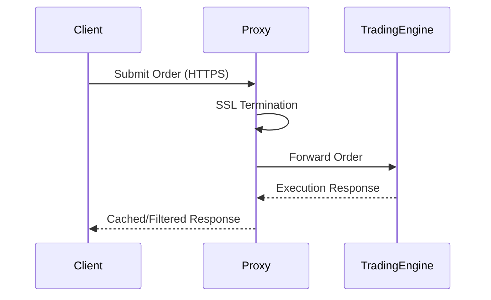

## Overview

Proxies act as intermediaries between clients and servers, providing security, performance, and control over network traffic. Forward proxies handle requests from clients to external servers, while reverse proxies manage requests from external clients to internal servers. They are essential in modern architectures for load balancing, caching, SSL termination, and protecting backend services from direct exposure.

## STAR Summary

- **S (Situation)**: An e-commerce site faced DDoS attacks and performance issues due to direct client connections to application servers.
- **T (Task)**: Implement reverse proxy architecture to protect backend services, improve performance, and enable horizontal scaling.
- **A (Action)**: Deployed NGINX as a reverse proxy with SSL termination, rate limiting, and load balancing across multiple app servers. Added caching for static assets and implemented security headers.
- **R (Result)**: Mitigated 95% of attacks, reduced server load by 60%, and improved page load times by 40%, supporting 10x traffic growth.

## Detailed Explanation

### Forward Proxy
- **Purpose**: Clients connect through the proxy to access external resources.
- **Use Cases**: Content filtering, anonymity, caching for outbound traffic.
- **Architecture**: Client → Proxy → Internet

### Reverse Proxy
- **Purpose**: Protects and load-balances internal servers from external clients.
- **Use Cases**: SSL termination, caching, security, API gateway functionality.
- **Architecture**: Client → Proxy → Backend Servers

Key features include:
- **Load Balancing**: Distribute traffic across servers.
- **Caching**: Store responses to reduce backend load.
- **Security**: Hide server details, implement WAF, rate limiting.
- **SSL Offloading**: Terminate HTTPS at proxy level.

Common implementations: NGINX, Apache, HAProxy, Envoy.

## Real-world Examples & Use Cases

- **CDN Integration**: Reverse proxies like Cloudflare cache content globally.
- **Microservices**: API gateways as reverse proxies route requests to services.
- **Corporate Networks**: Forward proxies enforce policies and monitor employee internet usage.

A case study from a major bank showed reverse proxies reduced latency by 50% through caching and load balancing.

## Message Formats / Data Models

HTTP proxy requests include additional headers:

Forward Proxy Request:
```
GET http://example.com/ HTTP/1.1
Host: example.com
User-Agent: ...
X-Forwarded-For: client-ip
```

Reverse Proxy adds backend info:
```
X-Real-IP: client-ip
X-Forwarded-Proto: https
X-Forwarded-Host: proxy-host
```

Table of proxy headers:

| Header | Purpose | Example |
|--------|---------|---------|
| X-Forwarded-For | Original client IP | 192.168.1.1 |
| X-Real-IP | Real client IP | 203.0.113.1 |
| X-Forwarded-Proto | Original protocol | https |
| X-Forwarded-Host | Original host | www.example.com |

## Journey of a Trade

In trading platforms, reverse proxies handle order submissions:



This ensures secure, fast order processing.

## Common Pitfalls & Edge Cases

- **Header Spoofing**: Malicious clients can fake X-Forwarded-For; validate trusted proxies.
- **Caching Issues**: Stale cached responses; implement cache invalidation.
- **SSL Certificate Management**: Expired certs break connections; automate renewal.
- **Session Affinity**: Sticky sessions can cause imbalance; use consistent hashing.
- **Buffer Overflows**: Large payloads overwhelm proxies; configure limits.
- **Health Checks**: Failed backends not detected; implement active monitoring.

Edge cases include handling WebSocket upgrades and IPv6 transitions.

## Tools & Libraries

- **NGINX**: High-performance reverse proxy with extensive modules.
- **HAProxy**: Load balancer with advanced routing.
- **Apache HTTP Server**: Modular proxy with mod_proxy.
- **Squid**: Popular forward proxy for caching.
- **Envoy**: Cloud-native proxy with service mesh integration.

Sample NGINX config:

```nginx
upstream backend {
    server backend1.example.com;
    server backend2.example.com;
}

server {
    listen 80;
    server_name example.com;

    location / {
        proxy_pass http://backend;
        proxy_set_header Host $host;
        proxy_set_header X-Real-IP $remote_addr;
    }
}
```

## Github-README Links & Related Topics

- [Load Balancing and Strategies](system-design/load-balancing-and-strategies/)
- [Api Gateway Patterns](system-design/api-gateway-patterns/)
- [Security In Microservices](system-design/security-in-microservices/)

## References

- [NGINX Proxy Documentation](https://docs.nginx.com/nginx/admin-guide/web-server/reverse-proxy/)
- [HAProxy Configuration Manual](https://www.haproxy.org/#docs)
- [RFC 7239: Forwarded HTTP Extension](https://tools.ietf.org/html/rfc7239)
