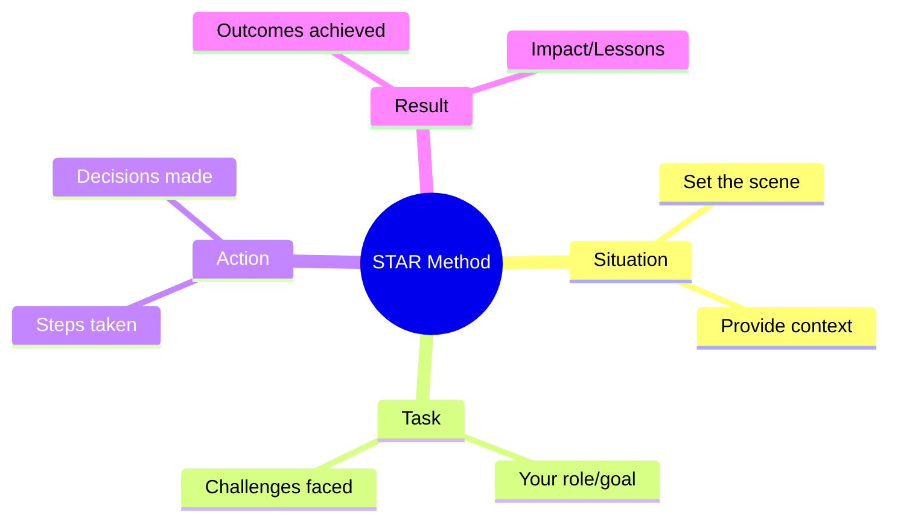

### Overview

Behavioral interview preparation involves anticipating common questions, practicing responses using structured frameworks, and reflecting on past experiences to demonstrate key competencies. Effective preparation builds confidence and ensures you can articulate your skills and experiences clearly.

## Detailed Explanation

Behavioral interviews assess how you've handled situations in the past to predict future performance. Preparation focuses on:

- Identifying common question categories (leadership, conflict resolution, problem-solving)
- Using frameworks like STAR (Situation, Task, Action, Result) to structure answers
- Preparing specific examples from your career
- Practicing responses aloud or with mock interviews
- Researching the company and role to tailor answers

Key competencies often evaluated: communication, teamwork, adaptability, initiative, and resilience.

## STAR Summary

The STAR method is essential for behavioral interview preparation:

- **Situation**: Describe the context or background.
- **Task**: Explain your responsibility or goal.
- **Action**: Detail the specific steps you took.
- **Result**: Share the outcome and lessons learned.

Practice by writing out 5-10 examples for each competency area.

## Real-world Examples & Use Cases

### Example 1: Preparing for Leadership Questions
**Question Category:** Leadership and Team Management

**Preparation Steps:**
1. Identify 2-3 leadership experiences from your career.
2. Structure each using STAR.
3. Practice explaining technical decisions to non-technical audiences.
4. Prepare questions about team dynamics and conflict resolution.

**Sample Answer Structure:**
- Situation: Led a team of 5 developers on a critical project with tight deadlines.
- Task: Deliver the project on time while mentoring junior developers.
- Action: Organized daily stand-ups, delegated tasks based on strengths, and provided code reviews.
- Result: Project completed 2 weeks early, team productivity increased by 25%.

### Example 2: Handling Failure Scenarios
**Question Category:** Learning from Mistakes

**Preparation Steps:**
1. Choose failures that led to positive outcomes.
2. Focus on lessons learned and improvements made.
3. Avoid blaming others; emphasize personal growth.

**Sample Answer:**
- Situation: A production deployment I managed caused a 2-hour outage.
- Task: Minimize downtime and prevent future incidents.
- Action: Coordinated with ops team for quick rollback, conducted post-mortem analysis, implemented automated testing.
- Result: System stability improved, and I developed a comprehensive deployment checklist.

### Use Cases
- Preparing for FAANG interviews where behavioral questions are heavily weighted
- Career transitions requiring demonstration of transferable skills
- Leadership roles emphasizing soft skills alongside technical expertise

## Code Examples

N/A - Behavioral preparation focuses on communication and experience rather than coding.

## References

- [Behavioral Interview Preparation Guide](https://www.thebalancecareers.com/behavioral-interview-questions-2061235)
- [STAR Method for Behavioral Interviews](https://www.indeed.com/career-advice/interviewing/star-interview-method)
- [Common Behavioral Competencies](https://www.glassdoor.com/blog/guide/behavioral-interview-questions/)

## Github-README Links & Related Topics

- [Behavioral Interview Questions](../behavioral-interview-questions/README.md)
- [STAR Method for Interviews](../star-method-for-interviews/README.md)
- [Coding Interview Strategies](../coding-interview-strategies/README.md)