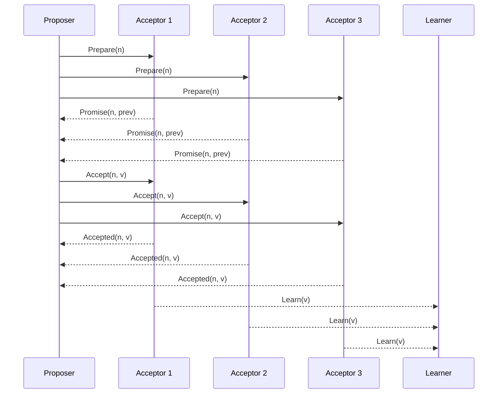

# Paxos Algorithm

## Overview

Paxos is a family of protocols for solving consensus in a network of unreliable processors. It ensures that a single value is chosen, even in the presence of failures, and once chosen, that value is learned by all correct processes.

## Detailed Explanation

Paxos involves three roles: Proposers, Acceptors, and Learners. The algorithm proceeds in two phases: Prepare and Accept.

### Phases

1. **Prepare Phase**: Proposer sends prepare request with proposal number
2. **Accept Phase**: If majority accept, proposer sends accept request

### Safety Properties

- Only a value that has been proposed may be chosen
- Only one value is chosen
- A process never learns a value unless it has been chosen

### Liveness

- Eventually, a value is chosen if a majority of processes are correct



## Real-world Examples & Use Cases

- Google's Chubby lock service
- Apache ZooKeeper (uses ZAB, similar to Paxos)
- Distributed databases for leader election

## Code Examples

### Simplified Paxos Pseudocode

```python
class Paxos:
    def __init__(self, acceptors):
        self.acceptors = acceptors
        self.proposal_number = 0

    def propose(self, value):
        self.proposal_number += 1
        # Prepare phase
        promises = []
        for acceptor in self.acceptors:
            promise = acceptor.prepare(self.proposal_number)
            if promise:
                promises.append(promise)
        
        if len(promises) > len(self.acceptors) // 2:
            # Choose value
            max_accepted = max((p.accepted_proposal for p in promises if p.accepted_proposal), default=None)
            if max_accepted:
                value = max_accepted.value
            
            # Accept phase
            accepts = 0
            for acceptor in self.acceptors:
                if acceptor.accept(self.proposal_number, value):
                    accepts += 1
            
            if accepts > len(self.acceptors) // 2:
                return value
        return None
```

## Journey / Sequence

1. **Proposal Initiation**: A proposer selects a unique proposal number and enters the prepare phase.
2. **Prepare Phase**: The proposer sends prepare requests to a majority of acceptors.
3. **Promise Phase**: Acceptors respond with promises, revealing any previously accepted values.
4. **Accept Phase**: If a majority promises, the proposer sends an accept request with the chosen value.
5. **Accepted Phase**: Acceptors accept the proposal if not promised to a higher number.
6. **Learn Phase**: Learners are notified of the accepted value once a majority accepts.

## Common Pitfalls & Edge Cases

- **Multiple Proposers**: Can lead to conflicts; higher proposal numbers take precedence.
- **Network Partitions**: May cause split votes, requiring majority for progress.
- **Failure of Leader**: Paxos doesn't have a leader; any node can propose.
- **Byzantine Faults**: Basic Paxos assumes non-Byzantine failures; use PBFT for Byzantine.
- **Livelock**: Rare, but can occur if proposal numbers conflict repeatedly.

## Tools & Libraries

- **Apache ZooKeeper**: Uses ZAB, a Paxos variant, for coordination.
- **etcd**: Uses Raft, but Paxos-inspired.
- **Consul**: Uses Raft for consensus.
- **Chubby**: Google's lock service using Paxos.

## References

- [Paxos Made Simple](https://lamport.azurewebsites.net/pubs/paxos-simple.pdf)
- [The Part-Time Parliament](https://lamport.azurewebsites.net/pubs/lamport-paxos.pdf)
- [Paxos Wikipedia](https://en.wikipedia.org/wiki/Paxos_(computer_science))

## Github-README Links & Related Topics

- [consensus-algorithms](../consensus-algorithms/README.md)
- [raft-and-leader-election](../raft-and-leader-election/README.md)
- [zookeeper-for-coordination](../zookeeper-for-coordination/README.md)