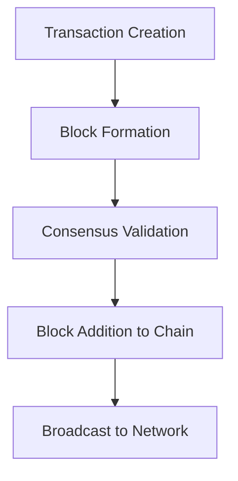

## Overview

Blockchain is a decentralized, distributed ledger technology that records transactions across multiple nodes securely and immutably.

## Detailed Explanation

- **Blocks**: Contain transactions linked via hashes.
- **Consensus**: Mechanisms like Proof-of-Work (PoW) or Proof-of-Stake (PoS).
- **Smart Contracts**: Self-executing contracts on the blockchain.

Key properties: Decentralization, transparency, immutability.

## Real-world Examples & Use Cases

- **Cryptocurrencies**: Bitcoin, Ethereum.
- **Supply Chain**: Tracking goods provenance.
- **Voting Systems**: Secure elections.
- **NFTs**: Digital asset ownership.

## Code Examples

### Simple Blockchain in Python

```python
import hashlib
import time

class Block:
    def __init__(self, index, previous_hash, timestamp, data, hash):
        self.index = index
        self.previous_hash = previous_hash
        self.timestamp = timestamp
        self.data = data
        self.hash = hash

def calculate_hash(index, previous_hash, timestamp, data):
    value = str(index) + str(previous_hash) + str(timestamp) + str(data)
    return hashlib.sha256(value.encode('utf-8')).hexdigest()

def create_genesis_block():
    return Block(0, "0", time.time(), "Genesis Block", calculate_hash(0, "0", time.time(), "Genesis Block"))

def create_new_block(previous_block, data):
    index = previous_block.index + 1
    timestamp = time.time()
    hash = calculate_hash(index, previous_block.hash, timestamp, data)
    return Block(index, previous_block.hash, timestamp, data, hash)
```

## Journey / Sequence



## Common Pitfalls & Edge Cases

- **Scalability**: High transaction volumes cause delays.
- **Energy Consumption**: PoW is resource-intensive.
- **Security**: 51% attacks.

## Tools & Libraries

- Ethereum
- Hyperledger Fabric
- Web3.js

## References

- [Bitcoin Whitepaper](https://bitcoin.org/bitcoin.pdf)
- [Ethereum Documentation](https://ethereum.org/en/developers/docs/)

## Github-README Links & Related Topics

- [Consensus Algorithms](./consensus-algorithms/README.md)
- [Distributed Systems](./cap-theorem-and-distributed-systems/README.md)