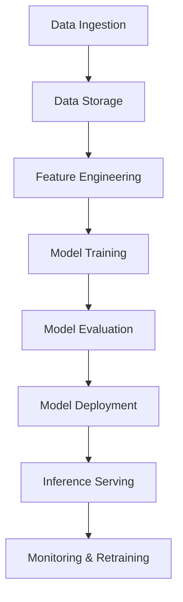

# Machine Learning System Design

## Overview

Machine Learning System Design involves architecting scalable, reliable, and efficient systems for training, deploying, and serving machine learning models. It encompasses data pipelines, model lifecycle management, and integration with production environments to handle large-scale data and computational requirements.

## Detailed Explanation

### Key Components

1. **Data Ingestion and Storage**: Collecting data from sources like databases, APIs, or sensors, and storing it in scalable systems such as data lakes (e.g., S3, HDFS).

2. **Feature Engineering**: Transforming raw data into features using techniques like normalization, encoding, and feature selection to improve model performance.

3. **Model Training**: Utilizing distributed computing frameworks (e.g., TensorFlow, PyTorch) to train models on large datasets, often in batch or incremental modes.

4. **Model Evaluation and Validation**: Using metrics like accuracy, precision, recall, and cross-validation to assess model quality and prevent overfitting.

5. **Model Deployment and Serving**: Deploying models to production using serving frameworks like TensorFlow Serving, ensuring low-latency inference.

6. **Monitoring and Maintenance**: Continuously monitoring model drift, performance degradation, and retraining models as data evolves.

### Architecture Patterns

- **Batch Processing**: Suitable for periodic model updates using tools like Apache Spark.
- **Online Learning**: For real-time model adaptation in streaming data scenarios.
- **A/B Testing**: Comparing model versions in production to select the best performer.



## Real-world Examples & Use Cases

- **Recommendation Engines**: Platforms like Netflix use ML to personalize content recommendations based on user behavior.
- **Fraud Detection**: Financial institutions like PayPal employ ML models to identify fraudulent transactions in real-time.
- **Autonomous Vehicles**: Companies like Tesla integrate ML for object detection, path planning, and decision-making.
- **Healthcare Diagnostics**: ML systems analyze medical images for early disease detection.

## Code Examples

### Training a Simple Model with Scikit-Learn

```python
from sklearn.ensemble import RandomForestClassifier
from sklearn.model_selection import train_test_split
from sklearn.metrics import accuracy_score
import pandas as pd

# Load dataset
data = pd.read_csv('data.csv')
X = data.drop('target', axis=1)
y = data['target']

# Split data
X_train, X_test, y_train, y_test = train_test_split(X, y, test_size=0.2, random_state=42)

# Train model
model = RandomForestClassifier(n_estimators=100)
model.fit(X_train, y_train)

# Evaluate
predictions = model.predict(X_test)
accuracy = accuracy_score(y_test, predictions)
print(f'Accuracy: {accuracy}')
```

### Model Serving with FastAPI

```python
from fastapi import FastAPI
from pydantic import BaseModel
import joblib

app = FastAPI()
model = joblib.load('model.pkl')

class PredictionRequest(BaseModel):
    features: list

@app.post('/predict')
def predict(request: PredictionRequest):
    prediction = model.predict([request.features])
    return {'prediction': prediction[0]}
```

## References

- [Designing Machine Learning Systems by Chip Huyen](https://www.oreilly.com/library/view/designing-machine-learning/9781098107956/)
- [Machine Learning Engineering Open Book](https://github.com/stanfordmlgroup/ml-engineering)
- [TensorFlow Serving Documentation](https://www.tensorflow.org/tfx/guide/serving)

## Github-README Links & Related Topics

- [Machine Learning in System Design](./machine-learning-in-system-design/README.md)
- [Distributed Systems](./cap-theorem-and-distributed-systems/README.md)
- [Data Consistency Models](./data-consistency-models/README.md)
- [Monitoring and Logging](./monitoring-and-logging/README.md)