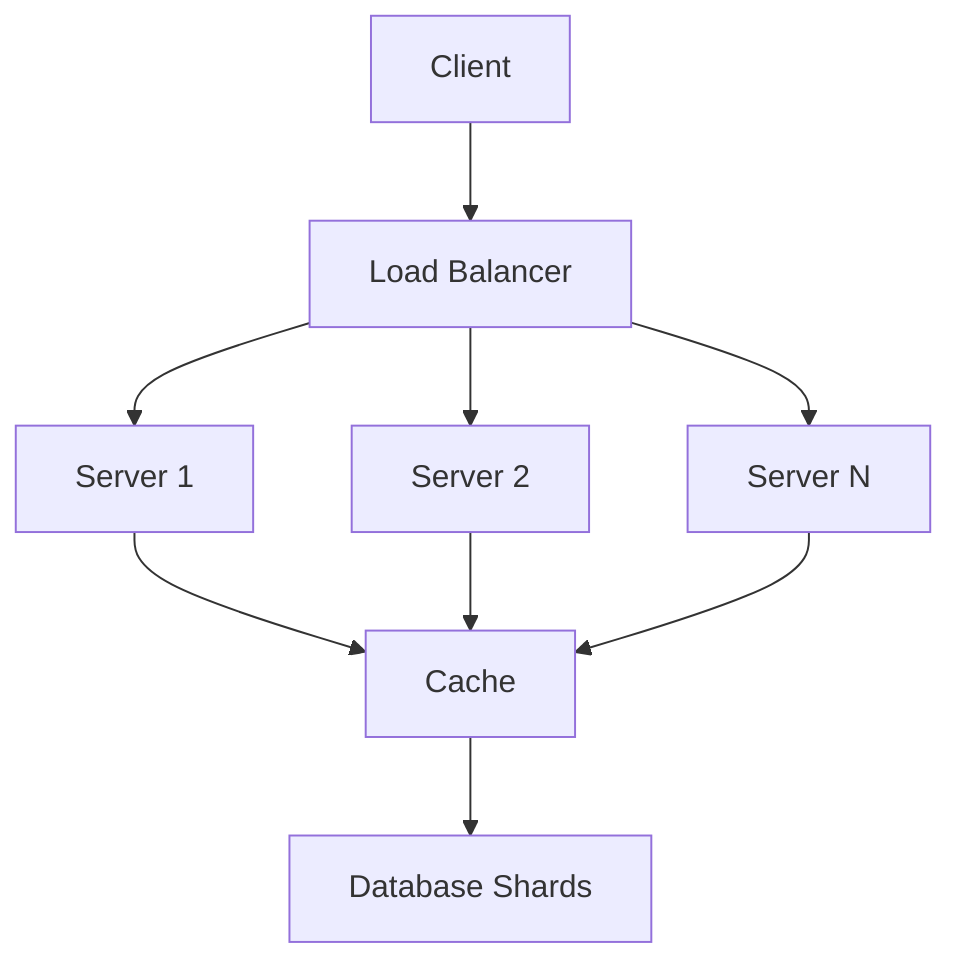

## Overview

Scalability patterns are architectural strategies to handle growing user loads, data volumes, and computational demands without compromising performance. They enable systems to scale horizontally (adding more nodes) or vertically (upgrading resources), ensuring reliability and efficiency.

## Detailed Explanation

Scalability involves designing systems that can grow seamlessly. Key patterns include:

- **Horizontal Scaling (Scale Out)**: Add more servers or instances to distribute load.
- **Vertical Scaling (Scale Up)**: Increase resources (CPU, RAM) on existing servers.
- **Load Balancing**: Distribute requests across multiple servers.
- **Caching**: Store frequently accessed data in memory for faster retrieval.
- **Database Sharding**: Split data across multiple databases.
- **Microservices**: Break down monolithic apps into smaller, independently scalable services.
- **Asynchronous Processing**: Use queues to handle tasks without blocking.

### Scalability Dimensions

| Dimension | Description | Example Pattern |
|-----------|-------------|-----------------|
| Load | Handle increased traffic | Load Balancing |
| Data | Manage large datasets | Sharding, Partitioning |
| Compute | Process more operations | Horizontal Scaling |
| Storage | Store more data | Replication, Archiving |

### Architecture Diagram



## Real-world Examples & Use Cases

- **Netflix**: Uses microservices and horizontal scaling to stream to millions of users, with load balancers and caching for content delivery.
- **Amazon**: Employs sharding for product databases and auto-scaling groups for web servers during peak shopping seasons.
- **Twitter**: Implements sharding for tweets and uses queues for asynchronous processing of feeds.
- **Google Search**: Scales with distributed indexing and caching layers to handle billions of queries.

## Code Examples

### Load Balancer in Python (Simple Round-Robin)

```python
class LoadBalancer:
    def __init__(self, servers):
        self.servers = servers
        self.index = 0

    def get_server(self):
        server = self.servers[self.index]
        self.index = (self.index + 1) % len(self.servers)
        return server

# Usage
lb = LoadBalancer(['server1', 'server2', 'server3'])
print(lb.get_server())  # server1
print(lb.get_server())  # server2
```

### Caching with Redis in Java

```java
import redis.clients.jedis.Jedis;

public class CacheExample {
    public static void main(String[] args) {
        Jedis jedis = new Jedis("localhost");
        jedis.set("key", "value");
        String value = jedis.get("key");
        System.out.println(value);  // value
        jedis.close();
    }
}
```

## Journey / Sequence

1. **Assess Current Load**: Monitor metrics like CPU, memory, and response times.
2. **Identify Bottlenecks**: Use profiling tools to find slow components.
3. **Choose Patterns**: Select based on needs (e.g., caching for read-heavy, sharding for data-heavy).
4. **Implement Incrementally**: Start with load balancing, add caching, then sharding.
5. **Test and Monitor**: Simulate loads, monitor for improvements.

## Common Pitfalls & Edge Cases

- **Over-Scaling**: Adding too many instances increases complexity and costs; use auto-scaling.
- **Cache Invalidation**: Stale data issues; implement TTL and invalidation strategies.
- **Shard Imbalance**: Uneven data distribution; use consistent hashing.
- **Network Latency**: In distributed setups, optimize data locality.
- **Stateful Services**: Harder to scale; prefer stateless designs.

## Tools & Libraries

- **Kubernetes**: For container orchestration and auto-scaling.
- **NGINX/HAProxy**: Load balancers.
- **Redis/Memcached**: Caching solutions.
- **Apache Cassandra**: For scalable databases with sharding.
- **AWS Auto Scaling**: Cloud-based scaling.

## References

- [Scalability Patterns - Microsoft](https://docs.microsoft.com/en-us/azure/architecture/patterns/)
- [The Art of Scalability - Book](https://www.amazon.com/Art-Scalability-Theory-Practice-Organizations/dp/0134032802)
- [Netflix Tech Blog on Scaling](https://netflixtechblog.com/)

## Github-README Links & Related Topics

- [Load Balancing and Strategies](../load-balancing-and-strategies/README.md)
- [Caching](../caching/README.md)
- [Database Sharding Strategies](../database-sharding-strategies/README.md)
- [Microservices Architecture](../microservices-architecture/README.md)
- [High Scalability Patterns](../high-scalability-patterns/README.md)