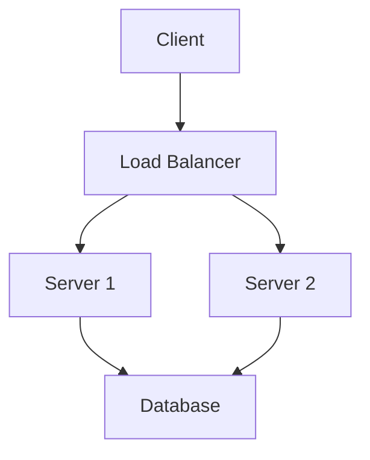
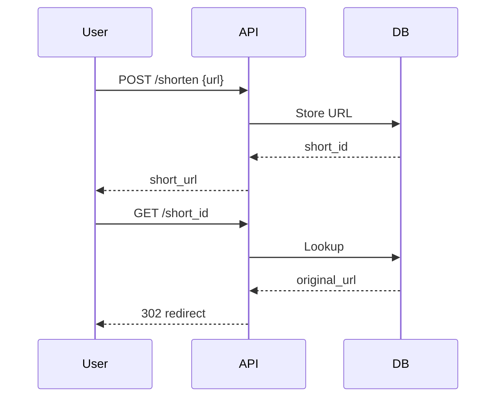

## Overview
System design basics cover the foundational concepts for designing scalable, reliable systems. It includes understanding requirements, trade-offs, and high-level architectures. Essential for interviews where you design systems like URL shorteners or chat apps.

## STAR Summary
**Situation:** Designing a notification service for a social media app with millions of users.  
**Task:** Ensure low latency and high availability.  
**Action:** Used load balancing, caching, and message queues.  
**Result:** Achieved 99.9% uptime and handled 10M notifications/day.

## Detailed Explanation
- **Requirements Gathering:** Functional (features) vs Non-functional (scalability, reliability).
- **Scalability:** Vertical (more power) vs Horizontal (more servers).
- **Availability:** Redundancy, failover.
- **Consistency:** CAP theorem trade-offs.
- **Components:** Load balancers, databases, caches, queues.

## Canonical Interview Prompt
**Design a URL Shortener Service (e.g., bit.ly)**

- **Functional Requirements:** Generate short aliases for long URLs, redirect short URLs to originals, support custom aliases, track click analytics.
- **Non-Functional Requirements:** High availability (99.9% uptime), low latency (<200ms), scalability to 1B URLs and 100k RPS.
- **High-Level Design (HLD):**

```mermaid
graph TD
    A[Client] --> B[API Gateway]
    B --> C[Shorten Service]
    C --> D[Database (URL Store)]
    B --> E[Redirect Service]
    E --> F[Cache (Redis)]
    F --> D
    E --> G[Analytics DB]
```

- **Capacity Estimation:** 1B URLs, each ~100 bytes, total storage ~100GB. 100k RPS, daily requests ~8.64B, peak traffic 1M RPS during events.
- **Tradeoffs:** Consistency vs Availability - use eventual consistency for analytics to prioritize availability. Scalability vs Cost - horizontal scaling with microservices increases complexity but allows elastic scaling.
- **API Design (OpenAPI-style):**
  - `POST /shorten` { "url": "https://example.com", "customAlias": "abc" } -> { "shortUrl": "http://short.ly/abc" }
  - `GET /{alias}` -> 302 redirect to original URL
- **Deployment Notes:** Deploy on Kubernetes for auto-scaling, use CDN (Cloudflare) for global redirect caching, database sharding by hash for scalability.

## Real-world Examples & Use Cases
- Netflix: Uses microservices with API gateways for scalability.
- Twitter: Employs sharding for tweets database to handle billions of posts.
- Use case: URL shortener for social sharing, requiring high availability and low latency.

## Code Examples
### Simple Load Balancer Simulation
```java
import java.util.List;
import java.util.concurrent.atomic.AtomicInteger;

class LoadBalancer {
    private List<String> servers;
    private AtomicInteger index = new AtomicInteger(0);

    public String getServer() {
        return servers.get(index.getAndIncrement() % servers.size());
    }
}
```

## Data Models / Message Formats


| Field | Type | Description |
|-------|------|-------------|
| url_id | string | Unique short ID |
| original_url | string | Full URL |
| created_at | timestamp | Creation time |

## Journey / Sequence


## Common Pitfalls & Edge Cases
- Ignoring bottlenecks early; edge case: hot keys in cache.
- Over-designing for non-existent scale.
- Neglecting monitoring and logging; edge case: silent failures in async queues.

## Tools & Libraries
- Diagrams: Draw.io or Mermaid.
- Simulation: Apache JMeter for load testing.

## Github-README Links & Related Topics
Related: [load-balancing-and-routing](../load-balancing-and-routing/), [caching-strategies](../caching-strategies/), [database-design-and-indexing](../database-design-and-indexing/), [partitioning-and-sharding](../partitioning-and-sharding/), [consistency-and-availability](../consistency-and-availability/)

## Common Interview Questions
- What are the key components of a scalable web service?
- How do you estimate capacity for a system?
- Explain CAP theorem and its implications.
- Describe the difference between horizontal and vertical scaling.
- How to handle database sharding in a distributed system?

## Additional Systems Concepts

### Latency and Throughput
- Latency: Time taken for a request to be processed.
- Throughput: Number of requests processed per unit time.
- Improving Latency: Use caching, optimize algorithms, reduce network hops.
- Improving Throughput: Horizontal scaling, asynchronous processing, efficient resource utilization.

### Availability
- Concept: Percentage of time a system is operational and accessible.
- Measured as uptime (e.g., 99.9% availability means ~8.76 hours downtime/year).

### Cache
- Cache Hit: Data found in cache.
- Cache Miss: Data not found, fetched from source.
- Eviction Policies: LRU (Least Recently Used), LFU (Least Frequently Used), FIFO.

### Proxy and Types
- Proxy: Intermediary server between client and server.
- Types: Forward Proxy (client-side), Reverse Proxy (server-side), Transparent Proxy.

### Replication vs Sharding
- Replication: Copying data across multiple nodes for redundancy.
- Sharding: Splitting data across multiple databases for scalability.

### Rate Limiting
- Technique to control the rate of requests to prevent abuse or overload.

### PubSub Model
- Publish-Subscribe: Asynchronous messaging where publishers send messages to topics, subscribers receive them.

### Pagination
- Dividing large datasets into pages for efficient API responses.

### Inversion of Control (IoC)
- Design principle where control flow is inverted; dependencies are injected rather than created.

### SOLID Principles
- Single Responsibility: A class should have one reason to change.
- Open-Closed: Open for extension, closed for modification.
- Liskov Substitution: Subtypes should be substitutable for their base types.
- Interface Segregation: Clients should not depend on interfaces they don't use.
- Dependency Inversion: Depend on abstractions, not concretions.

### Design Patterns
- Decorator: Adds behavior to objects dynamically.
- Singleton: Ensures a class has only one instance.
- Thread-Safe Singleton: Use double-checked locking or enums in Java.
- Factory: Creates objects without specifying exact classes.
- MVC: Model-View-Controller for separating concerns in UI.

## References
- "Designing Data-Intensive Applications" by Martin Kleppmann.
- System Design Interview resources on LeetCode.
- https://github.com/donnemartin/system-design-primer