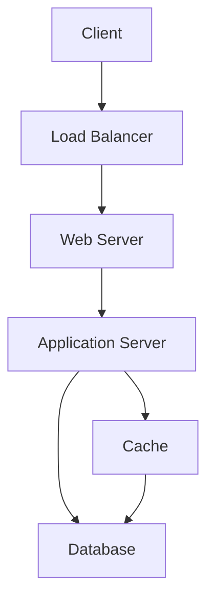

# System Design Basics

## Overview

System design involves designing scalable, reliable, and maintainable systems. It covers principles like scalability, reliability, availability, and trade-offs in distributed systems.

## Detailed Explanation

Key concepts:

- **Scalability**: Horizontal vs Vertical
- **Reliability**: Fault tolerance, redundancy
- **Availability**: Uptime, SLA
- **Consistency**: CAP theorem implications

### Architecture Patterns

- Monolithic vs Microservices
- Load Balancing
- Caching
- Database Sharding

### System Architecture Diagram



## Real-world Examples & Use Cases

- **Web Applications**: Designing APIs for millions of users.
- **E-commerce**: Handling peak loads during sales.
- **Social Media**: Storing and retrieving user data efficiently.

## Common Pitfalls & Edge Cases

- **Over-Engineering**: Designing for scale that may never come.
- **Ignoring Bottlenecks**: Not identifying performance bottlenecks early.
- **Poor Data Modeling**: Leading to inefficient queries.
- **Lack of Monitoring**: Unable to detect issues in production.
- **Edge Cases**: Handling zero users, single user, or extreme loads.

## Code Examples

### Simple Load Balancer

```java
import java.util.Arrays;
import java.util.List;

class LoadBalancer {
    private List<String> servers = Arrays.asList("server1", "server2", "server3");
    private int current = 0;

    public String getServer() {
        String server = servers.get(current);
        current = (current + 1) % servers.size();
        return server;
    }
}

public class LoadBalancerExample {
    public static void main(String[] args) {
        LoadBalancer lb = new LoadBalancer();
        System.out.println(lb.getServer()); // server1
        System.out.println(lb.getServer()); // server2
    }
}
```

### Basic Caching

```java
import java.util.HashMap;
import java.util.Map;

class SimpleCache {
    private Map<String, Object> cache = new HashMap<>();

    public Object get(String key) {
        return cache.get(key);
    }

    public void put(String key, Object value) {
        cache.put(key, value);
    }
}

// Usage
SimpleCache cache = new SimpleCache();
cache.put("user:123", "John Doe");
System.out.println(cache.get("user:123"));
```

## Tools & Libraries

- **Diagramming**: Draw.io, PlantUML
- **Prototyping**: Figma, Sketch
- **Load Testing**: Apache JMeter, k6
- **Monitoring**: Prometheus, New Relic

## References

- [Designing Data-Intensive Applications](https://www.amazon.com/Designing-Data-Intensive-Applications-Reliable-Maintainable/dp/1449373321)
- [System Design Primer](https://github.com/donnemartin/system-design-primer)

## Github-README Links & Related Topics

- [High Scalability Patterns](high-scalability-patterns/)
- [CAP Theorem & Distributed Systems](cap-theorem-and-distributed-systems/)