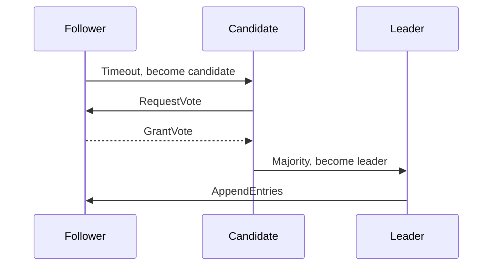

# Overview

Raft is a consensus algorithm for managing replicated logs in distributed systems, ensuring fault tolerance and consistency. Leader election is the process of selecting a primary node to coordinate operations. In MAANG interviews, expect deep dives into Raft's phases, failure modes, and implementations like etcd or ZooKeeper.

# STAR Summary

**Situation:** Designing a distributed key-value store for a microservices architecture.

**Task:** Implement consensus for data replication across 5 nodes.

**Action:** Chose Raft over Paxos for simplicity; implemented leader election with heartbeats and log replication.

**Result:** Achieved strong consistency with 99.9% uptime, handling 2 node failures gracefully.

# Detailed Explanation

Raft divides time into terms, elects leaders, and replicates logs.

Phases: Leader Election, Log Replication, Safety.

Leader Election: Candidates request votes; majority wins.

Failure Modes: Network partitions, node crashes.

# Real-world Examples & Use Cases

- **etcd:** Used in Kubernetes for storing cluster state and configuration, ensuring consistency across control plane nodes.
- **Consul:** HashiCorp's service mesh for service discovery and health checking with leader election for coordination.
- **CockroachDB:** Distributed SQL database using Raft for multi-row transactions and geo-replication.
- **Apache ZooKeeper:** Though using ZAB, similar to Raft for leader election in Hadoop ecosystems.
- **TiKV:** Key-value store in TiDB, using Raft for data replication and fault tolerance.

# Code Examples

Simple Raft state in Java:

```java
enum State { FOLLOWER, CANDIDATE, LEADER }

public class RaftNode {
    private State state = State.FOLLOWER;
    private int term = 0;

    public void startElection() {
        state = State.CANDIDATE;
        term++;
        // Send vote requests
    }
}
```

**Vote Request Handling:**

```java
public class RaftNode {
    // ... previous code

    public VoteResponse handleVoteRequest(VoteRequest req) {
        if (req.term > term) {
            term = req.term;
            state = State.FOLLOWER;
            votedFor = req.candidateId;
            return new VoteResponse(term, true);
        }
        return new VoteResponse(term, false);
    }
}
```

# Data Models / Message Formats

VoteRequest: {"term": 1, "candidateId": "node1"}

AppendEntries: {"term": 1, "leaderId": "node1", "entries": [...]}

# Journey / Sequence



# Common Pitfalls & Edge Cases

- Split brain in partitions.
- Log inconsistencies.
- Leader without majority.

# Tools & Libraries

- etcd
- Apache ZooKeeper

# Github-README Links & Related Topics

- [Consistency and Availability](system-design/consistency-and-availability/README.md)
- [Distributed Tracing and Observability](system-design/distributed-tracing-and-observability/README.md)
- [Raft Consensus and Leader Election](system-design/raft-consensus-and-leader-election/README.md)
- [System Design Basics](system-design/system-design-basics/README.md)

# References

- [Raft Paper](https://raft.github.io/raft.pdf)
- [etcd Raft](https://etcd.io/docs/v3.5/learning/raft/)