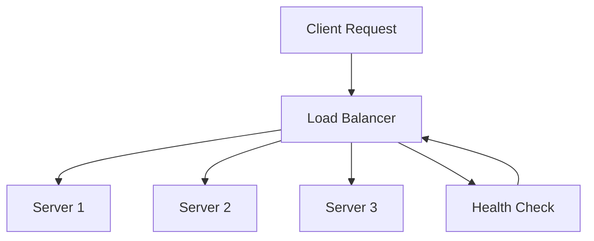

# Load Balancing and Strategies

## Overview

Load balancing is the process of distributing network traffic across multiple servers to ensure no single server becomes overwhelmed, improving application availability, reliability, and performance. It plays a crucial role in scaling applications horizontally and maintaining high availability.

## Detailed Explanation

### Load Balancing Concepts

- **Horizontal Scaling**: Adding more servers to handle increased load
- **Health Checks**: Monitoring server health to route traffic only to healthy instances
- **Session Persistence**: Maintaining user sessions with the same server (sticky sessions)
- **Failover**: Automatic redirection of traffic when servers fail

### Load Balancing Algorithms

1. **Round Robin**: Distributes requests sequentially across servers
2. **Least Connections**: Routes to server with fewest active connections
3. **IP Hash**: Uses client IP to determine server assignment
4. **Weighted Round Robin**: Assigns weights to servers based on capacity
5. **Least Response Time**: Routes to server with fastest response time

### Load Balancer Types

- **Hardware Load Balancers**: Dedicated appliances (F5, Citrix)
- **Software Load Balancers**: Nginx, HAProxy, AWS ELB
- **DNS Load Balancing**: Distributes at DNS level
- **Client-Side Load Balancing**: Applications choose servers directly



## Real-world Examples & Use Cases

1. **Web Applications**: Distributing HTTP requests across web servers
2. **Microservices**: Load balancing API calls between service instances
3. **Database Clusters**: Distributing read queries across replica servers
4. **CDN Networks**: Global load balancing for content delivery

## Code Examples

### HAProxy Configuration

```haproxy
global
    log /dev/log local0
    log /dev/log local1 notice
    chroot /var/lib/haproxy
    stats socket /run/haproxy/admin.sock mode 660 level admin expose-fd listeners
    stats timeout 30s
    user haproxy
    group haproxy
    daemon

defaults
    log global
    mode http
    option httplog
    option dontlognull
    timeout connect 5000
    timeout client 50000
    timeout server 50000

frontend http_front
    bind *:80
    default_backend http_back

backend http_back
    balance roundrobin
    server web1 192.168.1.10:80 check
    server web2 192.168.1.11:80 check
    server web3 192.168.1.12:80 check
```

### Nginx Load Balancing

```nginx
upstream backend {
    least_conn;
    server backend1.example.com:8080 weight=3;
    server backend2.example.com:8080 weight=2;
    server backend3.example.com:8080 weight=1;
    server backend4.example.com:8080 backup;
}

server {
    listen 80;
    location / {
        proxy_pass http://backend;
        proxy_set_header Host $host;
        proxy_set_header X-Real-IP $remote_addr;
    }
}
```

### AWS Application Load Balancer (Terraform)

```hcl
resource "aws_lb" "app_lb" {
  name               = "app-load-balancer"
  internal           = false
  load_balancer_type = "application"
  security_groups    = [aws_security_group.lb_sg.id]
  subnets            = aws_subnet.public.*.id
}

resource "aws_lb_target_group" "app_tg" {
  name     = "app-target-group"
  port     = 80
  protocol = "HTTP"
  vpc_id   = aws_vpc.main.id

  health_check {
    enabled             = true
    healthy_threshold   = 2
    interval            = 30
    matcher             = "200"
    path                = "/health"
    port                = "traffic-port"
    protocol            = "HTTP"
    timeout             = 5
    unhealthy_threshold = 2
  }
}

resource "aws_lb_listener" "app_listener" {
  load_balancer_arn = aws_lb.app_lb.arn
  port              = "80"
  protocol          = "HTTP"

  default_action {
    type             = "forward"
    target_group_arn = aws_lb_target_group.app_tg.arn
  }
}
```

### Java Client-Side Load Balancing with Ribbon

```java
@Configuration
public class RibbonConfig {
    @Bean
    public ILoadBalancer loadBalancer() {
        BaseLoadBalancer loadBalancer = new BaseLoadBalancer();
        loadBalancer.addServers(Arrays.asList(
            new Server("service1", 8080),
            new Server("service2", 8080),
            new Server("service3", 8080)
        ));
        return loadBalancer;
    }
}

@Service
public class LoadBalancedService {
    @Autowired
    private RestTemplate restTemplate;
    
    public String callService() {
        // Ribbon automatically load balances
        return restTemplate.getForObject("http://my-service/api/data", String.class);
    }
}
```

## Common Pitfalls & Edge Cases

- **Session Affinity Issues**: Sticky sessions can prevent proper load distribution
- **Health Check Configuration**: Incorrect health checks can lead to cascading failures
- **SSL Termination**: Performance impact of SSL decryption on load balancer
- **Connection Limits**: Managing maximum connections per server
- **Cross-Zone Load Balancing**: Ensuring traffic distribution across availability zones

## Tools & Libraries

- **Software Load Balancers**: HAProxy, Nginx, Envoy
- **Cloud Load Balancers**: AWS ELB, Google Cloud Load Balancing, Azure Load Balancer
- **Client-Side**: Netflix Ribbon, Spring Cloud LoadBalancer
- **Hardware**: F5 BIG-IP, Citrix ADC

## References

- [HAProxy Documentation](http://www.haproxy.org/#docs)
- [Nginx Load Balancing](https://docs.nginx.com/nginx/admin-guide/load-balancer/http-load-balancer/)
- [AWS Load Balancing](https://docs.aws.amazon.com/elasticloadbalancing/)
- [Load Balancing Algorithms](https://kemptechnologies.com/load-balancer/load-balancing-algorithms/)

## Github-README Links & Related Topics

- [High Scalability Patterns](high-scalability-patterns/)
- [Fault Tolerance in Distributed Systems](fault-tolerance-in-distributed-systems/)
- [API Gateway Design](api-gateway-design/)
- [Proxy Forward and Reverse](proxy-forward-and-reverse/)
- [Kubernetes Ingress and Load Balancing](kubernetes-ingress-and-load-balancing/)
