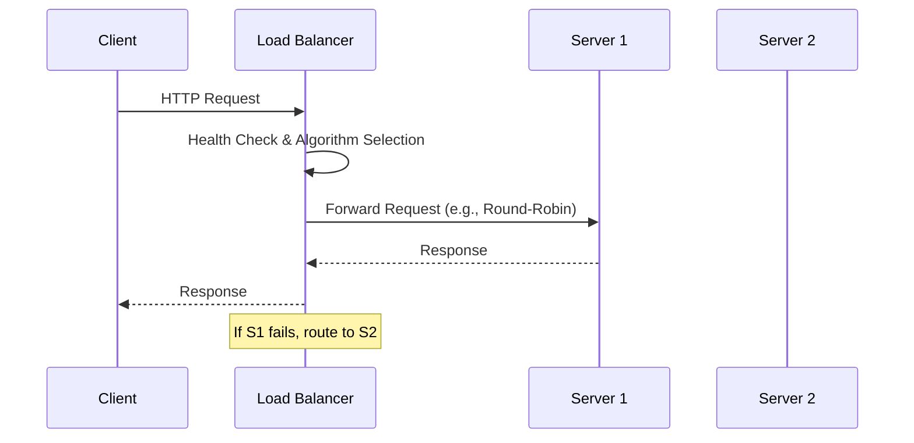
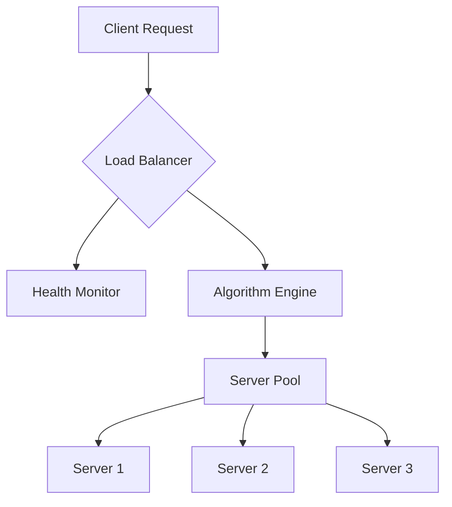

## Overview
Load balancing is the process of distributing computational workloads across multiple computing resources to optimize resource use, maximize throughput, minimize response time, and avoid overload. Strategies include various algorithms and architectures tailored to different scenarios, ensuring high availability, fault tolerance, and scalability in distributed systems.

## STAR Summary
**Situation:** A high-traffic e-commerce platform experienced frequent downtime during peak sales periods due to uneven server load.  
**Task:** Implement an effective load balancing strategy to distribute traffic evenly and prevent server overload.  
**Action:** Deployed a round-robin load balancer with health checks and session persistence, integrated with auto-scaling.  
**Result:** Achieved 50% reduction in response times, eliminated downtime, and improved user experience during peak loads.

## Detailed Explanation
Load balancing strategies vary based on the layer (Layer 4 for transport, Layer 7 for application), algorithm, and architecture. Key components include algorithms for distribution, health monitoring, and failover mechanisms.

### Load Balancing Algorithms
| Algorithm | Description | Pros | Cons | Use Cases |
|-----------|-------------|------|------|-----------|
| Round-Robin | Cycles through servers sequentially. | Simple, even distribution for homogeneous servers. | Ignores server load; poor for variable task sizes. | Basic web servers, equal-capacity nodes. |
| Least Connections | Routes to server with fewest active connections. | Balances based on current load. | Requires real-time monitoring; overhead. | Dynamic workloads, databases. |
| IP Hash | Uses client IP to assign servers consistently. | Session persistence without cookies. | Uneven load if IP distribution is skewed. | Stateful applications, geo-routing. |
| Weighted Round-Robin | Assigns weights based on server capacity. | Accounts for heterogeneous servers. | Manual weight tuning required. | Mixed hardware environments. |
| Least Response Time | Routes to server with fastest response. | Optimizes for performance. | Computationally intensive. | Latency-sensitive apps. |
| Power of Two Choices | Randomly selects two servers, chooses the better one. | Reduces variance in load distribution. | Slightly more complex. | High-variability tasks. |

### Types of Load Balancers
- **Hardware Load Balancers:** Dedicated devices (e.g., F5 BIG-IP) for high performance and security.
- **Software Load Balancers:** Applications like NGINX, HAProxy, or Envoy, often containerized.
- **Cloud Load Balancers:** Managed services like AWS ELB, Google Cloud Load Balancing, Azure Load Balancer.

### Routing Strategies
- **URL-based Routing:** Directs traffic based on URL paths (e.g., /api to backend, /static to CDN).
- **Header-based Routing:** Uses HTTP headers for decisions (e.g., User-Agent for mobile/desktop).
- **Geo-based Routing:** Routes based on client location for reduced latency.
- **Content-aware Routing:** Inspects payload for intelligent distribution.

### Health Checks and Failover
Health checks monitor server status via pings, HTTP requests, or custom probes. Strategies include:
- Active checks: Periodic polling.
- Passive checks: Monitor real traffic.
Failover ensures traffic reroutes on failures, often with N+1 redundancy.

## Real-world Examples & Use Cases
- **AWS Elastic Load Balancing (ELB):** Distributes traffic across EC2 instances, auto-scales, and integrates with health checks for fault tolerance in e-commerce platforms.
- **CDN Load Balancing:** Akamai or Cloudflare routes users to nearest edge servers based on geography, reducing latency for global content delivery.
- **Microservices Architecture:** Kubernetes Ingress controllers (e.g., NGINX Ingress) balance traffic across pods, enabling blue-green deployments.
- **Database Load Balancing:** ProxySQL or PgBouncer distributes read queries across replicas, improving performance for read-heavy applications like social media feeds.
- **Telecommunications:** Load balancing in 5G networks distributes data across base stations to handle high-density user areas.
- **AI Data Ingestion:** Load balancers manage high-volume data pipelines for training models, ensuring even distribution across compute nodes.

## Code Examples
### Round-Robin Load Balancer in Java
```java
import java.util.List;
import java.util.concurrent.atomic.AtomicInteger;

public class RoundRobinLoadBalancer {
    private final List<String> servers;
    private final AtomicInteger counter = new AtomicInteger(0);

    public RoundRobinLoadBalancer(List<String> servers) {
        this.servers = servers;
    }

    public String getNextServer() {
        return servers.get(counter.getAndIncrement() % servers.size());
    }
}
```

### Least Connections in Python
```python
import random

class LeastConnectionsLoadBalancer:
    def __init__(self, servers):
        self.servers = {server: 0 for server in servers}

    def get_server(self):
        # Select server with least connections
        server = min(self.servers, key=self.servers.get)
        self.servers[server] += 1
        return server

    def release_connection(self, server):
        if self.servers[server] > 0:
            self.servers[server] -= 1
```

### IP Hash in Go
```go
package main

import (
    "crypto/md5"
    "fmt"
    "net"
)

func ipHash(servers []string, clientIP string) string {
    hash := md5.Sum([]byte(clientIP))
    index := int(hash[0]) % len(servers)
    return servers[index]
}
```

### NGINX Configuration Example
```nginx
upstream backend {
    least_conn;
    server backend1.example.com:8080 weight=3;
    server backend2.example.com:8080 weight=1;
    server backend3.example.com:8080 backup;
}

server {
    listen 80;
    location / {
        proxy_pass http://backend;
        proxy_set_header Host $host;
    }
}
```

## Journey / Sequence


## Data Models / Message Formats


| Field | Type | Description |
|-------|------|-------------|
| server_id | string | Unique identifier for the server. |
| health_status | enum (UP, DOWN, DEGRADED) | Current operational status. |
| load_metric | int | Number of active connections or CPU usage. |
| weight | int | Assigned weight for weighted algorithms. |
| last_check | timestamp | Time of last health check. |

## Common Pitfalls & Edge Cases
- **Session Stickiness Issues:** Sticky sessions can lead to uneven loads; edge case: server failure causes session loss if not replicated.
- **Thundering Herd Problem:** All clients retry simultaneously after a failure, overwhelming remaining servers.
- **Health Check False Positives:** Overly sensitive checks mark healthy servers as down, reducing capacity.
- **Scalability Bottlenecks:** Load balancer becomes a single point of failure; mitigate with redundancy.
- **Geo-Distribution Skew:** IP-based hashing fails for VPN users; edge case: users behind proxies get inconsistent routing.
- **SSL/TLS Offloading Overhead:** Decrypting traffic at the balancer can bottleneck if not hardware-accelerated.

## Tools & Libraries
- **NGINX:** Open-source, supports HTTP/HTTPS, TCP/UDP; features like upstream modules for algorithms.
- **HAProxy:** High-performance, Layer 4/7 balancing, advanced health checks, and ACLs.
- **Envoy Proxy:** Cloud-native, integrates with service meshes like Istio.
- **AWS ALB/NLB:** Managed services for auto-scaling and integration with ECS/EKS.
- **Traefik:** Kubernetes-native, automatic service discovery.

## Github-README Links & Related Topics
- [system-design-basics](../system-design-basics/)
- [networking-tcp-ip-http2-tls](../../networking/networking-tcp-ip-http2-tls/)
- [caching-strategies](../caching-strategies/)
- [partitioning-and-sharding](../partitioning-and-sharding/)
- [microservices-architecture](../microservices-architecture/)
- [fault-tolerance-patterns](../fault-tolerance-patterns/)

## References
- [Load Balancing (Computing) - Wikipedia](https://en.wikipedia.org/wiki/Load_balancing_(computing))
- [NGINX Load Balancing Documentation](https://docs.nginx.com/nginx/admin-guide/load-balancer/)
- [AWS Elastic Load Balancing User Guide](https://docs.aws.amazon.com/elasticloadbalancing/)
- [HAProxy Configuration Manual](https://www.haproxy.org/#docs)
- Sanders, Peter; et al. (2019). *Sequential and Parallel Algorithms and Data Structures*. Springer.