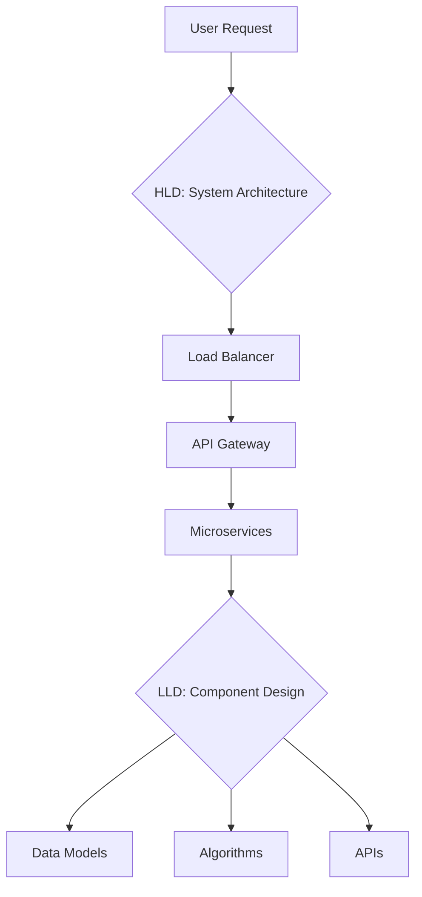

# Popular System Designs LLD HLD

## Overview

This section covers popular system design interview cases, focusing on both Low-Level Design (LLD) and High-Level Design (HLD). LLD delves into detailed component interactions, data structures, and algorithms, while HLD outlines the overall architecture, scalability, and trade-offs. These designs serve as templates for real-world applications and interview preparation.

## Detailed Explanation

### Low-Level Design (LLD)
LLD focuses on the internal workings of individual components. It includes class diagrams, data models, API specifications, and algorithmic details for specific features.

### High-Level Design (HLD)
HLD provides a bird's-eye view of the system, covering architecture patterns, data flow, scalability strategies, and integration points.

### Popular System Designs

| Design | LLD Focus | HLD Focus | Key Challenges |
|--------|-----------|-----------|----------------|
| URL Shortener | Hashing algorithms, database schema | Load balancing, caching | Collision handling, scalability |
| Netflix Video Streaming | Adaptive bitrate, CDN | Microservices, global distribution | Latency, bandwidth optimization |
| Twitter | Timeline generation, fan-out | Sharding, replication | Real-time updates, high throughput |
| Instagram | Image processing, feeds | Distributed storage, caching | Media handling, user growth |
| Uber | Location tracking, matching | Geo-sharding, real-time | Concurrency, geospatial queries |
| Airbnb | Search ranking, booking flow | Multi-tenant, payment integration | Trust, availability |



## Real-world Examples & Use Cases

- **URL Shortener**: Used by Bitly, TinyURL for link management.
- **Video Streaming**: Platforms like YouTube, Hulu for content delivery.
- **Social Media**: Facebook, LinkedIn for user interactions.
- **Ride Sharing**: Uber, Lyft for location-based services.
- **E-commerce**: Amazon, eBay for product search and transactions.

## Code Examples

### URL Shortener LLD (Java)
```java
import java.util.HashMap;
import java.util.Map;

class URLShortener {
    private Map<String, String> urlMap = new HashMap<>();
    private Map<String, String> shortMap = new HashMap<>();
    private static final String BASE_URL = "http://short.ly/";

    public String shorten(String longUrl) {
        if (shortMap.containsKey(longUrl)) {
            return shortMap.get(longUrl);
        }
        String shortUrl = BASE_URL + generateHash(longUrl);
        urlMap.put(shortUrl, longUrl);
        shortMap.put(longUrl, shortUrl);
        return shortUrl;
    }

    public String expand(String shortUrl) {
        return urlMap.get(shortUrl);
    }

    private String generateHash(String url) {
        return Integer.toHexString(url.hashCode());
    }
}
```

## References

- [System Design Interview](https://github.com/donnemartin/system-design-primer)
- [Low-Level Design vs High-Level Design](https://www.geeksforgeeks.org/difference-between-high-level-design-and-low-level-design/)

## Github-README Links & Related Topics

- [URL Shortener System Design](../../system-design/url-shortener-system-design/)
- [Netflix Video Streaming Architecture](../../system-design/netflix-video-streaming-architecture/)
- [Twitter System Design](../../twitter-system-design/)
- [Instagram System Design](../../instagram-system-design/)
- [LLD HLD Basics](../lld-hld-basics/)