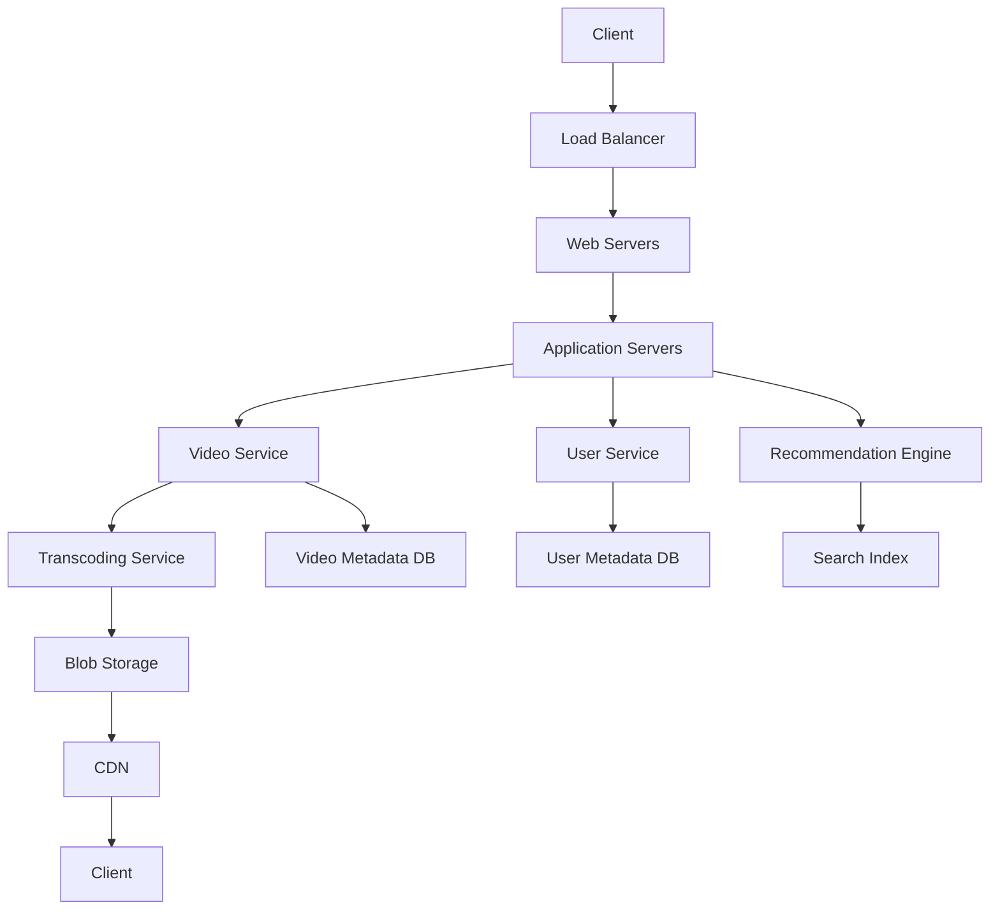

# Overview

YouTube is a massive video streaming platform handling billions of daily active users, with over 500 hours of video uploaded per minute and 694,000 hours streamed per minute. Designing a system like YouTube requires addressing high availability (99%+ uptime), low latency, scalability for millions of concurrent users, and reliability for persistent video storage. Key components include video upload/transcoding, distributed storage, content delivery networks (CDNs), recommendation engines, search, and user management. The architecture leverages microservices, distributed databases, and cloud infrastructure to manage petabytes of data and trillions of views annually.

# Detailed Explanation

YouTube's architecture is a distributed system built on microservices, utilizing Google Cloud Platform (GCP) for scalability. Core components include:

- **Video Upload and Transcoding**: Users upload videos via clients, processed by application servers, transcoded into multiple formats/resolutions (e.g., MP4, WebM, HLS) for compatibility and adaptive bitrate streaming (ABR).
- **Storage**: Videos stored in blob storage (e.g., Google Cloud Storage), thumbnails in fast-access databases like Bigtable. Temporary upload storage holds raw files before transcoding.
- **Content Delivery**: CDNs (e.g., Google Cloud CDN) cache and deliver videos globally, reducing latency. Colocation sites ensure regional availability.
- **Recommendation Engine**: Machine learning models analyze user behavior, video metadata, and engagement to suggest content, powered by data pipelines and real-time processing.
- **Search and Metadata**: Inverted indexes for fast search on titles, descriptions, tags. Metadata stored in relational/NoSQL databases (e.g., MySQL, Bigtable).
- **User Management**: Handles authentication, profiles, subscriptions via user services and databases.
- **Load Balancing and Scaling**: Load balancers distribute traffic; auto-scaling groups handle peak loads.

The system prioritizes availability over strict consistency (eventual consistency for metadata), using sharding, replication, and caching for performance.



| Component | Purpose | Technologies |
|-----------|---------|--------------|
| Load Balancer | Distribute traffic | Nginx, AWS ELB |
| Application Servers | Business logic | Java/Spring, Node.js |
| Transcoding Service | Format conversion | FFmpeg, Google Transcoder API |
| Blob Storage | Video files | GCS, S3 |
| CDN | Global delivery | Cloudflare, Akamai |
| Databases | Metadata | Bigtable, Cassandra |
| Recommendation | ML suggestions | TensorFlow, Spark |

# Real-world Examples & Use Cases

- **YouTube Platform**: Handles live streams, shorts, and 4K videos; scales during events like Super Bowl with billions of views.
- **Similar Platforms**: Vimeo for creator-focused streaming, TikTok for short-form video with algorithmic feeds, Netflix for on-demand with personalized recommendations.
- **Use Cases**:
  - **Video Streaming**: ABR adjusts quality based on network (e.g., 1080p to 480p for slow connections).
  - **Upload and Monetization**: Creators upload, transcode, and earn via ads/analytics.
  - **Search and Discovery**: Query-based search with filters; recommendations drive 70%+ of watch time.
  - **Live Broadcasting**: Real-time transcoding and global CDN delivery.

# Code Examples

Pseudocode for key flows:

**Video Upload Flow**:
```python
def upload_video(user_id, video_file):
    # Authenticate user
    if not authenticate(user_id):
        return "Unauthorized"
    
    # Store raw video temporarily
    temp_id = store_temp(video_file)
    
    # Queue for transcoding
    queue_transcode(temp_id, formats=["mp4", "webm"], resolutions=[480, 720, 1080])
    
    # Update metadata
    metadata = {"title": "Sample", "user": user_id}
    save_metadata(metadata)
    
    return "Upload queued"
```

**Recommendation Algorithm (Simplified Collaborative Filtering)**:
```python
def recommend_videos(user_id, watched_videos):
    # Fetch user preferences
    user_prefs = get_user_prefs(user_id)
    
    # Compute similarities
    similar_users = find_similar_users(user_prefs)
    candidates = get_videos_from_similar(similar_users)
    
    # Rank by engagement
    ranked = rank_by_engagement(candidates, watched_videos)
    
    return ranked[:10]  # Top 10 recommendations
```

**Adaptive Bitrate Streaming Chunk Selection**:
```javascript
function selectChunk(network_speed, current_quality) {
    const thresholds = { slow: 480, medium: 720, fast: 1080 };
    if (network_speed < 1) return getChunk(480);
    if (network_speed < 5) return getChunk(720);
    return getChunk(1080);
}
```

# References

- [YouTube System Design - Educative](https://www.educative.io/blog/youtube-system-design)
- [Design a System Like YouTube - GeeksforGeeks](https://www.geeksforgeeks.org/design-a-system-like-youtube/)
- [System Design for Beginners - YouTube Video](https://www.youtube.com/watch?v=sgqFmKPPKRg)
- [Google Cloud YouTube Architecture Overview](https://cloud.google.com/solutions/youtube-architecture)

# Github-README Links & Related Topics

- [Video Streaming](../video-streaming/README.md)
- [CDN Architecture](../cdn-architecture/README.md)
- [Distributed Caching with Redis](../distributed-caching-with-redis/README.md)
- [API Design Principles](../api-design-principles/README.md)
- [Scalability Patterns](../high-scalability-patterns/README.md)

# Journey / Sequence

1. **Upload**: Client uploads video → Load Balancer → Application Server → Temp Storage → Transcoding Queue.
2. **Processing**: Transcoder converts formats → Blob Storage → Metadata DB update.
3. **Streaming**: Client requests video → CDN checks cache → If miss, fetch from Blob → Deliver chunks via ABR.
4. **Recommendation**: User watches → Log engagement → ML pipeline processes → Suggest videos.

# Data Models / Message Formats

**Video Metadata** (JSON):
```json
{
  "video_id": "uuid",
  "title": "Sample Video",
  "description": "Description",
  "user_id": "uuid",
  "tags": ["tag1", "tag2"],
  "duration": 300,
  "formats": ["mp4", "webm"],
  "views": 1000000,
  "likes": 50000
}
```

**User Profile** (JSON):
```json
{
  "user_id": "uuid",
  "username": "creator",
  "subscriptions": ["channel1", "channel2"],
  "preferences": {"genre": "tech"}
}
```

# Common Pitfalls & Edge Cases

- **Buffering**: Poor ABR implementation; mitigate with pre-buffering and network monitoring.
- **Data Loss**: Single storage failure; use replication and backups.
- **Scalability Bottlenecks**: Viral videos overload CDNs; employ geo-sharding and auto-scaling.
- **Edge Cases**: Zero views on new videos (cold start problem); use content-based recommendations.
- **Security**: Unauthorized uploads; implement rate limiting and content moderation.

# Tools & Libraries

- **Transcoding**: FFmpeg, AWS Elemental MediaConvert.
- **Storage**: Google Cloud Storage, Amazon S3.
- **CDN**: Cloudflare, Akamai.
- **Databases**: Bigtable for metadata, Redis for caching.
- **ML/Recommendations**: TensorFlow, Apache Spark.
- **Monitoring**: Prometheus, Grafana for metrics.