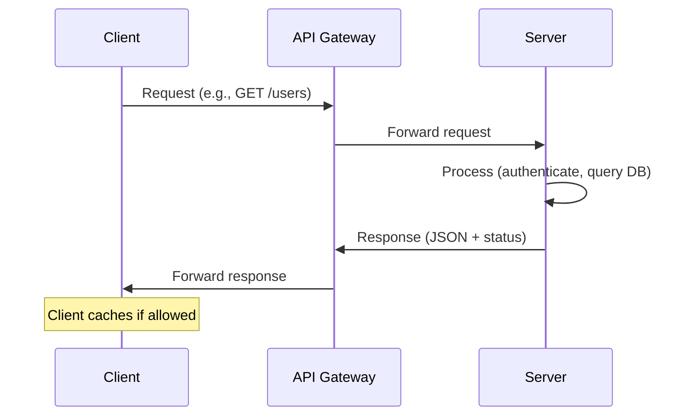

# Overview

API Design Principles encompass a set of guidelines and best practices for creating robust, scalable, and maintainable Application Programming Interfaces (APIs). These principles draw heavily from REST (Representational State Transfer) architecture, introduced by Roy Fielding in 2000, and extend to modern practices like versioning, security, and documentation. Key focuses include ensuring uniform interfaces, statelessness, cacheability, and proper resource modeling to facilitate seamless client-server interactions. Effective API design promotes interoperability, reduces coupling, and enhances developer experience.

# Detailed Explanation

API design principles are rooted in architectural constraints that ensure APIs are efficient, reliable, and easy to use. Below, we break down core principles, primarily based on REST, with additional best practices.

## Core REST Constraints

REST defines six guiding principles:

1. **Uniform Interface**: Ensures consistent interactions between clients and servers. Sub-constraints include:
   - **Resource Identification**: Use URIs to uniquely identify resources (e.g., `/users/123`).
   - **Manipulation via Representations**: Clients modify resources through representations (e.g., JSON payloads).
   - **Self-Descriptive Messages**: Responses include metadata for processing (e.g., Content-Type headers).
   - **Hypermedia as the Engine of Application State (HATEOAS)**: Responses contain links for state transitions.

2. **Client-Server Separation**: Decouples client (UI concerns) from server (data concerns), allowing independent evolution and improved scalability.

3. **Statelessness**: Each request must contain all necessary information; servers do not store client state. This simplifies scaling and fault tolerance.

4. **Cacheability**: Responses must indicate if they can be cached, reducing server load and improving performance.

5. **Layered System**: Architecture can include intermediaries (e.g., proxies, load balancers) without affecting client-server interactions.

6. **Code on Demand (Optional)**: Servers can extend client functionality by sending executable code (e.g., JavaScript).

## Additional Principles

- **Resource Modeling**: Treat data as resources with clear hierarchies (e.g., nouns like `/users`, `/orders`). Use plural nouns and avoid verbs in URIs.
- **HTTP Methods**: Leverage standard methods for CRUD operations:
  | Method | Purpose | Example |
  |--------|---------|---------|
  | GET | Retrieve resource | `GET /users/123` |
  | POST | Create resource | `POST /users` |
  | PUT | Update resource (full) | `PUT /users/123` |
  | PATCH | Update resource (partial) | `PATCH /users/123` |
  | DELETE | Remove resource | `DELETE /users/123` |
- **Status Codes**: Use appropriate HTTP status codes (e.g., 200 OK, 201 Created, 400 Bad Request, 404 Not Found, 500 Internal Server Error).
- **Versioning**: Handle API evolution via URL paths (e.g., `/v1/users`), headers, or query parameters to avoid breaking changes.
- **Security**: Implement authentication (e.g., OAuth 2.0, API keys), authorization, rate limiting, and input validation.
- **Documentation**: Provide clear, up-to-date docs using tools like OpenAPI/Swagger.
- **Error Handling**: Return consistent error responses with details (e.g., JSON error objects).

## Journey / Sequence

A typical API request-response cycle follows this sequence:



# Real-world Examples & Use Cases

- **GitHub API**: Uses RESTful principles with HATEOAS links in responses. Example: `GET /repos/octocat/Hello-World` returns repo data with links to issues, pulls, etc. Used for CI/CD integrations and third-party tools.
- **Stripe API**: Employs resource-based URIs (e.g., `/v1/customers`) and idempotent operations for payment processing. Ensures security with API keys and webhooks for event-driven updates.
- **Twitter API (v2)**: Supports pagination, filtering, and versioning. Used for social media analytics and automated posting.
- **Use Cases**: E-commerce platforms for order management, IoT systems for device data retrieval, and microservices for inter-service communication.

# Code Examples

## Basic RESTful Endpoint

```json
// GET /api/v1/users/123
{
  "id": 123,
  "name": "John Doe",
  "email": "john@example.com",
  "links": {
    "self": "/api/v1/users/123",
    "orders": "/api/v1/users/123/orders"
  }
}
```

## Creating a Resource

```bash
curl -X POST https://api.example.com/v1/users \
  -H "Content-Type: application/json" \
  -d '{"name": "Jane Doe", "email": "jane@example.com"}'
# Response: 201 Created with Location header
```

## Error Response

```json
{
  "error": {
    "code": 400,
    "message": "Invalid email format",
    "details": "Email must be a valid address"
  }
}
```

## OpenAPI Spec Snippet

```yaml
openapi: 3.0.0
info:
  title: Sample API
  version: 1.0.0
  description: Example API following design principles
paths:
  /users:
    get:
      summary: List users
      responses:
        '200':
          description: Success
          content:
            application/json:
              schema:
                type: array
                items:
                  $ref: '#/components/schemas/User'
components:
  schemas:
    User:
      type: object
      properties:
        id:
          type: integer
        name:
          type: string
```

# Data Models / Message Formats

APIs commonly use JSON for data exchange due to its readability and ubiquity. XML or Protocol Buffers may be used for specific needs.

## JSON Schema Example

```json
{
  "$schema": "http://json-schema.org/draft-07/schema#",
  "type": "object",
  "properties": {
    "id": { "type": "integer" },
    "name": { "type": "string", "minLength": 1 },
    "email": { "type": "string", "format": "email" }
  },
  "required": ["name", "email"]
}
```

# Common Pitfalls & Edge Cases

- **Ignoring HATEOAS**: Leads to tight coupling; clients hardcode URLs.
- **Stateful Sessions**: Violates statelessness, complicating scaling.
- **Over-fetching/Under-fetching**: Return only needed data; use GraphQL if flexible querying is required.
- **Inconsistent Versioning**: Causes breaking changes; always version APIs.
- **Poor Error Messages**: Vague errors frustrate developers; include actionable details.
- **Edge Case: Rate Limiting**: Handle bursts with 429 Too Many Requests and Retry-After headers.
- **Security Oversights**: Expose sensitive data; always validate inputs and use HTTPS.

# Tools & Libraries

- **Swagger/OpenAPI**: For API specification and documentation.
- **Postman**: For testing and mocking APIs.
- **Insomnia**: Alternative API client for design and testing.
- **Apigee/ Kong**: API gateways for management and security.
- **Libraries**: Express.js (Node.js) for REST APIs, Spring Boot (Java) for rapid development.

# STAR Summary

**Situation**: In a system design interview, explain API design for a scalable e-commerce platform.

**Task**: Design an API for user orders with CRUD operations, ensuring security and performance.

**Action**: Applied REST principles: used resource URIs (`/orders`), HTTP methods, stateless auth via JWT, caching headers, and OpenAPI docs. Implemented versioning and error handling.

**Result**: Delivered a maintainable API handling 10k RPS, with clear docs reducing integration time by 50%.

# References

- [REST Architectural Constraints - restfulapi.net](https://restfulapi.net/rest-architectural-constraints/)
- [What is REST? - restfulapi.net](https://restfulapi.net/)
- [API General Info - Swagger Docs](https://swagger.io/docs/specification/api-general-info/)
- [Roy Fielding's Dissertation](https://www.ics.uci.edu/~fielding/pubs/dissertation/rest_arch_style.htm)

# Github-README Links & Related Topics

- [API Design REST GRPC OpenAPI](../api-design-rest-grpc-openapi/README.md)
- [System Design Basics](../system-design-basics/README.md)
- [Microservices Architecture](../microservices-architecture/README.md)
- [Security Best Practices in Java](../security-best-practices-in-java/README.md)