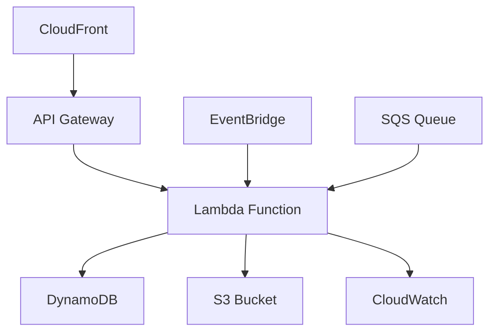
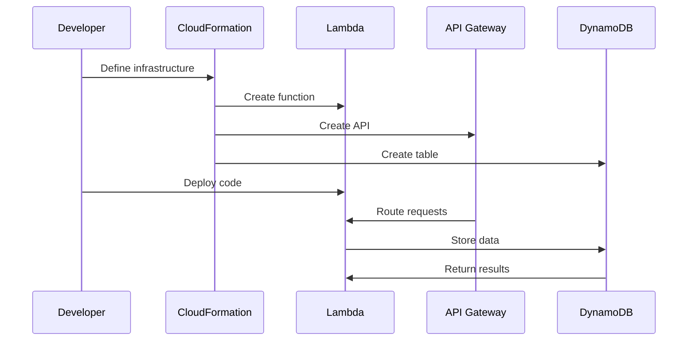

# AWS Architecture Patterns

## Overview

AWS provides a suite of services that enable various architecture patterns for scalable, resilient, and cost-effective applications.

## Detailed Explanation

AWS offers services across multiple categories to implement various architecture patterns:

| Category | Key Services | Use Case |
|----------|--------------|----------|
| Compute | EC2, Lambda, ECS, EKS | Running applications |
| Storage | S3, EBS, EFS, Glacier | Data storage and backup |
| Database | RDS, DynamoDB, Aurora | Relational and NoSQL data |
| Networking | VPC, CloudFront, Route 53 | Secure networking and CDN |
| Messaging | SQS, SNS, EventBridge | Decoupling and event-driven |
| Analytics | Redshift, EMR, Athena | Big data processing |
| Security | IAM, KMS, Cognito | Identity and access management |

### Serverless Architecture Pattern



Common patterns include:
- **Serverless**: Lambda for compute, API Gateway for APIs.
- **Microservices**: ECS/Fargate for containerized services.
- **Event-Driven**: SQS/SNS for asynchronous processing.
- **Data Lake**: S3 for storage, Glue for ETL.
- **Hybrid Cloud**: Direct Connect for on-premises integration.

## Real-world Examples & Use Cases

- **Serverless APIs**: Mobile app backends with Lambda and API Gateway.
- **Big Data Processing**: ETL pipelines with Glue and Athena.
- **Global Applications**: Multi-region deployments with CloudFront and Route 53.
- **IoT Data Ingestion**: Kinesis for real-time data streams.
- **Machine Learning**: SageMaker for model training and inference.
- **E-commerce Platforms**: Microservices with ECS and Aurora.

## Code Examples

### Lambda Function

```javascript
exports.handler = async (event) => {
    console.log('Event: ', event);
    return {
        statusCode: 200,
        body: JSON.stringify('Hello from Lambda!'),
    };
};
```

### CloudFormation Template

```yaml
AWSTemplateFormatVersion: '2010-09-09'
Resources:
  MyBucket:
    Type: 'AWS::S3::Bucket'
    Properties:
      BucketName: my-unique-bucket-name
```

### API Gateway Integration

```yaml
ApiGatewayRestApi:
  Type: AWS::ApiGateway::RestApi
  Properties:
    Name: MyAPI
    Description: API for serverless app

ApiGatewayMethod:
  Type: AWS::ApiGateway::Method
  Properties:
    RestApiId: !Ref ApiGatewayRestApi
    ResourceId: !GetAtt ApiGatewayRestApi.RootResourceId
    HttpMethod: GET
    AuthorizationType: NONE
    Integration:
      Type: AWS_PROXY
      IntegrationHttpMethod: POST
      Uri: !Sub arn:aws:apigateway:${AWS::Region}:lambda:path/2015-03-31/functions/${LambdaFunction.Arn}/invocations
```

### DynamoDB Table

```javascript
const AWS = require('aws-sdk');
const dynamodb = new AWS.DynamoDB.DocumentClient();

exports.handler = async (event) => {
    const params = {
        TableName: 'Users',
        Item: {
            id: event.id,
            name: event.name
        }
    };
    await dynamodb.put(params).promise();
    return { statusCode: 200, body: 'User created' };
};
```

### Event-Driven with SQS

```python
import boto3
import json

sqs = boto3.client('sqs')
queue_url = 'https://sqs.us-east-1.amazonaws.com/123456789012/my-queue'

def lambda_handler(event, context):
    message = {'data': 'Hello from SQS'}
    sqs.send_message(QueueUrl=queue_url, MessageBody=json.dumps(message))
    return {'statusCode': 200}
```

## Journey / Sequence

Building a serverless application on AWS:



## Common Pitfalls & Edge Cases

- Not monitoring costs leading to unexpected bills.
- Ignoring cold starts in Lambda performance.
- Improper IAM permissions causing access issues.
- Not using VPC for Lambda in private networks.
- Over-provisioning resources without auto-scaling.

## Tools & Libraries

- **AWS CLI**: Command-line interface for AWS services
- **AWS SDKs**: Language-specific libraries (boto3 for Python, AWS SDK for Java)
- **CloudFormation**: Infrastructure as code
- **Terraform**: Multi-cloud infrastructure management
- **AWS SAM**: Serverless application model
- **X-Ray**: Distributed tracing for applications

## References

- [AWS Architecture Center](https://aws.amazon.com/architecture/)
- [AWS Well-Architected Framework](https://aws.amazon.com/architecture/well-architected/)
- [AWS Whitepapers](https://aws.amazon.com/whitepapers/)
- [AWS Solutions Library](https://aws.amazon.com/solutions/)

## Github-README Links & Related Topics

- [Serverless Architecture](./serverless-architecture/README.md)
- [Cloud Computing Basics](./cloud-computing-basics/README.md)
