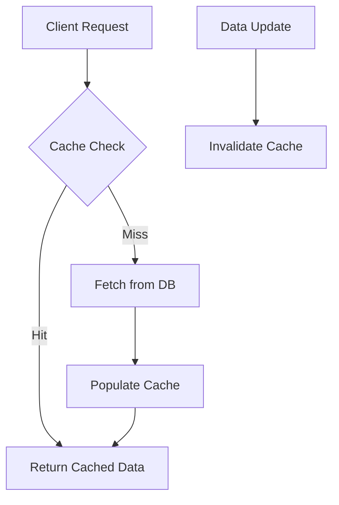
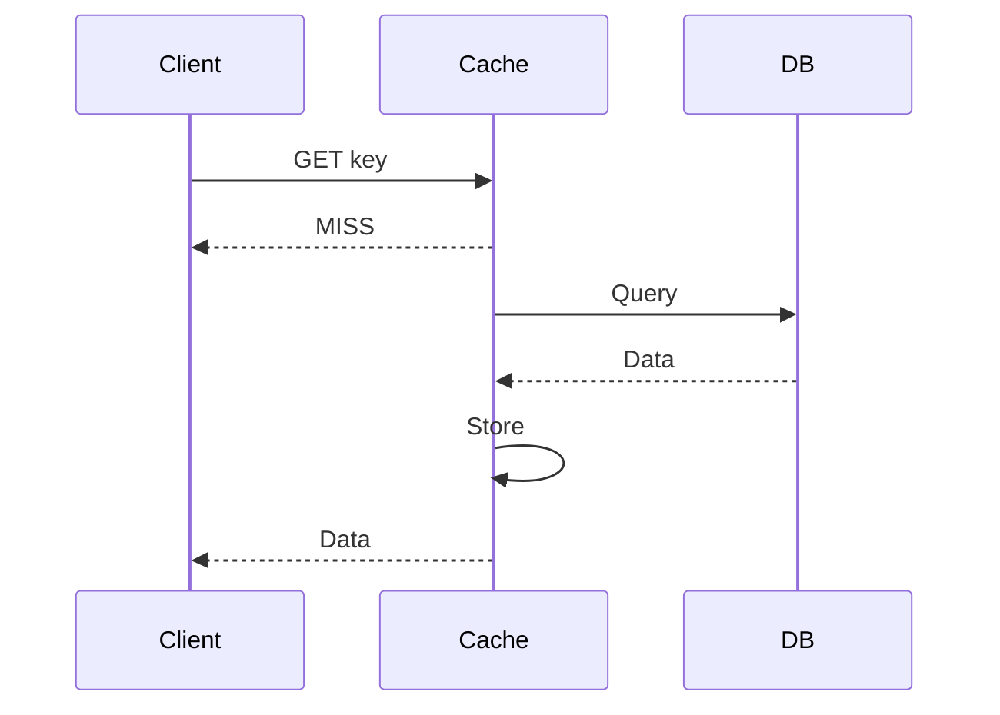

## Overview
Caching is a technique to store frequently accessed data in fast-access storage to reduce latency and load on primary data sources. Key patterns include cache-aside, write-through, write-back, and refresh-ahead. Invalidation strategies ensure data consistency, with options like TTL, LRU eviction, and explicit invalidation.

## STAR Summary
**Situation:** In a high-traffic e-commerce platform, product catalog queries caused database overload during peak hours.  
**Task:** Implement caching to reduce DB load by 70% while maintaining data freshness.  
**Action:** Deployed Redis cache-aside pattern with TTL-based invalidation and monitored hit rates.  
**Result:** Achieved 80% cache hit rate, reduced response time from 500ms to 50ms, and handled 10x traffic spike without DB degradation.

## Detailed Explanation
- **Cache-Aside (Lazy Loading):** Application checks cache first; if miss, fetches from DB and populates cache.
- **Write-Through:** Writes go to both cache and DB synchronously.
- **Write-Back:** Writes to cache first, asynchronously to DB.
- **Invalidation Strategies:** TTL for time-based expiry, LRU for least recently used eviction, and write-invalidation on updates.
- **Distributed Caching:** Use consistent hashing for sharding across nodes to avoid hotspots.

High-Level Design:


Capacity Estimation: For 1M daily users, 100 req/user, 10% cacheable, 1KB per entry: ~10GB cache size. Throughput: 10k req/s, with 90% hit rate, DB load reduced by 9x.

Tradeoffs:
- Consistency vs Performance: Strong consistency requires write-through, sacrificing speed.
- Scalability vs Complexity: Distributed caches add network latency.

API Design Example:
- GET /products/{id} - Check cache, fallback to DB.
- POST /products - Write-through to cache and DB.

Deployment: Use Redis clusters on Kubernetes, with sidecar for metrics.

## Real-world Examples & Use Cases
- CDN for static assets (e.g., Cloudflare).
- Database query caching in ORM layers.
- Session storage in web apps.

## Code Examples
Java implementation with Caffeine library:

```java
import com.github.benmanes.caffeine.cache.Cache;
import com.github.benmanes.caffeine.cache.Caffeine;
import java.util.concurrent.TimeUnit;

public class CacheExample {
    private static final Cache<String, String> cache = Caffeine.newBuilder()
        .expireAfterWrite(10, TimeUnit.MINUTES)
        .maximumSize(10_000)
        .build();

    public String getData(String key) {
        return cache.get(key, k -> fetchFromDB(k)); // Cache-aside
    }

    private String fetchFromDB(String key) {
        // Simulate DB fetch
        return "data for " + key;
    }

    public void invalidate(String key) {
        cache.invalidate(key);
    }
}
```

Maven dependency:
```xml
<dependency>
    <groupId>com.github.benmanes.caffeine</groupId>
    <artifactId>caffeine</artifactId>
    <version>3.1.8</version>
</dependency>
```

## Data Models / Message Formats
| Field | Type | Description |
|-------|------|-------------|
| key   | String | Cache key |
| value | Object | Cached data |
| ttl   | Long | Time-to-live in seconds |

Example JSON payload:
```json
{
  "key": "product:123",
  "value": {"name": "Widget", "price": 19.99},
  "ttl": 600
}
```

## Journey / Sequence


## Common Pitfalls & Edge Cases
- Cache Stampede: Multiple requests for expired key; use locks or refresh-ahead.
- Thundering Herd: Mass invalidation; stagger TTLs.
- Data Staleness: Invalidate on writes, but handle race conditions.
- Memory Pressure: Monitor eviction rates.

Common Interview Questions:
1. How to handle cache invalidation in distributed systems?
2. Compare cache-aside vs write-through.
3. Design a cache for social media feed.

## Tools & Libraries
- Redis: In-memory data structure store.
- Caffeine: High-performance Java caching library.
- Ehcache: Enterprise caching solution.

## Github-README Links & Related Topics
- [load-balancing-and-routing](./load-balancing-and-routing/README.md)
- [database-design-and-indexing](./database-design-and-indexing/README.md)
- [partitioning-and-sharding](./partitioning-and-sharding/README.md)

## References
- https://redis.io/documentation
- https://github.com/ben-manes/caffeine
- https://martinfowler.com/bliki/TwoHardThings.html