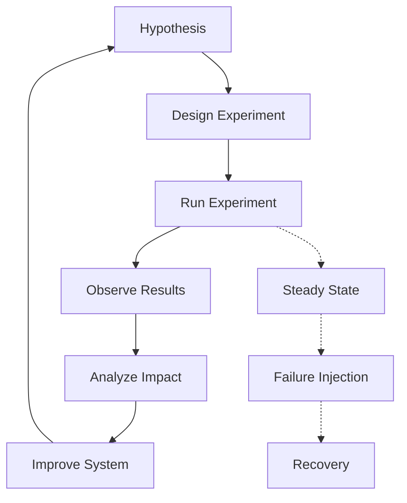

# Chaos Engineering Practices

## Overview

Chaos Engineering Practices involve deliberately introducing failures and disruptions into systems to test their resilience and identify weaknesses. This proactive approach helps teams build more robust, fault-tolerant applications by simulating real-world failure scenarios in controlled environments.



## Detailed Explanation

### Core Principles

1. **Build a Hypothesis**: Define what you expect to happen when failure occurs
2. **Start Small**: Begin with simple experiments and gradually increase complexity
3. **Minimize Blast Radius**: Limit the impact of experiments to prevent production issues
4. **Run in Production**: Test in production-like environments for realistic results
5. **Automate**: Make chaos experiments part of CI/CD pipelines
6. **Learn Continuously**: Use results to improve system design and operations

### Types of Chaos Experiments

- **Network Chaos**: Simulate network partitions, latency, and packet loss
- **Resource Chaos**: Induce CPU, memory, or disk pressure
- **Application Chaos**: Kill processes, crash containers, or corrupt data
- **Infrastructure Chaos**: Terminate instances, remove nodes, or simulate zone failures
- **Dependency Chaos**: Make external services unavailable or slow

### Chaos Engineering Maturity Levels

1. **Level 1**: Manual experiments in staging environments
2. **Level 2**: Automated experiments in staging with monitoring
3. **Level 3**: Automated experiments in production with safeguards
4. **Level 4**: Chaos engineering integrated into development workflow
5. **Level 5**: Organization-wide chaos culture with game days

## Real-world Examples & Use Cases

### Netflix Simian Army

```java
// Chaos Monkey - Random instance termination
public class ChaosMonkey {

    private final EC2Client ec2Client;
    private final InstanceRepository instanceRepository;

    public ChaosMonkey(EC2Client ec2Client, InstanceRepository instanceRepository) {
        this.ec2Client = ec2Client;
        this.instanceRepository = instanceRepository;
    }

    @Scheduled(fixedDelay = 3600000) // Run every hour
    public void terminateRandomInstance() {
        List<Instance> instances = instanceRepository.findAllActiveInstances();

        if (instances.isEmpty()) {
            return;
        }

        // Select random instance
        Instance victim = instances.get(new Random().nextInt(instances.size()));

        // Check if instance is protected
        if (isInstanceProtected(victim)) {
            return;
        }

        // Terminate instance
        ec2Client.terminateInstances(TerminateInstancesRequest.builder()
            .instanceIds(victim.getInstanceId())
            .build());

        logTermination(victim);
    }

    private boolean isInstanceProtected(Instance instance) {
        // Check for protection tags or other criteria
        return instance.getTags().stream()
            .anyMatch(tag -> "chaos-monkey-protected".equals(tag.getKey()));
    }
}
```

### Kubernetes Chaos with Litmus

```yaml
# Pod delete chaos experiment
apiVersion: litmuschaos.io/v1alpha1
kind: ChaosEngine
metadata:
  name: pod-delete-chaos
  namespace: default
spec:
  appinfo:
    appns: default
    applabel: "app=nginx"
    appkind: deployment
  chaosServiceAccount: litmus-admin
  experiments:
  - name: pod-delete
    spec:
      components:
        env:
        - name: TOTAL_CHAOS_DURATION
          value: '60'
        - name: CHAOS_INTERVAL
          value: '10'
        - name: FORCE
          value: 'true'
```

### Network Chaos with Toxiproxy

```go
package main

import (
    "log"
    "time"

    "github.com/Shopify/toxiproxy/client"
)

func main() {
    proxyClient := toxiproxy.NewClient("localhost:8474")

    // Create a proxy
    proxy, err := proxyClient.CreateProxy("redis-proxy", "localhost:6379", "upstream:6379")
    if err != nil {
        log.Fatal(err)
    }

    // Add latency toxic
    _, err = proxy.AddToxic("latency", "latency", "downstream", 1.0, toxiproxy.Attributes{
        "latency": 1000, // 1 second latency
        "jitter":  100,  // 100ms jitter
    })
    if err != nil {
        log.Fatal(err)
    }

    // Run experiment for 30 seconds
    time.Sleep(30 * time.Second)

    // Remove toxic
    err = proxy.RemoveToxic("latency")
    if err != nil {
        log.Fatal(err)
    }
}
```

## Code Examples

### Custom Chaos Experiment Framework

```python
import random
import time
import requests
from typing import List, Dict, Any

class ChaosExperiment:
    def __init__(self, name: str, hypothesis: str):
        self.name = name
        self.hypothesis = hypothesis
        self.metrics_before = {}
        self.metrics_after = {}

    def run(self) -> Dict[str, Any]:
        print(f"Starting chaos experiment: {self.name}")
        print(f"Hypothesis: {self.hypothesis}")

        # Steady state measurement
        self.metrics_before = self.measure_steady_state()

        # Inject chaos
        self.inject_chaos()

        # Wait for blast radius
        time.sleep(60)

        # Measure impact
        self.metrics_after = self.measure_steady_state()

        # Analyze results
        results = self.analyze_results()

        # Cleanup
        self.cleanup()

        return results

    def measure_steady_state(self) -> Dict[str, float]:
        # Implement steady state measurement
        # e.g., response times, error rates, throughput
        return {
            'response_time': self.get_average_response_time(),
            'error_rate': self.get_error_rate(),
            'throughput': self.get_throughput()
        }

    def inject_chaos(self):
        # Implement chaos injection
        pass

    def analyze_results(self) -> Dict[str, Any]:
        # Compare before/after metrics
        degraded = False
        for metric in self.metrics_before:
            if self.metrics_after[metric] > self.metrics_before[metric] * 1.5:  # 50% degradation
                degraded = True
                break

        return {
            'hypothesis_valid': not degraded,
            'metrics_before': self.metrics_before,
            'metrics_after': self.metrics_after,
            'blast_radius': self.calculate_blast_radius()
        }

    def cleanup(self):
        # Implement cleanup
        pass

class NetworkLatencyExperiment(ChaosExperiment):
    def __init__(self, target_service: str, latency_ms: int):
        super().__init__(
            f"Network Latency - {target_service}",
            f"System remains stable with {latency_ms}ms network latency"
        )
        self.target_service = target_service
        self.latency_ms = latency_ms

    def inject_chaos(self):
        # Use tc (traffic control) to add latency
        import subprocess
        cmd = f"tc qdisc add dev eth0 root netem delay {self.latency_ms}ms"
        subprocess.run(cmd, shell=True)

    def cleanup(self):
        import subprocess
        cmd = "tc qdisc del dev eth0 root"
        subprocess.run(cmd, shell=True)

# Usage
experiment = NetworkLatencyExperiment("api-service", 500)
results = experiment.run()
print(f"Experiment results: {results}")
```

### Chaos Engineering in CI/CD Pipeline

```yaml
# .github/workflows/chaos.yml
name: Chaos Engineering

on:
  schedule:
    - cron: '0 2 * * 1'  # Run weekly on Monday at 2 AM
  workflow_dispatch:

jobs:
  chaos-experiments:
    runs-on: ubuntu-latest

    steps:
    - uses: actions/checkout@v3

    - name: Set up Chaos Toolkit
      run: |
        pip install chaostoolkit
        pip install chaostoolkit-kubernetes

    - name: Run Pod Delete Experiment
      run: |
        chaos run experiments/pod-delete.json

    - name: Run Network Partition Experiment
      run: |
        chaos run experiments/network-partition.json

    - name: Generate Report
      run: |
        chaos report --export-format=html journal.json chaos-report.html

    - name: Upload Report
      uses: actions/upload-artifact@v3
      with:
        name: chaos-report
        path: chaos-report.html
```

### Monitoring Chaos Experiments

```java
@Service
public class ChaosMonitoringService {

    @Autowired
    private MeterRegistry meterRegistry;

    @Autowired
    private Tracer tracer;

    public void monitorExperiment(String experimentName, Runnable experiment) {
        Timer.Sample sample = Timer.start(meterRegistry);
        Span span = tracer.startSpan("chaos-experiment");

        try {
            span.setTag("experiment.name", experimentName);
            meterRegistry.counter("chaos.experiment.started", "name", experimentName).increment();

            experiment.run();

            meterRegistry.counter("chaos.experiment.completed", "name", experimentName).increment();
            span.setTag("outcome", "success");

        } catch (Exception e) {
            meterRegistry.counter("chaos.experiment.failed", "name", experimentName).increment();
            span.setTag("outcome", "failure");
            span.setTag("error", e.getMessage());
            throw e;

        } finally {
            sample.stop(meterRegistry.timer("chaos.experiment.duration", "name", experimentName));
            span.finish();
        }
    }
}
```

## Common Pitfalls & Edge Cases

- **Production Outages**: Always have rollback plans and monitoring
- **Insufficient Monitoring**: Ensure comprehensive observability before experiments
- **Team Resistance**: Build culture gradually and communicate benefits
- **Over-Confidence**: Don't assume experiments prove system reliability
- **Resource Constraints**: Chaos tools can be resource-intensive
- **Legal/Compliance Issues**: Consider data protection regulations
- **Timing**: Avoid running during peak business hours initially

## Tools & Libraries

- **Chaos Toolkit**: Open-source chaos engineering framework
- **Litmus**: Kubernetes-native chaos engineering
- **Chaos Monkey**: Netflix's instance termination tool
- **Gremlin**: Commercial chaos engineering platform
- **Toxiproxy**: Network proxy for simulating network conditions
- **Pumba**: Chaos testing tool for Docker
- **PowerfulSeal**: Kubernetes chaos engineering tool
- **Simian Army**: Netflix's suite of chaos tools

## References

- [Principles of Chaos Engineering](https://principlesofchaos.org/)
- [Chaos Toolkit Documentation](https://docs.chaostoolkit.org/)
- [Litmus Documentation](https://docs.litmuschaos.io/)
- [Gremlin Documentation](https://docs.gremlin.com/)
- [Netflix Simian Army](https://github.com/Netflix/SimianArmy)

## Github-README Links & Related Topics

- [Chaos Engineering](../chaos-engineering/README.md)
- [Fault Tolerance in Distributed Systems](../fault-tolerance-in-distributed-systems/README.md)
- [High Scalability Patterns](../high-scalability-patterns/README.md)
- [Monitoring and Logging](../monitoring-and-logging/README.md)
- [DevOps and Infrastructure as Code](../devops-and-infrastructure-as-code/README.md)