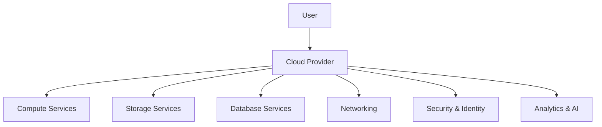
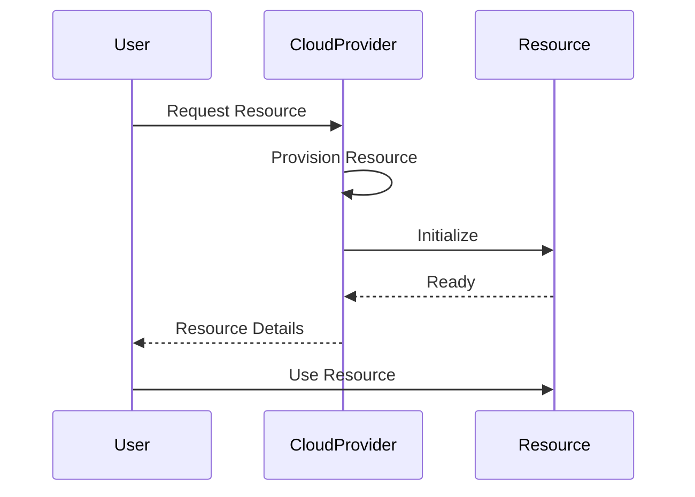

# Overview

Cloud computing is the delivery of computing services—including servers, storage, databases, networking, software, analytics, and intelligence—over the Internet ("the cloud") to offer faster innovation, flexible resources, and economies of scale. It eliminates the need for organizations to maintain physical data centers and servers.

# Detailed Explanation

## Service Models

### Infrastructure as a Service (IaaS)
- Provides virtualized computing resources over the internet.
- Examples: Amazon EC2, Google Compute Engine, Microsoft Azure VMs
- User manages: OS, applications, data
- Provider manages: Hardware, virtualization, networking

### Platform as a Service (PaaS)
- Provides a platform allowing customers to develop, run, and manage applications without dealing with infrastructure.
- Examples: Heroku, Google App Engine, AWS Elastic Beanstalk
- User manages: Applications and data
- Provider manages: OS, runtime, middleware, servers

### Software as a Service (SaaS)
- Software delivered over the internet on a subscription basis.
- Examples: Gmail, Salesforce, Office 365
- User manages: Data
- Provider manages: Everything else

## Deployment Models

### Public Cloud
- Services offered by third-party providers over the public internet.
- Examples: AWS, Azure, Google Cloud
- Benefits: Cost-effective, scalable, no maintenance

### Private Cloud
- Cloud infrastructure operated solely for a single organization.
- Benefits: More control, security, customization

### Hybrid Cloud
- Combination of public and private clouds.
- Allows data and applications to move between them.
- Benefits: Flexibility, cost optimization, compliance

## Key Characteristics

- **On-demand self-service**: Provision resources as needed
- **Broad network access**: Available over the network
- **Resource pooling**: Resources shared among multiple users
- **Rapid elasticity**: Scale resources up/down quickly
- **Measured service**: Pay for what you use

## Core Components

### Compute
- Virtual machines, containers, serverless functions

### Storage
- Object storage (S3), block storage (EBS), file storage (EFS)

### Networking
- Virtual networks, load balancers, CDNs

### Databases
- Relational (RDS), NoSQL (DynamoDB), data warehouses

### Security
- Identity management, encryption, compliance

## Architecture Diagram



# Real-world Examples & Use Cases

## Web Applications
- **Netflix**: Uses AWS for streaming infrastructure, auto-scaling based on demand
- **Airbnb**: Leverages cloud for global scalability and data analytics

## Big Data Analytics
- **Uber**: Processes massive amounts of ride data using cloud storage and compute
- **Spotify**: Analyzes user behavior and music preferences in the cloud

## IoT and Edge Computing
- **Smart Cities**: Cloud platforms process sensor data from IoT devices
- **Autonomous Vehicles**: Real-time data processing and AI inference in the cloud

## Disaster Recovery
- **Financial Institutions**: Use cloud for backup and failover capabilities
- **Healthcare**: Secure cloud storage for patient data and emergency access

# Code Examples

## AWS EC2 Instance Creation (Terraform)

```hcl
resource "aws_instance" "example" {
  ami           = "ami-0c55b159cbfafe1d0"
  instance_type = "t2.micro"

  tags = {
    Name = "ExampleInstance"
  }
}
```

## Azure Storage Account (ARM Template)

```json
{
  "$schema": "https://schema.management.azure.com/schemas/2019-04-01/deploymentTemplate.json#",
  "contentVersion": "1.0.0.0",
  "resources": [
    {
      "type": "Microsoft.Storage/storageAccounts",
      "apiVersion": "2021-04-01",
      "name": "examplestorageaccount",
      "location": "[resourceGroup().location]",
      "sku": {
        "name": "Standard_LRS"
      },
      "kind": "StorageV2"
    }
  ]
}
```

## Google Cloud Function (Serverless)

```javascript
exports.helloWorld = (req, res) => {
  res.status(200).send('Hello, World!');
};
```

## Cloud Storage Upload (Python with boto3)

```python
import boto3

s3 = boto3.client('s3')
s3.upload_file('local_file.txt', 'my-bucket', 'remote_file.txt')
```

# Data Models / Message Formats

### Cloud Resource Configuration (JSON)

```json
{
  "resourceType": "VirtualMachine",
  "provider": "AWS",
  "instanceType": "t3.medium",
  "region": "us-east-1",
  "tags": {
    "Environment": "Production",
    "Project": "WebApp"
  },
  "networking": {
    "vpcId": "vpc-12345",
    "subnetId": "subnet-67890",
    "securityGroups": ["sg-abcde"]
  }
}
```

### Cloud Billing Data

```json
{
  "accountId": "123456789",
  "period": "2023-09",
  "services": [
    {
      "service": "EC2",
      "usage": 720,
      "cost": 45.60
    },
    {
      "service": "S3",
      "usage": 100,
      "cost": 2.30
    }
  ],
  "totalCost": 47.90
}
```

# Journey / Sequence



# Common Pitfalls & Edge Cases

- **Vendor Lock-in**: Difficulty migrating between cloud providers
- **Security Misconfigurations**: Accidental exposure of sensitive data
- **Cost Overruns**: Unmonitored resource usage leading to unexpected bills
- **Latency Issues**: Choosing regions far from users
- **Data Sovereignty**: Compliance with local data regulations
- **Downtime**: Single points of failure in cloud architectures

# Tools & Libraries

- **Infrastructure as Code**: Terraform, CloudFormation, ARM Templates
- **Container Orchestration**: Kubernetes, Docker
- **Monitoring**: CloudWatch, Stackdriver, Azure Monitor
- **CI/CD**: GitHub Actions, Jenkins, Cloud Build
- **SDKs**: AWS SDK, Azure SDK, Google Cloud Client Libraries

# References

- [NIST Cloud Computing Definition](https://csrc.nist.gov/publications/detail/sp/800-145/final)
- [AWS Cloud Computing Concepts](https://aws.amazon.com/what-is-cloud-computing/)
- [Microsoft Azure Fundamentals](https://docs.microsoft.com/en-us/learn/paths/azure-fundamentals/)
- [Google Cloud Platform Documentation](https://cloud.google.com/docs)
- "Cloud Computing: Concepts, Technology & Architecture" by Thomas Erl

# Github-README Links & Related Topics

- [Cloud Architecture Patterns](./cloud-architecture-patterns/)
- [Infrastructure as Code with Terraform](./infrastructure-as-code-with-terraform/)
- [Container Orchestration with Kubernetes](./container-orchestration-with-kubernetes/)
- [Serverless Architecture](./serverless-architecture/)
- [Cloud Deployment Strategies](./cloud-deployment-strategies/)