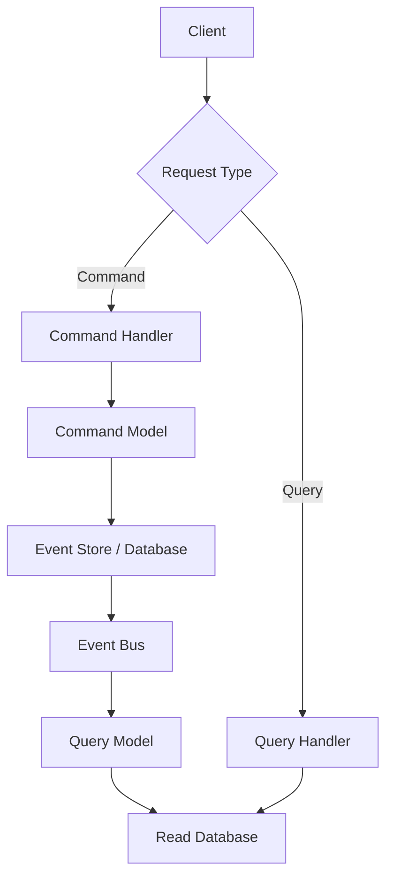

## Overview

CQRS stands for Command Query Responsibility Segregation. It's a pattern that separates the model used to update information from the model used to read information. This separation can be valuable in complex domains or high-performance applications but adds significant complexity and should be used cautiously.

## Detailed Explanation

In traditional CRUD systems, the same model handles both reading and writing data. CQRS introduces separate models:

- **Command Model**: Handles updates (commands) to the system
- **Query Model**: Handles reads (queries) from the system

These models often run in different logical processes and may use separate databases. Changes from the command side are communicated to the query side to maintain consistency.

### Key Concepts

- **Commands**: Operations that change state (e.g., CreateUser, UpdateOrder)
- **Queries**: Operations that retrieve data without changing state
- **Eventual Consistency**: The query model may lag behind the command model
- **Separate Storage**: Command and query models can use different databases optimized for their use cases

### Architecture Diagram



## Real-world Examples & Use Cases

1. **E-commerce Platform**: Separate models for order processing (commands) and product catalog browsing (queries)
2. **Banking System**: Transaction processing uses command model, account balance queries use optimized read model
3. **Social Media Feed**: Posting updates via command model, timeline generation via query model
4. **Inventory Management**: Stock adjustments via commands, inventory reports via queries

### When to Use CQRS

- Complex domains with different requirements for read and write operations
- High-performance applications with disparate read/write loads
- Systems requiring task-based UIs
- Domains benefiting from Domain-Driven Design

### When NOT to Use CQRS

- Simple CRUD applications
- Systems where read and write models overlap significantly
- Teams not experienced with the added complexity

## Code Examples

### Simple CQRS Implementation in Java

```java
// Command
public class CreateUserCommand {
    private String userId;
    private String name;
    private String email;
    
    // getters and setters
}

// Query
public class GetUserQuery {
    private String userId;
    
    // getter
}

// Command Handler
public class UserCommandHandler {
    public void handle(CreateUserCommand command) {
        // Validate and persist user
        User user = new User(command.getUserId(), command.getName(), command.getEmail());
        userRepository.save(user);
        
        // Publish event
        eventBus.publish(new UserCreatedEvent(user.getId()));
    }
}

// Query Handler
public class UserQueryHandler {
    public UserDto handle(GetUserQuery query) {
        return userReadRepository.findById(query.getUserId());
    }
}
```

### Event Sourcing Integration

```java
public class UserAggregate {
    private List<DomainEvent> changes = new ArrayList<>();
    
    public void createUser(String name, String email) {
        applyChange(new UserCreatedEvent(UUID.randomUUID().toString(), name, email));
    }
    
    private void applyChange(DomainEvent event) {
        changes.add(event);
        // Apply to aggregate state
    }
}
```

## Common Pitfalls & Edge Cases

- **Eventual Consistency Issues**: Query model may show stale data
- **Increased Complexity**: Requires coordination between models
- **Testing Challenges**: Need to test both models and synchronization
- **Over-engineering**: Applying CQRS to simple domains

## Tools & Libraries

- **Axon Framework**: Java framework for CQRS and Event Sourcing
- **EventStore**: Database optimized for event sourcing
- **Akka**: Actor-based framework supporting CQRS patterns

## References

- [CQRS by Martin Fowler](https://martinfowler.com/bliki/CQRS.html)
- [Clarified CQRS by Udi Dahan](http://www.udidahan.com/2009/12/09/clarified-cqrs/)
- [CQRS Journey on MSDN](https://docs.microsoft.com/en-us/previous-versions/msp-n-p/jj554200(v=pandp.10))

## Github-README Links & Related Topics

- [Event Sourcing](event-sourcing/README.md)
- [Domain-Driven Design](domain-driven-design/README.md)
- [Event-Driven Systems](event-driven-systems/README.md)
- [CAP Theorem & Distributed Systems](cap-theorem-and-distributed-systems/README.md)